# **数据分析概述与环境搭建**

## 1.1 **数据分析课程导论**

### 1.1.1  **为什么要学数据分析？**

| 功能       | Excel     | Python (Pandas) |
| ---------- | --------- | --------------- |
| 数据处理量 | 1万行以内 | 100万行以上     |
| 自动化     | 手动操作  | 代码一键运行    |
| 学习难度   | 简单      | 需基础编程知识  |

- **传统方法**：用Excel手工处理数据

￮ 问题：数据量超过1万行会卡顿，复杂计算需要写复杂公式

￮ 举例：统计全校1000名学生成绩排名，手动操作需2小时

- **Python数据分析**：

￮ 优势：自动处理百万级数据，代码可重复使用

￮ 举例：用Pandas代码3分钟完成相同任务

### 1.1.2  **学完能做什么？**

• **常见应用场景**：

￮ 销售分析（哪些商品卖得最好？）

￮ 用户行为分析（用户最喜欢点击哪个功能？）

￮ 金融预测（股票价格趋势）

 

### 1.1.3  **数据分析的完整流程**

1. **数据收集**

**数据从哪里来？**公司数据库 | 公开数据集（如政府数据） | 手动爬取

2. **数据清洗（最重要！）**

**典型问题**：

缺失值（如Excel里的空单元格）

错误数据（如年龄填成200岁）

格式混乱（日期写成“2023年1月1日”和“01/01/2023”混用）

3. **数据分析**

**常用方法**：

统计（平均值、最大值、比例）

分组对比（如男vs女用户的消费差异）

4. **数据可视化**

**一图胜千言**：折线图（趋势） | 柱状图（对比） | 散点图（相关性）

### 1.1.4  **数据分析工具链**

 **核心三件套**

| 工具           | 作用                          | 类比说明       |
| -------------- | ----------------------------- | -------------- |
| **Numpy**      | 高性能数值计算（矩阵/向量）   | 数据的"发动机" |
| **Pandas**     | 表格数据处理（类似高级Excel） | 数据的"手术刀" |
| **Matplotlib** | 数据可视化（绘图库）          | 数据的"翻译官" |

**典型工作流**

Numpy处理数字 → Pandas整理表格 → Matplotlib画图展示

 

**辅助工具**

• **Jupyter Notebook** 

￮ 交互式编程环境，实时显示代码和结果  

￮ 优势：适合教学/探索性分析（可保存图文混合笔记）  

• **Anaconda** 

￮ 一键安装所有工具的科学计算发行版  

￮ 包含：Python解释器 + 常用库 + 环境管理工具  

• **Git** 

￮ 代码版本控制（避免分析脚本丢失）  

￮ 协作必备：记录每次修改，支持多人合作  

## 1.2  **Anaconda安装**

### 1.2.1  **Anaconda介绍**

**什么是Anaconda**

Anaconda官网地址：https://www.anaconda.com/

简单来说，Anaconda = Python + 包和环境管理器（Conda）+ 常用库 + 集成工具。它适合那些需要快速搭建数据科学或机器学习开发环境的用户。Anaconda和Python相当于是汽车和发动机的关系，安装Anaconda后，就像买了一台车，无需自己去安装发动机和其他零配件，而Python作为发动机提供Anaconda工作所需的内核。

Anaconda包及其依赖项和环境的管理工具为 conda 命令，与传统的 Python pip 工具相比Anaconda的conda可以更方便地在不同环境之间进行切换，环境管理较为简单。

为什么选择 Anaconda？

- 方便安装： 安装 Anaconda 就像安装一个应用程序一样简单，它为您预先安装好了许多常用的工具，无需单独配置。

- 包管理器： Anaconda 包含一个名为 Conda 的包管理器，用于安装、更新和管理软件包。Conda 不仅限于 Python，还支持多种其他语言的包管理。

- 环境管理： 使用 Anaconda，您可以轻松地创建和管理多个独立的 Python 环境，比如可以安装 python2 和 python3 环境，然后实现自由切换。这对于在不同项目中使用不同的库和工具版本非常有用，以避免版本冲突。

- 集成工具和库： Anaconda 捆绑了许多用于数据科学、机器学习和科学计算的重要工具和库，如 NumPy、Pandas、Matplotlib、SciPy、Scikit-learn 等。

- Jupyter 笔记本： Jupyter 是一个交互式的计算环境，支持多种编程语言，但在 Anaconda 中主要用于 Python。它允许用户创建和共享包含实时代码、方程式、可视化和叙述文本的文档。

- Spyder 集成开发环境： Anaconda 中集成了 Spyder，这是一个专为科学计算和数据分析而设计的开发环境，具有代码编辑、调试和数据可视化等功能。

- 跨平台性： Anaconda可在Windows、macOS和 Linux等操作系统上运行，使其成为一个跨平台的解决方案。

- 社区支持： Anaconda 拥有庞大的社区，用户可以在社区论坛上获取帮助、分享经验和解决问题。

**核心优势解析**

1. **预装200+数据科学包**
2. **开箱即用**：无需手动安装NumPy/Pandas等库  
3. **完整生态**：包含数据分析、机器学习、可视化全套工具  
4. **Anaconda一站式 vs 原生Python+pip**

| 对比维度     | Anaconda方案            | 原生Python+pip方案           |
| ------------ | ----------------------- | ---------------------------- |
| **安装难度** | ⭐️ 一键安装所有工具      | ⭐️⭐️⭐️ 需手动装每个库           |
| **依赖管理** | Conda自动解决依赖冲突   | pip可能遇到版本兼容问题      |
| **磁盘占用** | ⚠️ 较大（3GB+基础包）    | ✅ 可按需安装（最小仅几十MB） |
| **适用场景** | 初学者/快速开始数据分析 | 开发者/需要精确控制环境      |
| **典型案例** | 学校教学/个人学习       | 生产服务器部署               |

**建议**：

> "如果你希望像用手机APP一样简单，选Anaconda；如果你像专业厨师需要定制厨房，选原生Python。"

### **1.2.2. 下载与安装**

进入官网，点击右上角Free Download

 

点击右下方[Skip registration](https://www.anaconda.com/download/success)跳过注册

 

点击Download下载，或选择相应的操作系统和版本进行下载

 

 

双击安装包进入安装

 

点击Next

 

点击I Agree

 

点击Next

 

修改安装路径，点击Next

 

酌情修改安装选项，之后点击Install安装，等待安装完成

安装选项依次为：

- 创建快捷方式-默认选中。为Anaconda Navigator、Spyder、Jupyter Notebook和Anaconda Prompt软件包创建“开始”菜单快捷方式。

- 将Anaconda3添加到我的PATH环境变量，将包含conda二进制文件的路径添加到path环境变量中。Anaconda不建议选择此选项。conda二进制文件路径包含其他包二进制文件，这些二进制文件将添加到path环境变量中，即使当前没有处于活动状态的conda环境也是如此。这使得其他软件可以使用这些软件包文件，这可能会导致错误。可以勾选，也可以在安装后手动添加环境变量。

- 注册Anaconda3作为我的默认Python 3.12-默认选中。将此安装中的Python包注册为VSCode，PyCharm等程序的默认Python。

• 安装完成后清除包缓存。

 

安装完成后，点击Next

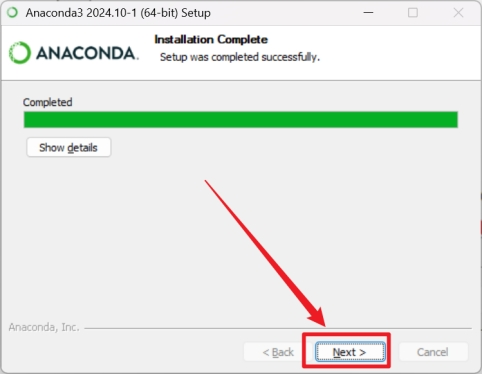 

再次点击Next

 

点击Finish，完成安装

 

## 1.3  **Jupyter笔记本**

​	Jupyter 是一个开源的交互式计算环境，广泛应用于数据科学、机器学习、科学研究等领域，主要组件有Jupyter Notebook和Jupyter Lab。JupyterLab作为Jupyter Notebook 的继承者，提供了更现代化和功能丰富的界面。JupyterLab的多文档界面、内置协作功能和扩展系统使其成为数据科学家和研究人员的首选。

### 1.3.1  **使用本地Jupyter**

命令提示符中输入jupyter lab或jupyter notebook，会弹出浏览器页面直接进入主页面

C:\Users\fuxiaofeng>jupyter lab

 

注意：由于网络等原因，可能导致访问时候出现警告，可以忽略。

### 1.3.2  **PyCharm中集成Jupyter**

Pycharm界面提供了对Jupyter Notebook的集成

创建Jupyter Notebook文件

 

 

会在当前项目下创建新的conda环境，新的conda环境中没有Jupyter，如果运行的话会自动在当前环境下安装。

### 1.3.3  **Jupyter快捷键**

| esc         | 从输入模式退出到命令模式        |
| ----------- | ------------------------------- |
| a           | 在当前cell上面创建一个新的cell  |
| b           | 在当前cell 下面创建一个新的cell |
| dd          | 删除当前cell                    |
| m           | 切换到markdown模式              |
| y           | 切换到code模式                  |
| ctrl+回车   | 运行cell                        |
| shift +回车 | 运行当前cell并创建一个新的cell  |

### 1.4  **章节小结**

• **知识总结**

- **核心三件套**

i. **NumPy**：快速计算数字（如矩阵运算） 

ii. **Pandas**：处理表格数据（类似高级Excel）

iii. **Matplotlib**：画图工具 

- **完整流程比喻**

i. **NumPy 切菜**：准备好数据（比如切好“销售额”和“成本”数组）。

ii. **Pandas 炒菜**：计算利润（销售额 - 成本），分析哪些产品赚钱。

iii. **可视化 摆盘**：用柱状图展示利润最高的产品，老板秒懂！

- **为什么必学？**

▪ 如果你想做数据分析：

• 不会 NumPy → 像用水果刀剁骨头，效率低。

• 不会 Pandas → 像用手抓菜炒，烫还慢。

• 不会可视化 → 像把菜糊糊端给客人，看不懂。

| 用户类型     | 推荐工具组合             | 原因                   |
| ------------ | ------------------------ | ---------------------- |
| **初学者**   | Anaconda + Jupyter       | 免配置，可视化操作     |
| **团队协作** | Anaconda + Git + VS Code | 环境可复制，代码可追溯 |
| **高级用户** | Miniconda + PyCharm      | 轻量级，自定义程度高   |

 

| 功能     | 原生Jupyter | PyCharm集成版  |
| -------- | ----------- | -------------- |
| 代码补全 | 基础        | 智能上下文感知 |
| 版本控制 | 需手动      | Git可视化集成  |
| 调试功能 | 有限        | 完整断点调试   |

 

# 2. **Numpy**科学计算

## 2.1  **numpy**介绍

numpy是Python中科学计算的基础包。它是一个Python库，提供多维数组对象、各种派生对象（例如掩码数组和矩阵）以及用于对数组进行快速操作的各种方法，包括数学、逻辑、形状操作、排序、选择、I/O 、离散傅里叶变换、基本线性代数、基本统计运算、随机模拟等等。

numpy的部分功能如下：

---

• ndarray，一个具有矢量算术运算和复杂广播能力的快速且节省空间的多维数组。

• 用于对整组数据进行快速运算的标准数学函数（无需编写循环）。

• 用于读写磁盘数据的工具以及用于操作内存映射文件的工具。

• 线性代数、随机数生成以及傅里叶变换功能。

• 用于集成由C、C++、Fortran等语言编写的代码的API。

---

为什么需要Numpy？

```python
Python
# 原生Python列表 vs NumPy数组性能对比
import time
import numpy as np

py_list = list(range(1000000))
np_arr = np.arange(1000000)

# 计算平方和
start = time.time()
sum([x**2 for x in py_list])
print(f"Python列表耗时: {time.time()-start:.4f}s")

start = time.time()
np.sum(np_arr**2)
print(f"NumPy数组耗时: {time.time()-start:.4f}s")
```


**输出示例**：

```python
Python列表耗时: 0.1256s   NumPy数组耗时: 0.0023s
```


**安装numpy包**

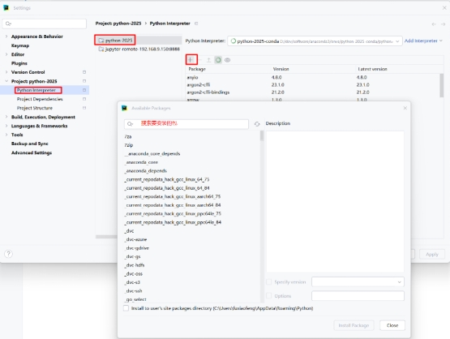 

**如果在**Pycharm中加载不出来，可以通过如下命令安装

```pyothon
C:\Users\fuxiaofeng>conda activate python-2025-conda (python-2025-conda) C:\Users\fuxiaofeng>conda install numpy
```


 

## 2.2  **ndarray**

### 2.2.1 **ndarray** **的核心特性**

1. **多维性**：支持 0 维（标量）、1 维（向量）、2 维（矩阵）及更高维数组。
2. **同质性**：所有元素类型必须一致（通过 dtype 指定）。
3. **高效性**：基于连续内存块存储，支持向量化运算。

### 2.2.2  **ndarray的属性**

#### **核心属性（必须掌握）**

（假设 arr = np.array([[1, 2], [3, 4]])）

| 属性名称 | 通俗解释                                           | 使用示例  | 输出结果          | 实际用途                                   |
| -------- | -------------------------------------------------- | --------- | ----------------- | ------------------------------------------ |
| shape    | **数组的形状**：行数和列数（或更高维度的尺寸）。   | arr.shape | (2, 2)            | 查看或调整数组结构（如变形）。             |
| ndim     | **维度数量**：数组是几维的（1维、2维、3维等）。    | arr.ndim  | 2                 | 判断数组是向量、矩阵还是高维数据。         |
| size     | **总元素个数**：数组中所有元素的总数。             | arr.size  | 4                 | 快速计算元素总量。                         |
| dtype    | **元素类型**：数组中元素的类型（整数、浮点数等）。 | arr.dtype | int64（或 int32） | 确保计算时类型一致（如避免整数除法问题）。 |

1. **shape**：就像问数组“长什么样”。

​	￮ 示例：arr = np.array([[1, 2], [3, 4]]) 的 shape 是 (2, 2)，表示2行2列。

​	￮ **变形操作**：arr.reshape(4, 1) 会变成4行1列的数组。

2. **ndim**：判断数组是“几维空间”。

​	￮ 一维数组（向量）：ndim=1，如 [1, 2, 3]。

​	￮ 二维数组（矩阵）：ndim=2，如表格数据。

​	￮ 三维数组（立体）：ndim=3，如RGB图片数据。

3. **dtype**：确保所有元素是“同一类型”。

​	￮ 如果数组中有小数，dtype 会自动变成 float64（避免精度丢失）。

​	￮ 强制指定类型：np.array([1, 2], dtype=np.float32)。

```python
import numpy as np

# 创建一个3x2的二维数组
arr = np.array([[1, 2], [3, 4], [5, 6]])

print("形状 shape:", arr.shape)    # 输出 (3, 2)
print("维度 ndim:", arr.ndim)     # 输出 2
print("总元素 size:", arr.size)   # 输出 6
print("元素类型 dtype:", arr.dtype)  # 输出 int64
```


 

#### **进阶属性（了解即可）**

| 属性名称 | 通俗解释                                     | 示例代码     | 输出结果               | 应用场景                   |
| -------- | -------------------------------------------- | ------------ | ---------------------- | -------------------------- |
| T        | **转置**：行变列，列变行。                   | arr.T        | [[1, 3], [2, 4]]       | 矩阵运算（如矩阵乘法）。   |
| itemsize | **单个元素占用的内存字节数**。               | arr.itemsize | 8（int64 类型占8字节） | 优化内存占用时参考。       |
| nbytes   | **数组总内存占用量**：size * itemsize。      | arr.nbytes   | 32（4元素 × 8字节）    | 处理大数据时监控内存消耗。 |
| flags    | **内存存储方式**：是否连续存储（高级优化）。 | arr.flags    | C_CONTIGUOUS : True 等 | 高性能计算或底层内存操作。 |

#### **练习题**

题目 1：观察数组形状

```python
Python import numpy as np arr = np.array([[1, 2, 3], [4, 5, 6]])
```

1. arr.shape 的输出是什么？ 
2. arr.ndim 的值是多少？ 
3. arr.size 的结果是什么？

 **答案** 

1. (2, 3) 
2. 2（二维数组） 
3. 6（总元素数：2行×3列=6）

 

题目 2：数据类型推断

以下数组的 dtype 分别是什么？

1. np.array([1, 2, 3]) 
2. np.array([1.0, 2, 3]) 
3. np.array(["apple", "banana"]) 

 **答案** 

1. int64（默认整数类型） 
2. float64（包含浮点数，自动提升为浮点类型） 
3. <U6（Unicode 字符串，长度 6）

 

题目 3：内存占用计算

```Python
arr = np.array([[0, 1], [2, 3]], dtype=np.int32)
```

1. arr.itemsize 的值是多少？ 
2. arr.nbytes 的结果是多少？ 

 

**答案** 

1. 4（int32 类型占 4 字节） 
2. 8（总字节数：4元素×4字节=16 → 注：原题应为 4 元素？需要检查数组大小）

（更正：数组是 2x2，共 4 元素。nbytes = 4 × 4 = 16，原题可能有误）

 

题目 4：转置操作

```python
arr = np.array([[1, 2], [3, 4], [5, 6]])
```

1. 写出 arr.T 的输出。 
2. 转置后的 shape 是什么？

**答案** 

```python
[[1 3 5]
 [2 4 6]]
```

(2, 3)（原数组是 3x2，转置后为 2x3）。

 

### 2.2.3  **ndarray**的创建

| **用途**                 | **方法**            | **语法示例**                            | **核心作用**                               | **输出示例**                               |
| ------------------------ | ------------------- | --------------------------------------- | ------------------------------------------ | ------------------------------------------ |
| **基础构造**             |                     |                                         |                                            |                                            |
| ▪ 从 Python 数据结构创建 | np.array()          | np.array([[1, 2], [3, 4]])              | 将列表/元组转换为 ndarray                  | array([[1, 2], [3, 4]])                    |
| ▪ 复制数组               | np.copy()           | np.copy(arr)                            | 创建独立副本（深拷贝）                     | 与原数组相同但不共享内存                   |
| **预定义形状填充**       |                     |                                         |                                            |                                            |
| ▪ 全0数组                | np.zeros()          | np.zeros((2,3))                         | 快速初始化全0数组                          | [[0., 0., 0.], [0., 0., 0.]]               |
| ▪ 全1数组                | np.ones()           | np.ones((3,2), dtype=int)               | 快速初始化全1数组                          | [[1, 1], [1, 1], [1, 1]]                   |
| ▪ 未初始化数组           | np.empty()          | np.empty((2,2))                         | 预分配内存（值随机）                       | 随机值（如 [[1e-323, 0.], [0., 0.]]）      |
| ▪ 填充固定值             | np.full()           | np.full((2,3), 5)                       | 用指定值填充数组                           | [[5, 5, 5], [5, 5, 5]]                     |
| **基于数值范围生成**     |                     |                                         |                                            |                                            |
| ▪ 等差序列               | np.arange()         | np.arange(0, 10, 2)                     | 生成步长固定的序列（不含终点）             | [0, 2, 4, 6, 8]                            |
| ▪ 等间隔序列             | np.linspace()       | np.linspace(0, 1, 5)                    | 生成指定数量的等间隔值（含终点）           | [0.0, 0.25, 0.5, 0.75, 1.0]                |
| ▪ 对数间隔序列           | np.logspace()       | np.logspace(0, 2, 3, base=10)           | 生成对数间隔值（如 10^0, 10^1, 10^2）      | [1.0, 10.0, 100.0]                         |
| **特殊矩阵生成**         |                     |                                         |                                            |                                            |
| ▪ 单位矩阵               | np.eye()            | np.eye(3)                               | 生成单位矩阵（对角线为1）                  | [[1., 0., 0.], [0., 1., 0.], [0., 0., 1.]] |
| ▪ 对角矩阵               | np.diag()           | np.diag([1, 2, 3])                      | 生成以指定值为对角线的矩阵                 | [[1, 0, 0], [0, 2, 0], [0, 0, 3]]          |
| **随机数组生成**         |                     |                                         |                                            |                                            |
| ▪ 均匀分布随机数         | np.random.rand()    | np.random.rand(2,2)                     | 生成 [0,1) 均匀分布的随机数                | [[0.43, 0.89], [0.21, 0.57]]               |
| ▪ 正态分布随机数         | np.random.randn()   | np.random.randn(2,2)                    | 生成标准正态分布随机数（均值为0，方差为1） | [[-0.5, 1.2], [0.3, -1.8]]                 |
| ▪ 随机整数               | np.random.randint() | np.random.randint(1,10, (2,2))          | 生成指定范围内的随机整数                   | [[3, 7], [5, 2]]                           |
| **高级构造方法**         |                     |                                         |                                            |                                            |
| ▪ 从字符串创建           | np.array()          | np.array(['a', 'bc'])                   | 将字符串转换为字符数组                     | array(['a', 'bc'], dtype='<U2')            |
| ▪ 从文件读取             | np.loadtxt()        | np.loadtxt('data.txt')                  | 从文本文件加载数据                         | 依赖文件内容（如 [[1., 2.], [3., 4.]]）    |
| ▪ 函数生成数组           | np.fromfunction()   | np.fromfunction(lambda i,j: i+j, (3,3)) | 根据函数生成数组元素                       | [[0., 1., 2.], [1., 2., 3.], [2., 3., 4.]] |

**创建方法汇总**

1. **基础构造**： 适用于手动构建小规模数组或复制已有数据。
2. **预定义形状填充**： 用于快速初始化固定形状的数组（如全0占位、全1初始化）。
3. **基于数值范围生成**： 生成数值序列，常用于模拟时间序列、坐标网格等。
4. **特殊矩阵生成**： 数学运算专用（如线性代数中的单位矩阵）。
5. **随机数组生成**： 模拟实验数据、初始化神经网络权重等场景。
6. **高级构造方法**： 处理非结构化数据（如文件、字符串）或通过函数生成复杂数组。

 

#### 2.2.3.1  **从** **Python** **数据结构转换**

将 Python 列表、元组等转换为 ndarray，是最直接的方式。

**np.array(object, dtype=None)**

```Python
import numpy as np

# 从列表创建一维数组
arr1 = np.array([1, 2, 3])
print(arr1)  # 输出: [1 2 3]

# 从嵌套列表创建二维数组
arr2 = np.array([[1, 2], [3, 4]])
print(arr2)
# 输出:
# [[1 2]
#  [3 4]]

# 指定数据类型
arr3 = np.array([1, 2.5], dtype=np.float32)
print(arr3.dtype)  # 输出: float32
```


**注意事项**

• 混合类型时，NumPy 会统一为最高优先级类型（如 int + float → float，数值 + 字符串 → 字符串）。

• 列表的嵌套层级决定 ndim（维度数）。

 

#### 2.2.3.2 **预定义形状填充**

快速初始化固定形状的数组，常用于占位或初始化权重矩阵。

```python
np.zeros(shape, dtype=float)  # 全0  返回给定形状和类型的新数组，用0填充。
np.ones(shape, dtype=float)   # 全1  返回给定形状和类型的新数组，用1填充。
```

 

```pyothon
# 创建 2x3 全0浮点数组
zeros_arr = np.zeros((2, 3))
print(zeros_arr)
# 输出:
# [[0. 0. 0.]
#  [0. 0. 0.]]

# 创建 3x2 全1整数数组
ones_arr = np.ones((3, 2), dtype=int)
print(ones_arr)
# 输出:
# [[1 1]
#  [1 1]
#  [1 1]]
```

默认数据类型为 float64，需显式指定 dtype 为 int 或其他类型。


**未初始化的数组** **(**np.empty**)**

np.empty(shape, dtype=float)

返回给定形状和类型的未初始化的新数组。

创建未初始化的数组（值随机，取决于内存状态），适用于对性能要求极高的场景。

```pyothon
empty_arr = np.empty((2, 2))
print(empty_arr)  # 输出可能为随机值（如 [[1e-323, 0. ], [0., 0. ]]）
```


**不推荐直接使用**：需手动填充数据，否则可能引入不可预测的错误。

需要注意的是，np.empty 并不保证数组元素被初始化为 0，它只是分配内存空间，数组中的元素值是未初始化的，可能是内存中的任意值。

 

**重复填充数组** **(**np.full**)**

np.full(shape, fill_value, dtype)

```pyothon
full_arr = np.full((2, 3), 5)
print(full_arr)
# 输出:
# [[5 5 5]
#  [5 5 5]]
```


**zeros_like()****：**返回与给定数组具有相同形状和类型的0新数组。

**ones_like()****：**返回与给定数组具有相同形状和类型的1新数组。

**empty_like()****：**返回与给定数组具有相同形状和类型的未初始化的新数组。

```pyothon
arr2 = np.ones_like(arr1)  # 创建和arr1形状相同的全1数组
arr4 = np.empty_like(arr3)  # 创建和arr3形状相同的未初始化数组
arr2 = np.full_like(arr1, 5)
```

Plain Text arr2 = np.ones_like(arr1)  # 创建和arr1形状相同的全1数组 arr4 = np.empty_like(arr3)  # 创建和arr3形状相同的未初始化数组 arr2 = np.full_like(arr1, 5)

 

#### 2.2.3.3 **基于数值范围生成**

**(1)** np.arange**：等差序列**

np.arange(start, stop, step)

返回在给定范围内用均匀间隔的值填充的一维数组。

```pyothon
arr = np.arange(0, 10, 2)  # 0 ≤ 值 <10，步长2
print(arr)  # 输出: [0 2 4 6 8]
```


**(2)** np.linspace**：等间隔数组（含终点）**

np.linspace(start, stop, num=50)  

返回指定范围和元素个数的等差数列。数组元素类型为浮点型。

```pyothon
arr = np.linspace(0, 1, 5)  # 0到1之间生成5个等间隔值
print(arr)  # 输出: [0.   0.25 0.5  0.75 1.  ]
```


**(3)** np.logspace**：对数间隔数组**

np.logspace(start, stop, num=50, base=10)  

返回指定指数范围、元素个数、底数的等比数列。

```pyothon
arr = np.logspace(0, 2, 3)  # 10^0, 10^1, 10^2
print(arr)  # 输出: [  1.  10. 100.]
```


2.2.3.4  **特殊矩阵**

**矩阵补充知识**

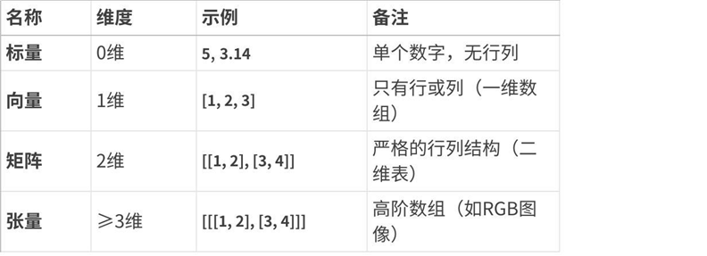

 

矩阵是线性代数的核心概念，可以理解为一个数字的矩形表格，用来表示数据、方程组或线性变换。下面用最直观的方式介绍它的基本概念和应用。

1. 矩阵是什么？

矩阵是一个由 行（row） 和 列（column） 排列成的矩形数组，例如：

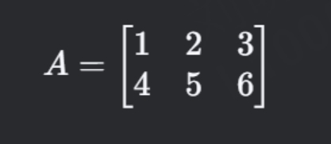 

• 形状（shape）：这个矩阵有 2 行 3 列，记作 2×32×3 矩阵。

• 元素（entry）：矩阵中的每个数字称为元素，如 A1,2=2*A*1,2=2（第 1 行第 2 列）。

2. 矩阵的用途

(1) 表示线性方程组

例如，方程组：

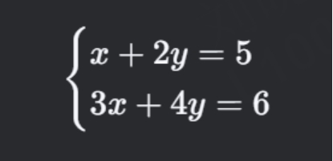 

可以写成矩阵形式：

 

即 *A***x**=**b**，其中：

• *A* 是系数矩阵，

• **x** 是未知数列向量，

• **b** 是常数项列向量。

(2) 表示线性变换

矩阵可以描述空间中的变换，比如旋转、缩放、投影。

例如，一个 2×22×2 矩阵可以表示二维平面的旋转：

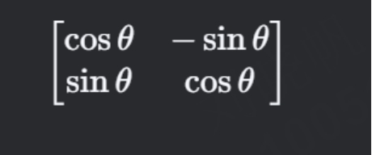 

用在向量 [xy][*xy*] 上，会使其旋转 θ*θ* 角度。

(3) 数据表示（如机器学习）

在机器学习中，数据集通常用矩阵表示：

• 每一行代表一个样本（如一张图片），

• 每一列代表一个特征（如像素值）。

3. 矩阵的基本运算

(1) 矩阵加法

对应位置的元素相加，要求两个矩阵形状相同：

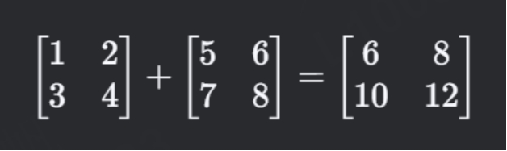 

(2) 矩阵数乘

矩阵的每个元素乘以一个标量（数）：

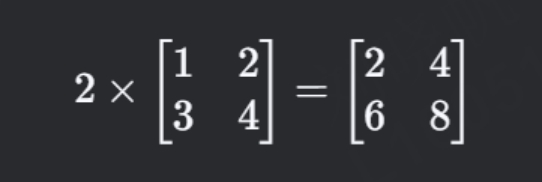 

(3) 矩阵乘法

矩阵乘法 不是 对应元素相乘，而是 行 × 列 的点积运算：

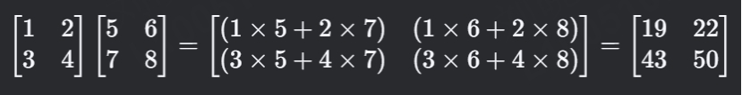 

注意：矩阵乘法不满足交换律（AB≠BA*AB* =*BA*）。

(4) 转置（Transpose）

行列互换：

 

 

#### 2.2.3.4. 特殊矩阵

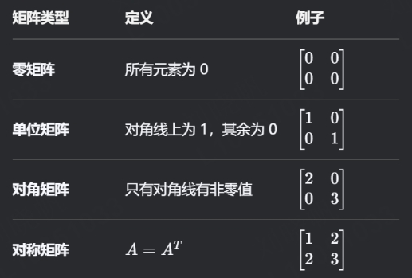 

**(1)** **单位矩阵** **(**np.eye/np.identity**)**

```python
np.eye(N)  # NxN 单位矩阵
np.identity(N)
```


 ```python
 eye_arr = np.eye(3)
 print(eye_arr)
 # 输出:
 # [[1. 0. 0.]
 #  [0. 1. 0.]
 #  [0. 0. 1.]]
 ```

Python eye_arr = np.eye(3) print(eye_arr) # 输出: # [[1. 0. 0.] #  [0. 1. 0.] #  [0. 0. 1.]]

**(2)** **对角矩阵** **(**np.diag**)**

```python
np.diag([a, b, c])  # 对角线为 a, b, c，其余为0
```


 ```python
 diag_arr = np.diag([1, 2, 3])
 print(diag_arr)
 # 输出:
 # [[1 0 0]
 #  [0 2 0]
 #  [0 0 3]]
 ```


 

#### 2.2.3.5  **随机数组**

**(1)** **均匀分布随机数** **(**np.random.rand**)**

返回给定形状的数组，用 [0, 1) 上均匀分布的随机样本填充。

```python
rand_arr = np.random.rand(2, 2)  # [0,1) 均匀分布
# 输出示例: [[0.43, 0.89], [0.21, 0.57]]
```


**(2)** **正态分布随机数** **(**np.random.randn**)**

返回给定形状的数组，用标准正态分布(均值为0，标准差为1)的随机样本填充。

```python
randn_arr = np.random.randn(2, 2)  # 均值为0，方差为1
# 输出示例: [[-0.5, 1.2], [0.3, -1.8]]
```


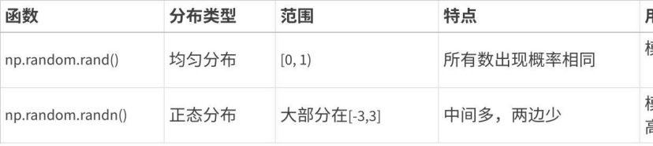

**(3)** **随机整数** **(**np.random.randint**)**

返回给定形状的数组，用从低位(包含)到高位(不包含)上均匀分布的随机整数填充。

```python
int_arr = np.random.randint(1, 10, (2, 2))  # [1,10) 的整数
# 输出示例: [[3, 7], [5, 2]]
```


（4）r**andom.uniform()**

**random.uniform()****：**返回给定形状的数组，用从低位(包含)到高位(不包含)上均匀分布的随机浮点数填充。

```python
arr3 = np.random.uniform(3, 6, (2, 3))
# [[5.69275495 3.84857937 3.2899215 ]
#  [5.32035519 3.7460973  3.33859905]]
```


**(5)** **设置随机种子** **(**np.random.seed**)**

np.random.seed 是 NumPy 中用于设置**随机数生成器种子**的函数，目的是确保程序的随机操作可以重复生成相同的结果（即保证随机结果的确定性）。这在实验复现、调试和教学场景中非常有用。

```python
import numpy as np

# 设置随机种子
np.random.seed(42)  # 参数可以是任意整数

# 生成随机数
print(np.random.rand(3))  # 输出固定结果
```


每次运行上述代码都会得到相同的随机数序列（例如 [0.37454012, 0.95071431, 0.73199394]）。

关键细节

1. **种子的一致性**：

​	￮ 相同种子生成的随机数序列完全一致。

​	￮ 不同种子（如 np.random.seed(0) 和 np.random.seed(1)）会产生不同序列。

2. **作用范围**：

​	￮ 种子对后续所有基于 NumPy 的随机函数生效（如 np.random.rand(), np.random.normal(), np.random.shuffle() 等）。

通过控制种子，你能在“随机”和“可复现”之间灵活切换！

 

#### 2.2.3.6 **高级构造方法**

**(1)** **np.loadtxt**

```python
data = np.loadtxt('data.txt')  # 读取文本文件
```


**(2)** **np.genfromtxt**

```python
data = np.genfromtxt('data.csv', delimiter=',')  # 支持复杂格式
```


 

#### 2.2.3.7 **创建方法推荐场景**

| **场景**               | **推荐方法**          | **优点**                 |
| ---------------------- | --------------------- | ------------------------ |
| 快速初始化全0/全1数组  | np.zeros/np.ones      | 内存预分配，明确值       |
| 生成数值序列           | np.arange/np.linspace | 灵活控制范围和步长       |
| 创建单位矩阵或对角矩阵 | np.eye/np.diag        | 数学运算专用             |
| 高性能预分配内存       | np.empty              | 速度最快（需手动初始化） |
| 随机数据生成           | np.random 模块        | 模拟实验数据             |

### 2.2.4  **ndarray的数据类型**

| **数据类型**                                                | **类型代码**         | **说明**                                                     |
| ----------------------------------------------------------- | -------------------- | ------------------------------------------------------------ |
| **bool**                                                    |                      | 布尔类型                                                     |
| **int8、uint8 、int16、uint16、int32、uint32int64、uint64** | i1,u1i2,u2i4,u4i8,u8 | 有符号、无符号的8位（1字节）整型有符号、无符号的16位（2字节）整型有符号、无符号的32位（4字节）整型有符号、无符号的64位（8字节）整型 |
| **float16、float32、float64**                               | f2f4或ff8或d         | 半精度浮点型单精度浮点型双精度浮点型                         |
| **complex64、complex128**                                   | c8c16                | 用两个32位浮点数表示的复数用两个64位浮点数表示的复数         |

创建数组时可以使用dtype参数指定元素类型：

```python
arr1 = np.array([1, 2, 3], dtype=np.float64)
# [1. 2. 3.]

arr2 = np.array([0.2, 2.5, 4.8], dtype="i8")
# [0 2 4]
```


也可以使用ndarray.astype()方法转换数组的元素类型：

```python
arr1 = np.array([1, 2, 3], dtype=np.float64)
# [1. 2. 3.]
arr2 = arr1.astype(np.int64)
# [1 2 3]
```

 

**数据类型深度解析**

```python
# 显式指定数据类型
arr = np.array([1, 2, 3], dtype=np.float32)

# 类型转换
int_arr = arr.astype(np.int32)

# 内存优化示例
large_arr = np.ones(1000000, dtype=np.float64)  # 占用8MB
optimized = large_arr.astype(np.float32)        # 优化为4MB
```


### 2.2.5  **索引与切片技巧**

| **索引/切片类型**           | **描述/用法**                                          | **示例代码**                                                 | **示例输出**                                                 |
| --------------------------- | ------------------------------------------------------ | ------------------------------------------------------------ | ------------------------------------------------------------ |
| **基本索引**                | 通过整数索引直接访问元素。索引从0开始。                | arr = np.arange(1, 10).reshape(3,3)<br>print(arr[1, 2])      | 6（第2行第3列的元素）                                        |
| **行/列切片**               | 使用冒号 : 切片语法选择行或列的子集。                  | print(arr[:, 1])<br>print(arr[::2, ::2])                     | [2 5 8]（所有行的第2列）<br>[[1, 3], [7, 9]]（隔行隔列取样） |
| **连续切片**                | 从起始索引到结束索引按步长切片。                       | arr = np.arange(10)<br>print(arr[2:9:2])<br>print(arr[2:])   | [2 4 6 8]（索引2到8，步长2）<br>[2 3 4 5 6 7 8 9]（索引2到最后） |
| **使用** **slice** **函数** | 通过 slice(start, stop, step) 定义切片规则。           | print(arr[slice(2, 9, 2)])                                   | [2 4 6 8]（等效于 arr[2:9:2]）                               |
| **布尔索引**                | 通过布尔条件筛选满足条件的元素。支持逻辑运算符 &、\|。 | data = np.random.randn(100)<br>print(data[(data > 0.5) & (data < 1.0)]) | 输出满足条件 0.5 < data < 1.0 的元素数组。                   |

 ```python
 arr = np.arange(1, 10).reshape(3,3)
 print(arr[1, 2])       # 第2行第3列 → 6
 print(arr[:, 1])       # 所有行的第2列 → [2 5 8]
 print(arr[::2, ::2])   # 隔行隔列取样 → [[1,3],[7,9]]
 
 # 布尔索引实战
 data = np.random.randn(100)
 print(data[(data > 0.5) & (data < 1.0)]) # 条件筛选
 ```


ndarray对象的内容可以通过索引或切片来访问和修改，与 Python 中 list 的切片操作一样。

可以通过内置的slice函数，或者冒号设置start, stop及step参数进行切片，从原数组中切割出一个新数组。

```python
import numpy as np
arr = np.arange(10)
print(arr)
# [0 1 2 3 4 5 6 7 8 9
#获取索引为2的数据
print(arr[2])
# 2

# 从索引 2开始到索引9(不包含)停止，间隔为2
print(arr[slice(2,9,2)])
# [2 4 6 8]

# 从索引2开始到索引9(不包含)停止，间隔为2
print(arr[2:9:2])
# [2 4 6 8]

# 从索引2开始到最后(不包含)，默认间隔为1
print(arr[2:])
# [2 3 4 5 6 7 8 9]

# 从索引2开始到索引9(不包含)结束，默认间隔为1
print(arr[2:9])
# [2 3 4 5 6 7 8]
```


1. **切片语法规则**：start:stop:step，左闭右开区间（包含 start，不包含 stop）。
2. **布尔索引限制**：布尔数组的维度需与原数组匹配。
3. **内存共享特性**：切片返回的是原数组的视图（共享内存），修改切片会影响原数组。需用 copy() 创建独立副本。

### **2.2.6** **基本运算**

numpy中的数组不用编写循环即可执行批量运算，称之为矢量化运算。

大小相等的数组之间的任何算术运算都会将运算应用到元素级。

```python
arr1 = np.array([[1, 2, 3], [4, 5, 6]])
arr2 = np.array([[7, 8, 9], [10, 11, 12]])
print(arr1 + arr2)
print(arr1 - arr2)
print(arr1 * arr2)
print(arr1 / arr2)
```

 

数组与标量的算术运算会将标量值传播到各个元素，不同大小的数组之间的运算叫做广播。

```python
arr1 = np.array([[1, 2, 3], [4, 5, 6]])
print(arr1 + 100)
print(arr1 - 100)
print(arr1 * 100)
print(arr1 / 100)
```


思考：形状不同的ndarray可以进行算术运算吗？

  

广播机制是 NumPy 中一个强大的特性，它允许在不同形状的数组之间进行元素级运算。广播机制的规则如下：

规则1：如果俩个数组的维度数不相同，那么小维度数组的形状将会在最左边补1。

```python
import numpy as np
# 一维数组
arr1 = np.array([1, 2, 3])  # 形状为 (3,)
# 二维数组
arr2 = np.array([[4], [5], [6]])  # 形状为 (3, 1)
# 对 arr1 应用规则 1，在其形状最左边补 1，变为 (1, 3)  [[1,2,3]]
# 此时 arr1 形状 (1, 3) 和 arr2 形状 (3, 1) 满足广播条件
result = arr1 + arr2
print("规则 1 示例结果：\n", result)
```


规则2：如果俩个数组的形状在任何一个维度上都不匹配，那么数组的形状会沿着维度大小（元素个数）为1的维度开始扩展 ，（维度必须是1开始）直到所有维度都一样， 以匹配另一个数组的形状。

```python
import numpy as np
# 二维数组
arr3 = np.array([[1, 2, 3]])  # 形状为 (1, 3)
# 二维数组
arr4 = np.array([[4], [5], [6]])  # 形状为 (3, 1)

# arr3 沿着第0个维度扩展,将原有的一行数据复制成3行,为 (3, 3)=>[[1,2,3], [1,2,3], [1,2,3]]
# arr4 沿着第1个维度扩展, (3, 3)=>[[4,4,4], [5,5,5], [6,6,6]]
result = arr3 + arr4
print("规则 2 示例结果：\n", result)
规则3：如果俩个数组的形状在任何一个维度上都不匹配，并且没有任何一个维度大小等于1，那么会引发异常。
import numpy as np
# 一维数组
arr5 = np.array([1, 2, 3])  # 形状为 (3,)
# 一维数组
arr6 = np.array([4, 5])  # 形状为 (2,)
try:
    result = arr5 + arr6
    print(result)
except ValueError as e:
    print(f"规则 3 示例错误信息：{e}")
```

 

**矢量化运算和广播机制的关系**

矢量化运算和广播机制是 NumPy 中两个密切相关但又有所区别的核心概念，它们共同使得 NumPy 能够高效地处理数组运算。以下是它们的关系和区别：

**矢量化运算（**Vectorization）

**核心思想**：用数组级别的操作替代显式循环，利用底层优化（如 SIMD 指令）加速计算。 

**特点**：

• 避免 Python 的 for 循环，直接对整个数组进行数学运算（如 a + b）。

• 要求参与运算的数组**形状完全相同**（否则会报错或触发广播机制）。

 

**示例**：

```python
import numpy as np

a = np.array([1, 2, 3])
b = np.array([4, 5, 6])
c = a + b  # 矢量化加法 → [5, 7, 9]
```

Python import numpy as np  a = np.array([1, 2, 3]) b = np.array([4, 5, 6]) c = a + b  # 矢量化加法 → [5, 7, 9]

 **广播机制（Broadcasting）**

**核心思想**：当数组形状不完全相同时，NumPy 会尝试自动扩展较小的数组，使其与较大的数组形状兼容。 

**特点**：

• 允许不同形状的数组进行运算（如标量与数组、行向量与列向量等）。

• 遵循严格的**广播规则**（见下文）。

 

**示例**：

```python
a = np.array([1, 2, 3])  # shape (3,)
b = 2                    # shape ()，标量
c = a * b                # 广播：b 被扩展为 [2, 2, 2] → [2, 4, 6]
```


**矢量化运算** **vs.** **广播机制的关系**

| 矢量化运算                  | 特性         | 广播机制                       |
| --------------------------- | ------------ | ------------------------------ |
| 避免显式循环，提升计算效率  | **目标**     | 解决不同形状数组的运算问题     |
| 广播机制是矢量化运算的补充  | **依赖关系** | 广播机制使矢量化运算更灵活     |
| 通常要求数组形状相同        | **形状要求** | 允许形状不同，但需满足广播规则 |
| 基于优化过的 C/Fortran 代码 | **底层实现** | 自动扩展数组，不实际复制数据   |

**关键联系**：

• **广播机制扩展了矢量化运算的适用范围**：如果没有广播机制，矢量化运算只能用于形状完全相同的数组。而广播机制让矢量化运算可以处理更多情况（如标量与数组、行向量与列向量等）。

 

• **广播机制本身也是矢量化实现的**：广播的数组扩展是隐式的（不真正复制数据），底层仍然用优化过的代码计算，因此效率很高。

 

**典型场景分析**

**纯矢量化运算（形状相同）**

```python
a = np.array([1, 2, 3])
b = np.array([4, 5, 6])
c = a + b  # 直接逐元素相加 → [5, 7, 9]
```


**矢量化** **+** **广播（形状不同但可广播）**

```python
a = np.array([[1], [2], [3]])  # shape (3, 1)
b = np.array([10, 20, 30])     # shape (3,)
c = a + b  
# 广播步骤：
# 1. a 扩展为 [[1, 1, 1], [2, 2, 2], [3, 3, 3]]（虚拟扩展，不实际复制）
# 2. b 扩展为 [[10, 20, 30], [10, 20, 30], [10, 20, 30]]
# 结果：
# [[11, 21, 31],
#  [12, 22, 32],
#  [13, 23, 33]]
```


**无法广播的情况**

```python
a = np.array([1, 2, 3])
b = np.array([10, 20])
a + b  # 报错：shapes (3,) and (2,) cannot be broadcast
```


**总结**

• **矢量化运算**是 NumPy 高效计算的基础，它用数组操作替代循环。 

• **广播机制**是矢量化运算的“增强工具”，让不同形状的数组也能参与运算。 

• **二者协作**：广播机制使得矢量化运算可以处理更灵活的场景，同时保持高性能。

 

**简单记忆**： 

• 矢量化 → “不用循环，直接算”。 

• 广播 → “形状不同，自动对齐”。

 

**矩阵乘法**

通过*运算符和np.multiply()对两个数组相乘进行的是对位乘法而非矩阵乘法运算。

```python
arr1 = np.array([[1, 2, 3], [4, 5, 6]])
arr2 = np.array([[6, 5, 4], [3, 2, 1]])
print(arr1 * arr2)
print(np.multiply(arr1, arr2))
```

使用np.dot()、ndarray.dot()、@可以进行矩阵乘法运算。

```python
arr1 = np.array([[1, 2, 3], [4, 5, 6]])
arr2 = np.array([[6, 5], [4, 3], [2, 1]])
#对于矩阵乘法来说，要求第一个矩阵的列数等于第二个矩阵的行数
print(arr1)
print(arr2)
print(arr1.shape, arr2.shape)
print(np.dot(arr1, arr2))
print(arr1.dot(arr2))
print(arr1 @ arr2)
# 一个二维数组跟一个大小合适的一维数组的矩阵点积运算之后将会得到一个一维数组
arr3 = np.array([6, 5, 4])
print(arr1 @ arr3)
```

 

矩阵乘法的规则是：结果矩阵中第 i 行第 j 列的元素等于第一个矩阵的第 i 行与第二个矩阵的第 j 列对应元素乘积之和。

• 结果矩阵第一行第一列的元素：

计算 arr1 的第一行 [1, 2, 3] 与 arr2 的第一列 [6, 4, 2] 对应元素乘积之和，即 1*6 + 2*4 + 3*2 = 6 + 8 + 6 = 20。

• 结果矩阵第一行第二列的元素：

计算 arr1 的第一行 [1, 2, 3] 与 arr2 的第二列 [5, 3, 1] 对应元素乘积之和，即 1*5 + 2*3 + 3*1 = 5 + 6 + 3 = 14。

• 结果矩阵第二行第一列的元素：

计算 arr1 的第二行 [4, 5, 6] 与 arr2 的第一列 [6, 4, 2] 对应元素乘积之和，即 4*6 + 5*4 + 6*2 = 24 + 20 + 12 = 56。

• 结果矩阵第二行第二列的元素：

计算 arr1 的第二行 [4, 5, 6] 与 arr2 的第二列 [5, 3, 1] 对应元素乘积之和，即 4*5 + 5*3 + 6*1 = 20 + 15 + 6 = 41。

所以，手动计算得到的结果矩阵是 [[20, 14], [56, 41]]。

```python
A = np.array([[1,2],[3,4]])
B = np.array([[5,6],[7,8]])

# 逐元素运算
print(A * B)   # [[5,12],[21,32]] 

# 矩阵乘法
print(A @ B)   # [[19,22],[43,50]]

# 广播机制演示
C = np.array([10,20])
print(A + C)   # [[11,22],[13,24]]
```

 

## 2.3  **numpy常用函数**

| **分类**     | **函数**                  | **功能说明**                 |
| ------------ | ------------------------- | ---------------------------- |
| **基本数学** | np.sqrt(x)                | 计算平方根                   |
|              | np.exp(x)                 | 计算指数（e^x）              |
|              | np.log(x)                 | 计算自然对数（ln(x)）        |
|              | np.sin(x)                 | 计算正弦值                   |
|              | np.abs(x)                 | 计算绝对值                   |
|              | np.power(a, b)            | 计算 a 的 b 次幂             |
|              | np.round(x, n)            | 四舍五入（保留 n 位小数）    |
| **统计**     | np.sum(x)                 | 求和                         |
|              | np.mean(x)                | 计算均值                     |
|              | np.median(x)              | 计算中位数                   |
|              | np.std(x)                 | 计算标准差                   |
|              | np.var(x)                 | 计算方差                     |
|              | np.min(x) / np.max(x)     | 查找最小值/最大值            |
|              | np.percentile(x, q)       | 计算分位数（q: 0~100）       |
| **比较**     | np.greater(a, b)          | 元素级比较 a > b             |
|              | np.less(a, b)             | 元素级比较 a < b             |
|              | np.equal(a, b)            | 元素级比较 a == b            |
|              | np.logical_and(a, b)      | 逻辑与（逐元素）             |
|              | np.where(condition, x, y) | 根据条件选择元素             |
| **排序**     | np.sort(x)                | 返回排序后的副本             |
|              | x.sort()                  | 原地排序（修改原数组）       |
|              | np.argsort(x)             | 返回排序后的索引             |
|              | np.lexsort(keys)          | 多键排序（按最后一列优先）   |
| **去重**     | np.unique(x)              | 返回唯一值并排序             |
|              | np.in1d(a, b)             | 检查 a 的元素是否在 b 中存在 |
| **其他实用** | np.concatenate((a, b))    | 数组拼接                     |
|              | np.split(x, indices)      | 分割数组                     |
|              | np.reshape(x, shape)      | 调整数组形状                 |
|              | np.copy(x)                | 创建数组的深拷贝             |
|              | np.isnan(x)               | 检测 NaN 值                  |

### 2.3.1 **统计基础**

| **统计量名称** | **数学定义与解释**                                           | **常见用途**                 | **图示理解建议（文本）**         |
| -------------- | ------------------------------------------------------------ | ---------------------------- | -------------------------------- |
| 总和（和）     | 所有数值相加的结果                                           | 总支出、总收入、总分等       | 直方图每列的“高度总和”           |
| 计数（非空）   | 所有非缺失值的数量                                           | 数据有效性统计               | 每列或每组的“存在数量”           |
| 唯一计数       | 去重后的值的个数                                             | 用户量、种类、独特答案数等   | 彩色圆点图：每种颜色的数量       |
| 频率统计       | 每个唯一值出现的次数                                         | 投票结果、偏好选项统计       | 每种值为一柱的频数柱状图         |
| 平均数         | 所有数值的总和 / 个数                                        | 成绩均值、产品均价           | 数轴上“重心”位置                 |
| 中位数         | 将所有值排序后位于中间位置的那个值                           | 房价中位数、收入中位数       | 数轴上“居中”点                   |
| 众数           | 出现频率最高的值；可能有多个                                 | 最常见类别、最流行选项       | 柱状图中“最高柱”的位置           |
| 众数个数       | 用于判断是否有多个众数                                       | 检查分布集中性               | 多个柱一样高 → 多众数            |
| 最大值         | 数据中的最大元素                                             | 最高温度、最大销量           | 数轴最右端的点                   |
| 最小值         | 数据中的最小元素                                             | 最低成绩、最低价格           | 数轴最左端的点                   |
| 分位数         | 把数据分成若干个相同大小的部分，第 q 个分位数是从小到大第 q 比例处的值 | 算工资等级、考试分数线       | 25%、50%、75%点→形成“箱型图”     |
| 方差           | 所有数据与平均值之差的平方和的平均数（度量“离均差”的平方）   | 波动性分析、风险评估         | 离平均数越远的点 → 贡献越大      |
| 标准差         | 方差的平方根；表示数据的波动程度                             | 正态分布、偏差分析、误差建模 | 平均数±1个标准差 → 约68%数据范围 |
| 协方差         | 两个变量各自与均值之差乘积的平均值，衡量两者的变化趋势是否一致 | 股价、气温等变量共同趋势     | 趋势一致 → 正值，反向 → 负值     |
| 相关系数       | 标准化的协方差，范围为 [-1, 1]，衡量两个变量之间的线性相关程度 | 预测模型、特征选择、相关分析 | 趋势完全相同 → 1，完全相反 → -1  |

 

### 2.3.2  **基本数学函数**

| **函数**          | **功能说明**                                                 | **示例代码**                | **示例输出**        |
| ----------------- | ------------------------------------------------------------ | --------------------------- | ------------------- |
| np.sqrt(x)        | 计算平方根                                                   | np.sqrt([1, 4, 9])          | [1. 2. 3.]          |
| np.exp(x)         | 计算指数（e^x）                                              | np.exp([0, 1])              | [1.     2.71828183] |
| np.log(x)         | 计算自然对数（ln(x)）                                        | np.log([1, np.e])           | [0. 1.]             |
| np.sin(x)         | 计算正弦值                                                   | np.sin(np.pi/2)             | 1.0                 |
| np.abs(x)         | 计算绝对值                                                   | np.abs([-1, 2.5])           | [1.  2.5]           |
| np.power(a, b)    | 计算 a 的 b 次幂                                             | np.power(2, [3, 4])         | [8 16]              |
| np.round(x, n)    | 四舍五入（保留 n 位小数）                                    | np.round(3.1415, 2)         | 3.14                |
| np.ceil(x)        | 向上取整（不小于原数的最小整数）                             | np.ceil([1.2, 3.7, -2.3])   | [ 2.  4. -2.]       |
| np.floor(x)       | 向下取整（不大于原数的最大整数）                             | np.floor([1.2, 3.7, -2.3])  | [ 1.  3. -3.]       |
| np.rint(x)        | 四舍五入到最近的整数；当需要舍入的数字恰好是 5 时，会看 5 前面的数字，如果是偶数则直接舍去 5，如果是奇数则进位。 | np.rint([1.5, 2.3, 3.7])    | [1. 2. 4.]          |
| np.multiply(a, b) | 元素级乘法（等价于 a * b）                                   | np.multiply([2, 3], [4, 5]) | [ 8 15]             |
| np.divide(a, b)   | 元素级除法（等价于 a / b）                                   | np.divide([6, 8], [2, 4])   | [3. 2.]             |
| np.isnan(x)       | 检测 NaN 值                                                  | np.isnan([1, np.nan, 3])    | [False  True False] |

 ```python
 arr1 = np.random.randn(2, 3)
 print(arr1)
 print(np.abs(arr1))
 print(np.ceil(arr1))
 print(np.floor(arr1))
 print(np.rint(arr1))
 print(np.isnan(arr1))
 print(np.multiply(arr1, 2))
 print(np.divide(arr1, arr1))
 ```


### 2.3.3  **统计函数**

 

| 函数                | 功能说明                     | 示例代码                     | 示例输出   |
| ------------------- | ---------------------------- | ---------------------------- | ---------- |
| np.sum(x)           | 求和                         | np.sum([[1, 2], [3, 4]])     | 10         |
| np.mean(x)          | 计算均值                     | np.mean([1, 2, 3, 4])        | 2.5        |
| np.median(x)        | 计算中位数                   | np.median([5, 2, 3, 1])      | 2.5        |
| np.std(x)           | 计算标准差                   | np.std([1, 2, 3])            | 0.81649658 |
| np.var(x)           | 计算方差                     | np.var([1, 2, 3])            | 0.66666667 |
| np.min(x)           | 查找最小值                   | np.min([[4, 2], [3, 1]])     | 1          |
| np.max(x)           | 查找最大值                   | np.max([[4, 2], [3, 1]])     | 4          |
| np.percentile(x, q) | 计算分位数（q: 0~100）       | np.percentile([1,2,3,4], 50) | 2.5        |
| np.argmax(x)        | 返回最大值的索引             | np.argmax([1, 3, 2])         | 1          |
| np.argmin(x)        | 返回最小值的索引             | np.argmin([1, 3, 2])         | 0          |
| np.cumsum(x)        | 计算累积和（逐元素累加结果） | np.cumsum([1, 2, 3])         | [1, 3, 6]  |
| np.cumprod(x)       | 计算累积积（逐元素累乘结果） | np.cumprod([1, 2, 3])        | [1, 2, 6]  |

多维数组在计算时默认计算全部维度，可以使用axis参数指定按某一维度为轴心统计，axis=0按列统计、axis=1按行统计。

```python
arr1 = np.random.randint(1, 5, (2, 3))
print(arr1)
print(np.mean(arr1))
print(np.sum(arr1))
print(np.max(arr1))
print(np.min(arr1))
print(np.std(arr1))
print(np.var(arr1))
print(np.argmax(arr1))
print(np.argmin(arr1))
print(np.cumsum(arr1))
print(np.cumprod(arr1))
print(np.cumprod(arr1, axis=1))
```


NumPy统计量表

| 统计量名称     | NumPy方法            | 数学定义与解释                                      | 常见用途                   | 图示理解建议（文本）         |
| -------------- | -------------------- | --------------------------------------------------- | -------------------------- | ---------------------------- |
| **总和（和）** | np.sum()             | 所有数值相加的结果                                  | 总支出、总收入、总分等     | 直方图每列的"高度总和"       |
| **计数**       | np.size()            | 数组中元素的总个数（包括缺失值需额外处理）          | 数据规模统计               | 数组的"总格子数"             |
| **非零计数**   | np.count_nonzero()   | 数组中非零元素的数量                                | 稀疏矩阵分析、激活单元统计 | 点亮非零元素的网格图         |
| **平均数**     | np.mean()            | 所有数值的总和 / 个数                               | 成绩均值、产品均价         | 数轴上"重心"位置             |
| **加权平均**   | np.average(weights=) | Σ(值×权重)/Σ权重                                    | 加权评分、指数计算         | 不同权重的砝码平衡点         |
| **中位数**     | np.median()          | 将所有值排序后位于中间位置的值                      | 房价中位数、收入中位数     | 数轴上"居中"点               |
| **众数**       | scipy.stats.mode()   | 出现频率最高的值（需SciPy支持）                     | 最常见类别、最流行选项     | 柱状图中"最高柱"的位置       |
| **最大值**     | np.max()             | 数据中的最大元素                                    | 最高温度、最大销量         | 数轴最右端的点               |
| **最小值**     | np.min()             | 数据中的最小元素                                    | 最低成绩、最低价格         | 数轴最左端的点               |
| **极差**       | np.ptp()             | 最大值与最小值的差（Peak-to-Peak）                  | 数据波动范围               | 数轴两端点之间的距离         |
| **方差**       | np.var()             | Σ(值-均值)²/n （ddof=0为总体方差）                  | 波动性分析、风险评估       | 离均值越远的点→贡献越大      |
| **标准差**     | np.std()             | 方差的平方根（ddof=0为总体标准差）                  | 正态分布、偏差分析         | 均值±1个标准差→约68%数据范围 |
| **分位数**     | np.quantile()        | 将数据分成q比例处的值（如0.25为下四分位数）         | 工资等级、考试分数线       | 25%、50%、75%点→形成"箱型图" |
| **百分位数**   | np.percentile()      | 分位数的百分数表示（quantile(0.25)=percentile(25)） | 统计分布边界               | 标记特定百分比位置的参考线   |
| **协方差矩阵** | np.cov()             | 变量间协方差的矩阵表示（每对变量的协方差）          | 多元统计分析、PCA          | 热力图显示变量间相关性       |
| **相关系数**   | np.corrcoef()        | 标准化的协方差矩阵，范围[-1,1]                      | 特征选择、相关分析         | 颜色深浅表示相关性强弱       |
| **直方图统计** | np.histogram()       | 将数据划分到等宽区间并计数                          | 分布分析、数据分箱         | 柱状图显示各区间的频数       |
| **累积和**     | np.cumsum()          | 从第一个元素开始逐步累加的结果数组                  | 累计收益、增长曲线         | 阶梯式上升的折线图           |
| **累积积**     | np.cumprod()         | 从第一个元素开始逐步累乘的结果数组                  | 复利计算、连乘效应         | 指数增长的曲线               |
| **唯一值**     | np.unique()          | 返回排序后的唯一值数组（可附加计数）                | 类别统计、去重操作         | 彩色圆点图：每种颜色的数量   |
| **排序统计**   | np.sort()+索引       | 排序后通过分位数位置获取统计量                      | 非参数统计、排名分析       | 有序数轴上的位置标记         |
| **迹（矩阵）** | np.trace()           | 矩阵主对角线元素的和                                | 线性代数运算、矩阵特征     | 矩阵对角线上元素的求和       |
| **范数**       | np.linalg.norm()     | 向量的模（如L2范数为欧几里得距离）                  | 相似度计算、正则化         | 向量箭头的长度               |

 

关键说明：

1. **轴方向控制**：多数函数支持axis参数（如axis=0列统计，axis=1行统计）
2. **缺失值处理**：需先用np.nan相关函数（如np.nansum()）处理含NaN的数据
3. **精度控制**：可通过dtype参数指定计算精度（如np.mean(dtype=np.float64)）
4. **高维扩展**：所有统计量均支持高维数组，通过axis元组指定多轴（如axis=(1,2)）

 

 

 

### 2.3.4  **比较函数**

| **函数**                    | **功能说明**                              | **示例代码**                                                 | **示例输出**     |
| --------------------------- | ----------------------------------------- | ------------------------------------------------------------ | ---------------- |
| np.greater(a, b)            | 元素级比较 a > b                          | np.greater([3, 1], [2, 2])                                   | [True, False]    |
| np.less(a, b)               | 元素级比较 a < b                          | np.less([3, 1], [2, 2])                                      | [False, True]    |
| np.equal(a, b)              | 元素级比较 a == b                         | np.equal([1, 2], [1, 3])                                     | [True, False]    |
| np.logical_and(a, b)        | 逻辑与（逐元素）                          | np.logical_and([True, False], [True, True])                  | [True, False]    |
| np.logical_or(a, b)         | 逻辑或（逐元素）                          | np.logical_or([True, False], [False, False])                 | [True, False]    |
| np.logical_not(a)           | 逻辑非（逐元素）                          | np.logical_not([True, False])                                | [False, True]    |
| np.any(a)                   | 检查数组中是否 **至少有一个元素** 为 True | np.any([0, 1, 0])                                            | True             |
| np.all(a)                   | 检查数组中是否 **所有元素** 为 True       | np.all([1, 2, 0])                                            | False            |
| np.where(condition, x, y)   | 根据条件选择元素                          | np.where([True, False, True], 1, 0)                          | [1, 0, 1]        |
| np.select(condition,result) | 根据条件选择元素,返回结果                 | np.select([score>80,(score>60) &(score <80),score <60,],[‘ok’,’60’,,’no’],default=null) | [“ok”,”60”,”no”] |

**注意事项**

1. **默认行为**： 

​	￮ np.any() 和 np.all() 默认对整个数组操作，但可通过 axis 参数按轴计算（如 axis=0 按列检查）。 

2. **布尔数组处理**： 

​	￮ 非布尔数组会被隐式转换为布尔值（0 为 False，非零为 True）。 

3. **空数组处理**： 

​	￮ np.any([]) 返回 False（无元素满足条件）。 

​	￮ np.all([]) 返回 True（所有元素均满足条件，属于逻辑真空情况）。 

 

### 2.3.5  **排序函数**

| 函数             | 功能说明                   | 示例代码                            | 示例输出           |
| ---------------- | -------------------------- | ----------------------------------- | ------------------ |
| np.sort(x)       | 返回排序后的副本           | np.sort([3, 1, 2])                  | [1 2 3]            |
| x.sort()         | 原地排序（修改原数组）     | arr = np.array([3,1,2]); arr.sort() | arr 变为 [1, 2, 3] |
| np.argsort(x)    | 返回排序后的索引           | np.argsort([3, 1, 2])               | [1, 2, 0]          |
| np.lexsort(keys) | 多键排序（按最后一列优先） | np.lexsort(([2,1,3], [3,1,2]))      | [1, 0, 2]          |

**ndarray.sort()****：**就地排序（直接修改原数组）。

axis：指定排序的轴。默认值为 -1，表示沿着最后一个轴进行排序。在二维数组中，axis = 0 表示按列排序，axis = 1 表示按行排序。

在 NumPy 中，轴是对数组维度的一种抽象描述。对于多维数组，每个维度都对应一个轴，轴的编号从 0 开始。对于二维数组，它有两个轴：

轴 0：代表垂直方向，也就是行的方向。可以把二维数组想象成一个表格，轴 0 就像是表格中从上到下的行索引方向对列数据排序，所以axis=0表示按列排序。

轴 1：代表水平方向，也就是列的方向。就像是表格中从左到右的列索引方向对行数据进行排序，所以axis=1表示按行排序。

```python
arr1 = np.random.randint(0, 10, (3, 3))
print(arr1)
arr1.sort()
print(arr1)
arr1.sort(axis=0)
print(arr1)

arr1 = np.random.randint(0, 10, (3, 3))
print(arr1)
print(np.sort(arr1))
```


### 2.3.6  **去重函数**

| 函数          | 功能说明                     | 示例代码                   | 示例输出             |
| ------------- | ---------------------------- | -------------------------- | -------------------- |
| np.unique(x)  | 返回唯一值并排序             | np.unique([2, 1, 2, 3, 1]) | [1 2 3]              |
| np.in1d(a, b) | 检查 a 的元素是否在 b 中存在 | np.in1d([1, 2, 3], [2, 4]) | [False, True, False] |

**np.unique()**：计算唯一值并返回有序结果。

```python
arr1 = np.random.randint(0, 5, (3, 3))
print(arr1)
print(np.unique(arr1))
```


### 2.3.7 **其他实用函数**

| 函数                   | 功能说明         | 示例代码                       | 示例输出                     |
| ---------------------- | ---------------- | ------------------------------ | ---------------------------- |
| np.concatenate((a, b)) | 数组拼接         | np.concatenate(([1,2], [3,4])) | [1, 2, 3, 4]                 |
| np.split(x, indices)   | 分割数组         | np.split([1,2,3,4], [2])       | [array([1,2]), array([3,4])] |
| np.reshape(x, shape)   | 调整数组形状     | np.reshape([1,2,3,4], (2,2))   | [[1, 2], [3, 4]]             |
| np.copy(x)             | 创建数组的深拷贝 | b = np.copy(a)                 | b 与原数组 a 独立            |
| np.isnan(x)            | 检测 NaN 值      | np.isnan([1, np.nan, 3])       | [False, True, False]         |

### 2.3.8  **章节小结**

**注意事项**

1. **原地操作与副本**： 

​	￮ x.sort() 直接修改原数组，而 np.sort(x) 返回副本。

2. **缺失值处理**： 

​	￮ 使用 np.isnan() 检测 NaN，但统计函数默认忽略 NaN（需用 np.nanmean() 等专门函数）。

3. **维度匹配**： 

​	￮ 拼接（concatenate）或分割（split）时需确保维度一致。

4. **广播机制**： 

​	￮ 比较函数支持广播（如 np.greater(arr, 5) 判断每个元素是否大于5）。

 

## **2.4** **综合练习**

### **题目** 1：温度数据分析

**题目**：某城市一周的最高气温（℃）为 [28, 30, 29, 31, 32, 30, 29]。 

• 计算平均气温、最高气温和最低气温。 

• 找出气温超过 30℃ 的天数。 

 

**解析**：

1. 使用 np.mean() 计算平均值。 
2. 使用 np.max() 和 np.min() 计算极值。 
3. 使用布尔索引 arr[arr > 30] 筛选数据。 

 

**答案**：

```python
import numpy as np
temps = np.array([28, 30, 29, 31, 32, 30, 29])
print("平均气温:", np.mean(temps))  # 29.857
print("最高气温:", np.max(temps))   # 32
print("最低气温:", np.min(temps))   # 28
print("超过30℃的天数:", len(temps[temps > 30]))  # 2
```

### **题目** 2：学生成绩统计

**题目**：某班级 5 名学生的数学成绩为 [85, 90, 78, 92, 88]。 

• 计算成绩的平均分、中位数和标准差。 

• 将成绩转换为百分制（假设满分为 100）。 

 

**解析**：

1. 使用 np.mean()、np.median() 和 np.std() 计算统计量。 
2. 百分制无需转换（已经是百分制）。 

 

**答案**：

```python
scores = np.array([85, 90, 78, 92, 88])
print("平均分:", np.mean(scores))      # 86.6
print("中位数:", np.median(scores))    # 88
print("标准差:", np.std(scores))       # 4.98
```


### **题目** 3：矩阵运算

**题目**：给定矩阵 A = [[1, 2], [3, 4]] 和 B = [[5, 6], [7, 8]]。 

• 计算 A + B 和 A * B（逐元素乘法）。 

• 计算 A 和 B 的矩阵乘法（点积）。 

 

**解析**：

1. A + B 和 A * B 是逐元素运算。 
2. 矩阵乘法用 A @ B 或 np.dot(A, B)。 

 

**答案**：

```python
A = np.array([[1, 2], [3, 4]])
B = np.array([[5, 6], [7, 8]])
print("A + B:\n", A + B)  # [[6, 8], [10, 12]]
print("A * B:\n", A * B)  # [[5, 12], [21, 32]]
print("A @ B:\n", A @ B)  # [[19, 22], [43, 50]]
```


### **题目** 4：随机数据生成

**题目**：生成一个 (3, 4) 的随机整数数组，范围 [0, 10)。 

• 计算每列的最大值和每行的最小值。 

• 将数组中的所有奇数替换为 -1。 

 

**解析**：

1. 使用 np.random.randint() 生成随机数。 
2. np.max(axis=0) 计算列最大值，np.min(axis=1) 计算行最小值。 
3. 使用布尔索引 arr[arr % 2 == 1] = -1 替换奇数。 

 

**答案**：

```python
arr = np.random.randint(0, 10, (3, 4))
print("原数组:\n", arr)
print("每列最大值:", np.max(arr, axis=0))
print("每行最小值:", np.min(arr, axis=1))
arr[arr % 2 == 1] = -1  # 奇数替换为-1
print("替换后:\n", arr)
```


### **题目** 5：数组变形

**题目**：创建一个 1 到 12 的一维数组，并转换为 (3, 4) 的二维数组。 

• 计算每行的和与每列的平均值。 

• 将数组展平为一维数组。 

 

**解析**：

1. 用 np.arange(1, 13).reshape(3, 4) 创建数组。 
2. np.sum(axis=1) 计算行和，np.mean(axis=0) 计算列均值。 
3. arr.flatten() 展平数组。 

 

**答案**：

```python
arr = np.arange(1, 13).reshape(3, 4)
print("每行和:", np.sum(arr, axis=1))  # [10, 26, 42]
print("每列均值:", np.mean(arr, axis=0))  # [5, 6, 7, 8]
print("展平后:", arr.flatten())  # [1, 2, ..., 12]
```


### **题目** 6：布尔索引

**题目**：生成一个 (5, 5) 的随机数组，范围 [0, 20)。 

• 找出数组中大于 10 的元素。 

• 将所有大于 10 的元素替换为 0。 

 

**解析**：

1. 使用 np.random.randint() 生成数组。 
2. 用 arr[arr > 10] 筛选元素。 
3. 直接赋值 arr[arr > 10] = 0 替换。 

 

**答案**：

```python
arr = np.random.randint(0, 20, (5, 5))
print(">10的元素:", arr[arr > 10])
arr[arr > 10] = 0  # 替换为0
print("替换后:\n", arr)
```


 

### **题目** 7：统计函数应用

**题目**：某公司 6 个月的销售额（万元）为 [120, 135, 110, 125, 130, 140]。 

• 计算销售额的总和、均值和方差。 

• 找出销售额最高的月份和最低的月份。 

 

**解析**：

1. np.sum()、np.mean()、np.var() 计算统计量。 
2. np.argmax() 和 np.argmin() 返回极值索引。 

 

**答案**：

```python
sales = np.array([120, 135, 110, 125, 130, 140])
print("总和:", np.sum(sales))        # 760
print("均值:", np.mean(sales))       # 126.67
print("方差:", np.var(sales))        # 108.89
print("最高月份:", np.argmax(sales) + 1)  # 6
print("最低月份:", np.argmin(sales) + 1)  # 3
```

 

### **题目** 8：数组拼接

**题目**：给定 A = [1, 2, 3] 和 B = [4, 5, 6]。 

• 水平拼接为 [1, 2, 3, 4, 5, 6]。 

• 垂直拼接为 [[1, 2, 3], [4, 5, 6]]。 

 

**解析**：

1. 水平拼接用 np.concatenate((A, B))。 
2. 垂直拼接需先转为二维 np.vstack((A, B))。 

 

**答案**：

```python
A, B = np.array([1, 2, 3]), np.array([4, 5, 6])
print("水平拼接:", np.concatenate((A, B)))  # [1, 2, 3, 4, 5, 6]
print("垂直拼接:\n", np.vstack((A, B)))    # [[1,2,3], [4,5,6]]
```


### **题目** 9：唯一值与排序

**题目**：给定数组 [2, 1, 2, 3, 1, 4, 3]。 

• 找出唯一值并排序。 

• 计算每个唯一值出现的次数。 

 

**解析**：

1. np.unique() 返回唯一值并排序。 
2. return_counts=True 统计频次。 

 

**答案**：

```python
arr = np.array([2, 1, 2, 3, 1, 4, 3])
unique_values, counts = np.unique(arr, return_counts=True)
print("唯一值:", unique_values)  # [1, 2, 3, 4]
print("出现次数:", counts)       # [2, 2, 2, 1]
```

 

### **题目** 10：缺失值处理

**题目**：给定数组 [1, np.nan, 3, np.nan, 5]。 

• 计算非缺失值的数量。 

• 将缺失值替换为 0。 

 

**解析**：

1. np.isnan() 检测缺失值。 
2. ~np.isnan(arr) 计算非缺失值数量。 
3. arr[np.isnan(arr)] = 0 替换缺失值。 

 

**答案**：

```python
arr = np.array([1, np.nan, 3, np.nan, 5])
print("非缺失值数量:", np.sum(~np.isnan(arr)))  # 3
arr[np.isnan(arr)] = 0  # 替换为0
print("替换后:", arr)  # [1, 0, 3, 0, 5]
```

 

# 3.Pandas数据分析

## 3.1 Pandas 简介

### 3.1.1  **Pandas** **是什么？**

Pandas 是 Python 数据分析工具链中最核心的库，充当数据读取、清洗、分析、统计、输出的高效工具。

Pandas 是一个开源的数据分析和数据处理库，它是基于 Python 编程语言的。

Pandas 提供了易于使用的数据结构和数据分析工具，特别适用于处理结构化数据，如表格型数据（类似于Excel表格）。

Pandas 是数据科学和分析领域中常用的工具之一，它使得用户能够轻松地从各种数据源中导入数据，并对数据进行高效的操作和分析。

Pandas是基于NumPy构建的专门为处理表格和混杂数据设计的Python库，其核心设计理念包括：

​	• **标签化数据结构**：提供带标签的轴(行索引和列名)

​	• **灵活处理缺失数据**：内置NaN处理机制

​	• **智能数据对齐**：自动按标签对齐数据

​	• 强大IO工具：支持从CSV、Excel、SQL等20+数据源读写

​	• **时间序列处理**：原生支持日期时间处理和频率转换

 

**名称由来**

pandas这个名字源于panel data（面板数据，这是多维结构化数据集在计量经济学中的术语）以及Python data analysis（Python数据分析）。

 

pandas兼具numpy高性能的数组计算功能以及电子表格和关系型数据库（如SQL）灵活的数据处理功能。它提供了复杂精细的索引功能，能更加便捷地完成重塑、切片和切块、聚合以及选取数据子集等操作。

pandas功能：

​	• 有标签轴的数据结构

在数据结构中，每个轴都被赋予了特定的标签，这些标签用于标识和引用轴上的数据元素，使得数据的组织、访问和操作更加直观和方便

 

**应用场景**

| **工具**        | **功能特色**         | **适用场景**                 |
| --------------- | -------------------- | ---------------------------- |
| Excel           | 图形界面，简单上手   | 人工分析、小规模数据         |
| SQL             | 高效读写，最终数据源 | 数据库查询和联表             |
| Python + Pandas | 算法和分析部署核心   | 数据清洗，统计分析，可视化等 |

1. 与Excel对比：

￮ 优势：

​	▪ 处理百万级数据不卡顿（Excel约100万行限制）

​	▪ 可复用的分析流程（脚本 vs 手工操作）

​	▪ 支持复杂数据转换（如：分组聚合、时间重采样）

￮ 局限：

​	▪ 可视化交互性较弱

​	▪ 学习曲线较陡峭

2. **与数据库对比**：

￮ 优势：

​	▪ 无需SQL知识即可分析

​	▪ 适合探索性分析（即时反馈）

​	▪ 丰富的数据清洗函数

￮ 局限：

​	▪ 数据量受内存限制

​	▪ 不适合高并发访问

3. **与纯**Python代码对比：

￮ 优势：

​	▪ 向量化运算比for循环快10-100倍

​	▪ 内置统计分析方法（如：相关系数计算）

​	▪ 丰富的数据透视功能

￮ 局限：

​	▪ 需要额外学习Pandas API

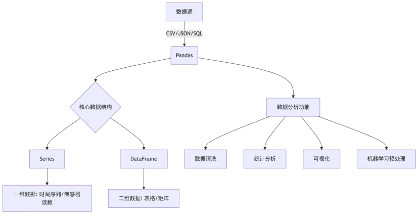 

**行业洞见**：根据2023年Kaggle调查，Pandas是数据科学家使用率最高的工具（占比93%），远超第二名Excel（占比32%）

 

 

### 3.1.2 **了解** **Pandas** **核心数据结构：**Series **和** **DataFrame**

Pandas 基于 Numpy，并提供了 2 大核心数据结构：

​	• **Series**：一维带有标签的数组

​	• **DataFrame**：二维表格结构，可看作多个 Series 的组合

用得最多的pandas对象是Series，一个一维的标签化数组对象，另一个是DataFrame，它是一个面向列的二维表结构。

| 特性         | Series             | DataFrame                     |
| ------------ | ------------------ | ----------------------------- |
| **维度**     | 一维               | 二维                          |
| **索引**     | 单索引             | 行索引+列名                   |
| **数据存储** | 同质化数据类型     | 各列可不同数据类型            |
| **类比**     | Excel单列          | 整张Excel工作表               |
| **创建方式** | pd.Series([1,2,3]) | pd.DataFrame({'col':[1,2,3]}) |

 

| 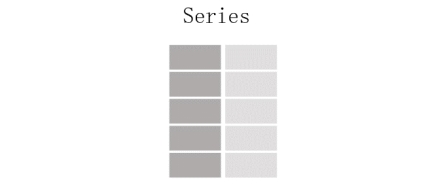 | 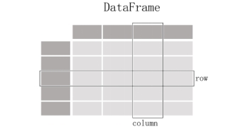 |
| ------------------------------------------------------------ | ------------------------------------------------------------ |
|                                                              |                                                              |

 

Pandas 与 Numpy 的关系与区别

就像学习数学要先掌握算术才能学代数一样，NumPy就是数据分析的"算术基础"。虽然可以直接用计算器（Pandas），但理解底层原理才能走得更远。

 

 

 

 

## ***3.2*** **核心数据结构**Series

### 3.2.1 **创建与访问**

#### **什么是**Series

类似于 NumPy 一维数组，但增加了 "标签"，可以理解为「一维标签化数组」

Series 是 Pandas 中的一个核心数据结构，类似于一个一维的数组，具有数据和索引。

Series 可以存储任何数据类型（整数、浮点数、字符串等），并通过标签（索引）来访问元素。Series 的数据结构是非常有用的，因为它可以处理各种数据类型，同时保持了高效的数据操作能力，比如可以通过标签来快速访问和操作数据。

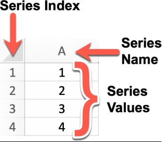 

Series 特点：

​	• 一维数组：Series 中的每个元素都有一个对应的索引值。

​	• 索引： 每个数据元素都可以通过标签（索引）来访问，默认情况下索引是从 0 开始的整数，但你也可以自定义索引。

​	• 数据类型： Series 可以容纳不同数据类型的元素，包括整数、浮点数、字符串、Python 对象等。

​	• 大小不变性：Series 的大小在创建后是不变的，但可以通过某些操作（如 append 或 delete）来改变。

​	• 操作：Series 支持各种操作，如数学运算、统计分析、字符串处理等。

​	• 缺失数据：Series 可以包含缺失数据，Pandas 使用NaN（Not a Number）来表示缺失或无值。

​	• 自动对齐：当对多个 Series 进行运算时，Pandas 会自动根据索引对齐数据，这使得数据处理更加高效。

我们可以使用 Pandas 库来创建一个 Series 对象，并且可以为其指定索引（Index）、名称（Name）以及值（Values）：

```python
import pandas as pd
s = pd.Series([10, 20, 30], index=["a", "b", "c"])
```


**创建**Series

 

##### 直接通过列表创建Series

```python
import pandas as pd
s = pd.Series([4, 7, -5, 3])
print(s)
# 0    4
# 1    7
# 2   -5
# 3    3
# dtype: int64
```


> Series的字符串表现形式为：索引在左边，值在右边。由于我们没有为数据指定索引，于是会自动创建一个0到N-1（N为数据的长度）的整数型索引。

 

##### 通过列表创建Series时指定索引

```python
s = pd.Series([4, 7, -5, 3], index=["a", "b", "c", "d"])
print(s)
# a    4
# b    7
# c   -5
# d    3
# dtype: int64
```

 

##### 通过列表创建Series时指定索引和名称

```python
s = pd.Series([4, 7, -5, 3], index=["a", "b", "c", "d"],name="hello_python")
print(s)
# a    4
# b    7
# c   -5
# d    3
# Name: hello_python, dtype: int6
```


**名称的作用，与变量名的区别**

在 Pandas 的 Series 中，name 参数用于给整个 Series 对象赋予一个名称。这个名称有以下几个用途：

1. **标识作用**

​	• name 可以作为 Series 的标识，类似于给数据列取一个名字。

​	• 当你打印 Series 时，name 会显示在输出的最下方（如你的例子所示）。

2. **DataFrame** **列名**

​	• 如果你将一个 Series 转换成 DataFrame 或与其他 DataFrame 合并，name 会自动成为列名。

​	• 例如：

```python
df = s.to_frame()  # 转换为 DataFrame，列名就是 "hello_python"
print(df)

#   hello_python
#a             4
#b             7
#c            -5
```


3. **对齐操作**

​	• 在 Pandas 运算（如 concat、merge 等）时，name 可以帮助对齐数据。

4. **导出数据**

​	• 当你将 Series 导出为 CSV 或其他格式时，name 会成为列名。

 

name 的主要作用是 给 Series 一个标识，方便后续数据处理、合并或导出。如果只是单独使用 Series，name 可能看起来作用不大，但在更复杂的数据操作中（如 DataFrame 整合），它会很有用。

 

##### 直接通过字典创建Series

```python
dic = {"a": 4, "b": 7, "c": -5, "d": 3}
s = pd.Series(dic)
print(s)
# a    4
# b    7
# c   -5
# d    3
# dtype: int64
s1 = pd.Series(dic,index=["a","c"],name="aacc")
print(s1)
# a    4
# c   -5
# Name: aacc, dtype: int64
```

 

#### **访问**Series数据

以下是 Pandas 中访问 Series 数据的主要方法汇总表格：

| **方法分类**      | **语法示例**     | **描述**                               | **返回值**    | **是否支持切片****/****布尔索引** |
| ----------------- | ---------------- | -------------------------------------- | ------------- | --------------------------------- |
| **位置索引**      | s.iloc[0]        | 通过整数位置访问（从0开始）            | 标量值        | 是                                |
|                   | s.iloc[1:3]      | 位置切片（左闭右开）                   | Series        |                                   |
| **标签索引**      | s.loc['a']       | 通过索引标签访问                       | 标量值        | 是                                |
|                   | s.loc[['a','b']] | 通过标签列表访问                       | Series        |                                   |
| **直接索引**      | s[0]             | 类似iloc（当索引非整数时可能混淆）     | 标量值/Series | 是                                |
|                   | s['a']           | 类似loc（优先标签索引）                |               |                                   |
| **布尔索引**      | s[s > 3]         | 通过布尔条件筛选                       | Series        | 是                                |
|                   | s[~(s > 3)]      | 取反条件                               |               |                                   |
| **函数访问**      | s.at['a']        | 快速访问单个标签（类似loc但效率更高）  | 标量值        | 否                                |
|                   | s.iat[0]         | 快速访问单个位置（类似iloc但效率更高） |               |                                   |
| **头部**/**尾部** | s.head(3)        | 访问前N行（默认5）                     | Series        | 否                                |
|                   | s.tail(2)        | 访问后N行（默认5）                     |               |                                   |
| **取唯一值**      | s.unique()       | 返回唯一值数组                         | ndarray       | 否                                |
| **值计数**        | s.value_counts() | 统计各值出现次数                       | Series        |                                   |

 

1. **优先使用loc**/**iloc**：直接索引[]的行为可能因索引类型不同而变化，明确场景时建议显式使用loc（标签）或iloc（位置）。
2. **切片差异**：

​	￮ loc切片为闭区间（包含两端）

​	￮ iloc切片为左闭右开（与Python列表一致）

3. **布尔索引**：常用于条件过滤，如s[s > 3 & s < 10]。

````python
s = pd.Series([10, 20, 30, 40], index=['a', 'b', 'c', 'd'])
# 位置索引
print(s.iloc[0])  # 10
# 标签访问
s["a"]    
# 标签索引
print(s.loc['b'])  # 20
# 布尔索引
print(s[s > 25])  # c:30, d:40
# 花式索引
print(s[['a', 'c']])  # a:10, c:30

#使用布尔索引从Series中筛选满足某些条件的值
bools = s > s.mean()  # 将大于平均值的元素标记为 True
print(bools)
# a    False
# b     True
# c     True
# d    False
# dtype: bool
print(s[bools])
# b    3.5
# c    6.8
# dtype: float64
# 使用where过滤
print(s.where(s > 20, -1))  # 小于等于20的值替换为-1
````

   


#### **Series**的常用属性

| **属性**              | **说明**                   |
| --------------------- | -------------------------- |
| **index**             | Series的索引对象           |
| **values**            | Series的值                 |
| **dtype**或**dtypes** | Series的元素类型           |
| **shape**             | Series的形状               |
| **ndim**              | Series的维度               |
| **size**              | Series的元素个数           |
| **name**              | Series的名称               |
| **loc[]**             | 显式索引，按标签索引或切片 |
| **iloc[]**            | 隐式索引，按位置索引或切片 |
| **at[]**              | 使用标签访问单个元素       |
| **iat[]**             | 使用位置访问单个元素       |

 ````python
 import pandas as pd
 arrs = pd.Series([11,22,33,44,55],name="atguigu",index=["a","b","c","d","e"])
 # print(arrs)
 # index Series的索引对象
 print(arrs.index)
 for i in arrs.index:
     print(i)
 print(arrs.values) # values    Series的值
 print(arrs.ndim)  # ndim  Series的维度
 print(arrs.shape)  # shape Series的形状
 print(arrs.size) # size  Series的元素个数
 # dtype或dtypes  Series的元素类型
 print(arrs.dtype)
 print(arrs.dtypes)
 # name  Series的名称
 print(arrs.name)
 # loc[] 显式索引，按标签索引或切片
 print(arrs.loc["c"])
 print(arrs.loc["c":"d"])
 # iloc[]    隐式索引，按位置索引或切片
 print(arrs.iloc[0])
 print(arrs.iloc[0:3])
 # at[]  使用标签访问单个元素
 print(arrs.at["a"])
 # iat[] 使用位置访问单个元素
 print(arrs.iat[3])
 ````


### 3.2.2 **Series**的运算

````python
s1 = pd.Series([1, 2, 3, 4])
s2 = pd.Series([10, 20, 30, 40])
# 基本运算
print(s1 + s2)  # 对应位置相加
print(s1 * 2)   # 标量乘法
````


 

### 3.2.3 **常用方法与统计**

| **用途分类** | **方法**          | **说明**                                                  | **示例代码**                       |
| ------------ | ----------------- | --------------------------------------------------------- | ---------------------------------- |
| 数据预览     | head()            | 查看前 n 行数据，默认 5 行                                | s.head(3)                          |
| 数据预览     | tail()            | 查看后 n 行数据，默认 5 行                                | s.tail(2)                          |
| 条件判断     | isin()            | 判断元素是否包含在参数集合中                              | s.isin([1, 2])                     |
| 缺失值处理   | isna()            | 判断是否为缺失值（如 NaN 或 None）                        | s.isna()                           |
| 聚合统计     | sum()             | 求和，自动忽略缺失值                                      | s.sum()                            |
| 聚合统计     | mean()            | 平均值                                                    | s.mean()                           |
| 聚合统计     | min()             | 最小值                                                    | s.min()                            |
| 聚合统计     | max()             | 最大值                                                    | s.max()                            |
| 聚合统计     | var()             | 方差                                                      | s.var()                            |
| 聚合统计     | std()             | 标准差                                                    | s.std()                            |
| 聚合统计     | median()          | 中位数                                                    | s.median()                         |
| 聚合统计     | mode()            | 众数（可返回多个）                                        | s.mode()                           |
| 聚合统计     | quantile(q)       | 分位数，q 取 0~1 之间                                     | s.quantile(0.25)                   |
| 聚合统计     | describe()        | 常见统计信息（count、mean、std、min、25%、50%、75%、max） | s.describe()                       |
| 频率统计     | value_counts()    | 每个唯一值的出现次数                                      | s.value_counts()                   |
| 频率统计     | count()           | 非缺失值数量                                              | s.count()                          |
| 频率统计     | nunique()         | 唯一值个数（去重）                                        | s.nunique()                        |
| 唯一处理     | unique()          | 获取去重后的值数组                                        | s.unique()                         |
| 唯一处理     | drop_duplicates() | 去除重复项                                                | s.drop_duplicates()                |
| 抽样分析     | sample()          | 随机抽样                                                  | s.sample(2)                        |
| 排序操作     | sort_index()      | 按索引排序                                                | s.sort_index()                     |
| 排序操作     | sort_values()     | 按值排序                                                  | s.sort_values()                    |
| 替换值       | replace()         | 替换值                                                    | s.replace({1: 100})                |
| 转换结构     | to_frame()        | 将 Series 转为 DataFrame                                  | s.to_frame()                       |
| 比较判断     | equals()          | 判断两个 Series 是否完全相等                              | s1.equals(s2)                      |
| 信息提取     | keys()            | 返回 Series 的索引对象                                    | s.keys()                           |
| 统计关系     | corr()            | 计算相关系数（默认皮尔逊）                                | s1.corr(s2)                        |
| 统计关系     | cov()             | 协方差                                                    | s1.cov(s2)                         |
| 可视化       | hist()            | 绘制直方图（需安装 matplotlib）                           | s.hist()                           |
| 遍历操作     | items()           | 返回索引和值的迭代器                                      | for i, v in s.items(): print(i, v) |

 ````python
 import pandas as pd
 import numpy as np
 arrs = pd.Series([11,22,np.nan,None,44,22],index=['a','b','c','d','e','f'])
 # head()    查看前n行数据，默认5行
 print(arrs.head())
 # tail()    查看后n行数据，默认5行
 print(arrs.tail(3))
 # describe()    常见统计信息
 print(arrs.describe())
 # count()   非缺失值元素的个数
 print(arrs.count())
 # keys()    返回Series的索引对象
 print(arrs.index)
 print(arrs.keys())
 # isin()    判断数组中的每一个元素是否包含在参数集合中
 print(arrs.isin([11]))
 # isna()    元素是否为缺失值
 print(arrs.isna())
 
 #统计
 # sum() 求和，会忽略 Series 中的缺失值
 print(arrs.sum())
 # mean()    平均值
 print(arrs.mean())
 # min() 最小值
 print(arrs.min())
 # max() 最大值
 print(arrs.max())
 # var() 方差 每个元素与平均值的差 的平方 的和
 print(arrs.var())
 # std() 标准差 方差的平方根
 print(arrs.std())
 # print(arrs.var())
 # median()  中位数
 # 若数据集的元素个数为奇数，中位数就是排序后位于中间位置的数值。
 # 若数据集的元素个数为偶数，中位数则是排序后中间两个数的平均值。
 # 去除缺失值之后，arrs 就变成了 [11, 22, 44, 22]。
 # 对 [11, 22, 44, 22] 进行排序，得到 [11, 22, 22, 44]
 print(arrs.median())
 # mode()    众数
 print(arrs.mode())
 # quantile()    指定位置的分位数，如quantile(0.5)
 # 分位数：分位数是把一组数据按照从小到大的顺序排列后，分割成若干等份的数值点。
 # 0.25 分位数就是将数据从小到大排序后，位于 25% 位置处的数值。
 # 插值方法：当计算分位数时，若位置不是整数，就需要借助插值方法来确定分位数值。# "midpoint" 插值方法是指当分位数位置处于两个数据点之间时，取这两个数据点的
 # 平均值作为分位数值。
 # 对于有 n个数据点的有序数据集，q分位数的位置 i可以通过公式 i=(n−1)q来计
 # 算。这里 n=4，q=0.25，则 i=(4−1)×0.25=0.75。这意味着 0.25 分位数处于第一个# 数据点（值为 11）和第二个数据点（值为 22）之间。使用 "midpoint" 插值方法，
 # 分位数值就是这两个数据点的平均值，即 (11+22)÷2=16.5
 print(arrs.quantile(0.25, interpolation="midpoint"))
 
 
 print(len(arrs))
 # drop_duplicates() 去重  这里可以看出，底层None也作为NaN处理
 print(arrs.drop_duplicates())
 # unique()  去重后的数组
 print(arrs.unique())
 # nunique() 去重后非缺失值元素元素个数
 print(arrs.nunique())
 # sample()  随机采样
 print(arrs.sample())
 # value_counts()    每个元素的个数
 print(arrs.value_counts())
 
 # sort_index()  按索引排序
 print(arrs.sort_index())
 
 # sort_values() 按值排序
 print(arrs.sort_values())
 # replace() 用指定值代替原有值
 print(arrs.replace(22,"haha"))
 
 # to_frame()    将Series转换为DataFrame
 print(arrs.to_frame())
 
 # equals()  判断两个Series是否相同
 arr1 = pd.Series([1,2,3])
 arr2 = pd.Series([1,2,3])
 print(arr1.equals(arr2))
 
 # corr()    计算与另一个Series的相关系数
 # arr1.corr(arr2)：由于 arr1 和 arr2 的值完全相同，它们之间是完全正相关的，
 #因此相关系数为 1。
 # arr1.corr(arr3)：arr1 的值是递增的，而 arr3 的值是递减的，它们之间是完全
 # 负相关的，所以相关系数为 -1。
 # arr1.corr(arr4)：arr1 和 arr4 的值都是递增的，且变化趋势一致，它们之间是
 # 完全正相关的，相关系数为 1。
 # arr5.corr(arr6)：arr5 和 arr6 的值之间没有明显的线性关系，它们的相关系数
 # 为 0。
 arr3 = pd.Series([3,2,1])
 arr4 = pd.Series([6,7,8])
 arr5 = pd.Series([1, -1, 1, -1])
 arr6 = pd.Series([1, 1, -1, -1])
 print(arr1.corr(arr2))
 print(arr1.corr(arr3))
 print(arr1.corr(arr4))
 print(arr5.corr(arr6))
 
 # cov() 计算与另一个Series的协方差
 # 协方差用于衡量两个变量的总体误差，其值的正负表示两个变量的变化方向关系：
 # 正值表示同向变化，负值表示反向变化。
 print(arr1.cov(arr3))
 ````

 


 

### 3.2.4  **统计实例**

#### **学生成绩统计**

创建一个包含10名学生数学成绩的Series，成绩范围在50-100之间。计算平均分、最高分、最低分，并找出高于平均分的学生人数。

````python
import pandas as pd
import numpy as np

# 生成随机成绩
np.random.seed(42)
scores = pd.Series(np.random.randint(50, 101, 10), 
                  index=['学生'+str(i) for i in range(1, 11)])

# 你的代码...
````


 ````python
 import pandas as pd
 import numpy as np
 
 # 生成随机成绩
 np.random.seed(42)
 scores = pd.Series(np.random.randint(50, 101, 10), 
                   index=['学生'+str(i) for i in range(1, 11)])
 
 # 计算统计量
 mean_score = scores.mean()
 max_score = scores.max()
 min_score = scores.min()
 above_avg = scores[scores > mean_score].count()
 
 print(f"平均分: {mean_score:.1f}")
 print(f"最高分: {max_score}")
 print(f"最低分: {min_score}")
 print(f"高于平均分的学生人数: {above_avg}")
 ````


 

#### **温度数据分析**

给定某城市一周每天的最高温度Series，完成以下任务：

找出温度超过30度的天数

计算平均温度

将温度从高到低排序

找出温度变化最大的两天

 ````python
 temperatures = pd.Series([28, 31, 29, 32, 30, 27, 33], 
                          index=['周一', '周二', '周三', '周四', '周五', '周六', '周日'])
 ````

diff  

abs 

nlargest()

tolist()

````python
temperatures = pd.Series([28, 31, 29, 32, 30, 27, 33], 
                         index=['周一', '周二', '周三', '周四', '周五', '周六', '周日'])

# 1. 找出温度超过30度的天数
hot_days = temperatures[temperatures > 30].count()

# 2. 计算平均温度
avg_temp = temperatures.mean()

# 3. 将温度从高到低排序
sorted_temp = temperatures.sort_values(ascending=False)

# 4. 找出温度变化最大的两天
temp_diff = temperatures.diff().abs()
max_diff_days = temp_diff.nlargest(2).index.tolist()

print(f"超过30度的天数: {hot_days}")
print(f"平均温度: {avg_temp:.1f}")
print("温度排序:\n", sorted_temp)
print(f"温度变化最大的两天: {max_diff_days}")
````


 

#### **股票价格分析**

给定某股票连续10个交易日的收盘价Series：

计算每日收益率（当日收盘价/前日收盘价 - 1）

找出收益率最高和最低的日期

计算波动率（收益率的标准差）

````python
prices = pd.Series([102.3, 103.5, 105.1, 104.8, 106.2, 107.0, 106.5, 108.1, 109.3, 110.2],
                  index=pd.date_range('2023-01-01', periods=10))

prices = pd.Series([102.3, 103.5, 105.1, 104.8, 106.2, 107.0, 106.5, 108.1, 109.3, 110.2],
                  index=pd.date_range('2023-01-01', periods=10))

# 1. 计算每日收益率
returns = prices.pct_change()

# 2. 找出收益率最高和最低的日期
max_return_date = returns.idxmax()
min_return_date = returns.idxmin()

# 3. 计算波动率
volatility = returns.std()

print("每日收益率:\n", returns)
print(f"收益率最高的日期: {max_return_date}")
print(f"收益率最低的日期: {min_return_date}")
print(f"波动率: {volatility:.4f}")
````


#### **销售数据分析**

某产品过去12个月的销售量Series：

计算季度平均销量（每3个月为一个季度）

找出销量最高的月份

计算月环比增长率

找出连续增长超过2个月的月份

 ````python
 sales = pd.Series([120, 135, 145, 160, 155, 170, 180, 175, 190, 200, 210, 220],
                  index=pd.date_range('2022-01-01', periods=12, freq='M'))
 ````


resample('Q')

常用频率别名（rule 参数）

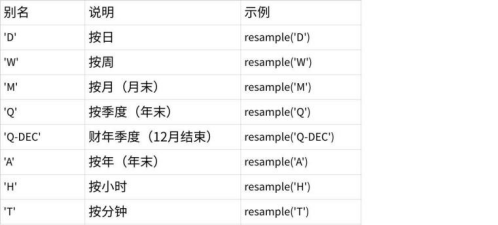

 ````python
 sales = pd.Series([120, 135, 145, 160, 155, 170, 180, 175, 190, 200, 210, 220],
                  index=pd.date_range('2022-01-01', periods=12, freq='M'))
 
 # 1. 计算季度平均销量
 quarterly_avg = sales.resample('Q').mean()
 
 # 2. 找出销量最高的月份
 max_sales_month = sales.idxmax()
 
 # 3. 计算月环比增长率
 mom_growth = sales.pct_change()
 
 # 4. 找出连续增长超过2个月的月份
 growth_mask = mom_growth > 0
 consecutive_growth = growth_mask.rolling(3).sum() >= 2
 growth_months = sales[consecutive_growth].index
 
 print("季度平均销量:\n", quarterly_avg)
 print(f"销量最高的月份: {max_sales_month}")
 print("月环比增长率:\n", mom_growth)
 print("连续增长超过2个月的月份:", growth_months.tolist())
 ````

 

#### **数据合并与计算**

有两个Series分别记录了某产品在两个城市的日销量：

计算两个城市的总日销量

找出哪个城市的销量更高

计算两个城市销量的相关系数

 ````python
 city_a = pd.Series([120, 135, 140, 130, 145],
                   index=pd.date_range('2023-01-01', periods=5))
 city_b = pd.Series([110, 125, 150, 140, 130],
                   index=pd.date_range('2023-01-01', periods=5))
 ````


答案：

````python
city_a = pd.Series([120, 135, 140, 130, 145],
                  index=pd.date_range('2023-01-01', periods=5))
city_b = pd.Series([110, 125, 150, 140, 130],
                  index=pd.date_range('2023-01-01', periods=5))

# 1. 计算两个城市的总日销量
total_sales = city_a + city_b

# 2. 找出哪个城市的销量更高
city_a_total = city_a.sum()
city_b_total = city_b.sum()
higher_sales_city = 'A' if city_a_total > city_b_total else 'B'

# 3. 计算两个城市销量的相关系数
correlation = city_a.corr(city_b)

print("总日销量:\n", total_sales)
print(f"总销量更高的城市: {higher_sales_city}")
print(f"两个城市销量的相关系数: {correlation:.2f}")
````

 

## **3.3 **核心数据结构：DataFrame

### 3.3.1  **创建与访问**

#### **什么是** **DataFrame**？

DataFrame 是 Pandas 中的核心数据结构之一，多行多列表格数据，类似于 **Excel** **表格** 或 **SQL** **查询结果**。
 它是一个 **二维表格结构**，具有行索引（index）和列标签（columns）。

```python
df = pd.DataFrame({
    "name": ["Alice", "Bob"],
    "score": [90, 80]
})
```


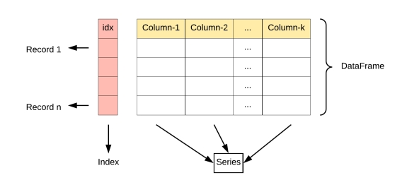 

DataFrame中的数据是以一个或多个二维块存放的（而不是列表、字典或别的一维数据结构）。它可以被看做由Series组成的字典（共同用一个索引）。提供了各种功能来进行数据访问、筛选、分割、合并、重塑、聚合以及转换等操作，广泛用于数据分析、清洗、转换、可视化等任务。

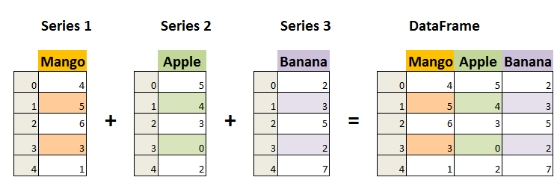 

#### **DataFrame**的创建

```python
# 通过series来创建
import pandas as pd
import numpy as np
np.random.seed(42)
s1 = pd.Series(np.random.randint(0,10,6))
np.random.seed(41)
s2 = pd.Series(np.random.randint(0,20,6))
df = pd.DataFrame({"s1":s1,"s2":s2})
```


直接通过字典创建DataFrame

```python
import pandas as pd
df = pd.DataFrame({    "name": ["Alice", "Bob"],    "score": [90, 80]})
print(df)
df = pd.DataFrame({"id": [101, 102, 103], 
"name": ["张三", "李四", "王五"], "age": [20, 30, 40]})
print(df)
#     id name  age
# 0  101   张三   20
# 1  102   李四   30
# 2  103   王五   40
```


通过字典创建时指定列的顺序和行索引

```python
df = pd.DataFrame(
    data={"age": [20, 30, 40], 
    "name": ["张三", "李四", "王五"]}, 
    columns=["name", "age"], index=[101, 102, 103]
)
print(df)
#     name  age
# 101   张三   20
# 102   李四   30
# 103   王五   40
```


#### **获取**DataFrame数据

| **方法分类**      | **语法示例**                     | **描述**                                                 | **返回值类型**   | **是否支持切片****/****条件索引** |
| ----------------- | -------------------------------- | -------------------------------------------------------- | ---------------- | --------------------------------- |
| **列选择**        | df['col']                        | 选择单列（返回Series）                                   | Series           | ❌                                 |
|                   | df[['col1', 'col2']]             | 选择多列（返回DataFrame）                                | DataFrame        |                                   |
| **行选择**        | df.loc[row_label]                | 通过行标签选择单行（返回Series）                         | Series           | ✅（标签切片）                     |
|                   | df.loc[start:end]                | 通过标签切片选择多行（闭区间）                           | DataFrame        |                                   |
|                   | df.iloc[row_index]               | 通过行位置选择单行（从0开始）                            | Series           | ✅（位置切片）                     |
|                   | df.iloc[start:end]               | 通过位置切片选择多行（左闭右开）                         | DataFrame        |                                   |
| **行列组合选择**  | df.loc[row_labels, col_labels]   | 通过标签选择行和列（如df.loc['a':'b', ['col1','col2']]） | Series/DataFrame | ✅                                 |
|                   | df.iloc[row_idx, col_idx]        | 通过位置选择行和列（如df.iloc[0:2, [1,3]]）              | Series/DataFrame |                                   |
| **条件筛选**      | df[df['col'] > 3]                | 通过布尔条件筛选行                                       | DataFrame        | ✅                                 |
|                   | df.query("col1 > 3 & col2 < 10") | 使用表达式筛选（需字符串表达式）                         | DataFrame        |                                   |
| **快速访问**      | df.at[row_label, 'col']          | 快速访问单个值（标签索引，高效）                         | 标量值           | ❌                                 |
|                   | df.iat[row_idx, col_idx]         | 快速访问单个值（位置索引，高效）                         | 标量值           |                                   |
| **头部**/**尾部** | df.head(n)                       | 返回前n行（默认5）                                       | DataFrame        | ❌                                 |
|                   | df.tail(n)                       | 返回后n行（默认5）                                       | DataFrame        |                                   |
| **样本抽样**      | df.sample(n=3)                   | 随机抽取n行                                              | DataFrame        |                                   |
| **索引重置**      | df.reset_index()                 | 重置索引（原索引变为列）                                 | DataFrame        |                                   |
| **设置索引**      | df.set_index('col')              | 指定某列作为新索引                                       | DataFrame        |                                   |

 

1. **loc** vs iloc 

​	￮ loc：基于**标签**（index/column names），切片为**闭区间**（如df.loc['a':'c']包含'c'）。 

​	￮ iloc：基于**整数位置**（从0开始），切片为**左闭右开**（如df.iloc[0:2]不包含索引2）。 

 

2. **布尔条件筛选** 

​	￮ 支持组合条件（需用&、|，并用括号分隔条件）： 

```python
df[(df['col1'] > 3) & (df['col2'] == 'A')]
```

 

3. **at**/**iat** vs **loc**/**iloc** 

​	￮ at/iat：仅用于**访问单个值**，速度更快。 

​	￮ loc/iloc：支持多行/列选择，功能更灵活。 

获取一列数据

```python
# 访问数据
print(df['name'])  #访问某列数据
print(df.score)
 # df["col"] / df.col
df["name"]       # 返回 Series
df.name      
df[["name"]]     # 返回 DataFrame
```


获取多列数据

```python
df[["date", "temp_max", "temp_min"]]  # 获取多列数据
print(df[['name','score']]) # 访问多列数据
```


获取行数据

**loc**：通过行标签获取数据

```python
df.loc[1]  # 获取行标签为1的数据
df.loc[[1, 10, 100]]  # 获取行标签分别为1、10、100的数据
```


**iloc**：通过行位置获取数据

```python
df.iloc[0]  # 获取行位置为0的数据
df.iloc[-1]  # 获取行位置为最后一位的数据
```


获取指定单元格

```python
df.loc[101, "name"]    # 标签访问
df.iloc[0, 1]          # 位置访问
df.loc[1, "precipitation"]  # 获取行标签为1，列标签为precipitation的数据
df.loc[:, "precipitation"]  # 获取所有行，列标签为precipitation的数据
df.iloc[:, [3, 5, -1]]  # 获取所有行，列位置为3，5，最后一位的数据
df.iloc[:10, 2:6]  # 获取前10行，列位置为2、3、4、5的数据
df.loc[:10, ["date", "precipitation", "temp_max", "temp_min"]]  # 通过行列标签获取数据
```

 

查看部分数据

通过head()、tail()获取前n行或后n行

```python
print(df.head())
print(df.tail(10))
```


使用布尔索引筛选数据

```python
# 条件筛选
df['score']>70
print(df[df.score>70])
print(df[(df['score']>70) & (df['age']<20)])
# 随机抽样
df.sample(2)
```


#### **常用属性**

| **属性**    | **说明**                       |
| ----------- | ------------------------------ |
| **index**   | DataFrame的行索引              |
| **columns** | DataFrame的列标签              |
| **values**  | DataFrame的值                  |
| **ndim**    | DataFrame的维度                |
| **shape**   | DataFrame的形状                |
| **size**    | DataFrame的元素个数            |
| **dtypes**  | DataFrame的元素类型            |
| **T**       | 行列转置                       |
| **loc[]**   | 显式索引，按行列标签索引或切片 |
| **iloc[]**  | 隐式索引，按行列位置索引或切片 |
| **at[]**    | 使用行列标签访问单个元素       |
| **iat[]**   | 使用行列位置访问单个元素       |

 ```python
 import pandas as pd
 df = pd.DataFrame(data={"id": [101, 102, 103], "name": ["张三", "李四", "王五"], "age": [20, 30, 40]},index=["aa", "bb", "cc"])
 # index DataFrame的行索引
 print(df.index)
 # columns   DataFrame的列标签
 print(df.columns)
 # values    DataFrame的值
 print(df.values)
 # ndim  DataFrame的维度
 print(df.ndim)
 # shape DataFrame的形状
 print(df.shape)
 # size  DataFrame的元素个数
 print(df.size)
 # dtypes    DataFrame的元素类型
 print(df.dtypes)
 # T 行列转置
 print(df.T)
 # loc[] 显式索引，按行列标签索引或切片 逗号前是行切片规则，后是列切片规则
 print(df.loc["aa":"cc"])
 print(df.loc[:,["id","name"]])
 # iloc[]    隐式索引，按行列位置索引或切片
 print(df.iloc[0:1])
 print(df.iloc[0:3,2])
 print("----------")
 # at[]  使用行列标签访问单个元素
 print(df.at["aa","name"])
 # iat[] 使用行列位置访问单个元素
 print(df.iat[0,1])
 ```


 

### 3.3.2 **常用方法与统计**

| **方法**              | **说明**                                                     |
| --------------------- | ------------------------------------------------------------ |
| **head()**            | 查看前n行数据，默认5行                                       |
| **tail()**            | 查看后n行数据，默认5行                                       |
| **isin()**            | 元素是否包含在参数集合中                                     |
| **isna()**            | 元素是否为缺失值                                             |
| **sum()**             | 求和                                                         |
| **mean()**            | 平均值                                                       |
| **min()**             | 最小值                                                       |
| **max()**             | 最大值                                                       |
| **var()**             | 方差                                                         |
| **std()**             | 标准差                                                       |
| **median()**          | 中位数                                                       |
| **mode()**            | 众数                                                         |
| **quantile()**        | 指定位置的分位数，如quantile(0.5)                            |
| **describe()**        | 常见统计信息                                                 |
| **info()**            | 基本信息                                                     |
| **value_counts()**    | 每个元素的个数                                               |
| **count()**           | 非空元素的个数                                               |
| **drop_duplicates()** | 去重                                                         |
| **sample()**          | 随机采样                                                     |
| **replace()**         | 用指定值代替原有值                                           |
| **equals()**          | 判断两个DataFrame是否相同                                    |
| **cummax()**          | 累计最大值                                                   |
| **cummin()**          | 累计最小值                                                   |
| **cumsum()**          | 累计和                                                       |
| **cumprod()**         | 累计积                                                       |
| **diff()**            | 一阶差分，对序列中的元素进行差分运算，也就是用当前元素减去前一个元素得到差值，默认情况下，它会计算一阶差分，即相邻元素之间的差值。参数：periods：整数，默认为 1。表示要向前或向后移动的周期数，用于计算差值。正数表示向前移动，负数表示向后移动。axis：指定计算的轴方向。0 或 'index' 表示按列计算，1 或 'columns' 表示按行计算，默认值为 0。 |
| **sort_index()**      | 按行索引排序                                                 |
| **sort_values()**     | 按某列的值排序，可传入列表来按多列排序，并通过ascending参数设置升序或降序 |
| **nlargest()**        | 返回某列最大的n条数据                                        |
| **nsmallest()**       | 返回某列最小的n条数据                                        |

 ```python
 import pandas as pd
 df = pd.DataFrame(data={"id": [101, 102, 103,104,105,106,101], "name": ["张三", "李四", "王五","赵六","冯七","周八","张三"], "age": [10, 20, 30, 40, None, 60,10]},index=["aa", "bb", "cc", "dd", "ee", "ff","aa"])
 # head()    查看前n行数据，默认5行
 print(df.head())
 # tail()    查看后n行数据，默认5行
 print(df.tail())
 # isin()    元素是否包含在参数集合中
 print(df.isin([103,106]))
 # isna()    元素是否为缺失值
 print(df.isna())
 # sum() 求和
 print(df["age"].sum())
 # mean()    平均值
 print(df["age"].mean())
 # min() 最小值
 print(df["age"].min())
 # max() 最大值
 print(df["age"].max())
 # var() 方差
 print(df["age"].var())
 # std() 标准差
 print(df["age"].std())
 # median()  中位数
 print(df["age"].median())
 # mode()    众数
 print(df["age"].mode())
 # quantile()    指定位置的分位数，如quantile(0.5)
 print(df["age"].quantile(0.5))
 # describe()    常见统计信息
 print(df.describe())
 # info()    基本信息
 print(df.info())
 # value_counts()    每个元素的个数
 print(df.value_counts())
 # count()   非空元素的个数
 print(df.count())
 # drop_duplicates() 去重  duplicated()判断是否为重复行
 print(df.duplicated(subset="age"))
 # sample()  随机采样
 print(df.sample())
 # replace() 用指定值代替原有值
 print("----------------")
 print(df.replace(20,"haha"))
 
 # cummax()  累计最大值
 df3 = pd.DataFrame({'A': [2, 5, 3, 7, 4],'B': [1, 6, 2, 8, 3]})
 # 按列  等价于axis=0 默认
 print(df3.cummax(axis="index"))
 # 按行  等价于axis=1
 print(df3.cummax(axis="columns"))
 # cummin()  累计最小值
 print(df3.cummin())
 # cumsum()  累计和
 print(df3.cumsum())
 # cumprod() 累计积
 print(df3.cumprod())
 # diff()    一阶差分
 print(df3.diff())
 # sort_index()  按行索引排序
 print(df.sort_index())
 # sort_values() 按某列的值排序，可传入列表来按多列排序，并通过ascending参数设置升序或降序
 print(df.sort_values(by="age"))
 # nlargest()    返回某列最大的n条数据
 print(df.nlargest(n=2,columns="age"))
 # nsmallest()   返回某列最小的n条数据
 print(df.nsmallest(n=1,columns="age"))
 ```


### 3.3.3 **运算**

标量运算

标量与每个元素进行计算。

 ```python
 df = pd.DataFrame(data={"age": [20, 30, 40, 10], "name": ["张三", "李四", "王五", "赵六"]},
     columns=["name", "age"],
     index=[101, 104, 103, 102],
 )
 print(df * 2)
 #      name  age
 # 101  张三张三   40
 # 104  李四李四   60
 # 103  王五王五   80
 # 102  赵六赵六   20
 
 df1 = pd.DataFrame(
     data={"age": [10, 20, 30, 40], "name": ["张三", "李四", "王五", "赵六"]},
     columns=["name", "age"],
     index=[101, 102, 103, 104],
 )
 df2 = pd.DataFrame(
     data={"age": [10, 20, 30, 40], "name": ["张三", "李四", "王五", "田七"]},
     columns=["name", "age"],
     index=[102, 103, 104, 105],
 )
 print(df1 + df2)
 #      name   age
 # 101   NaN   NaN
 # 102  李四张三  30.0
 # 103  王五李四  50.0
 # 104  赵六王五  70.0
 # 105   NaN   NaN
 ```


### 3.3.4  **案例练习**

#### **案例**1：学生成绩分析

**场景**：某班级的学生成绩数据如下，请完成以下任务：

1. 计算每位学生的总分和平均分。
2. 找出数学成绩高于90分或英语成绩高于85分的学生。
3. 按总分从高到低排序，并输出前3名学生。

  ```python
  import pandas as pd
  
  data = {
      '姓名': ['张三', '李四', '王五', '赵六', '钱七'],
      '数学': [85, 92, 78, 88, 95],
      '英语': [90, 88, 85, 92, 80],
      '物理': [75, 80, 88, 85, 90]
  }
  df = pd.DataFrame(data)
  
  # 1. 计算总分和平均分
  df['总分'] = df[['数学', '英语', '物理']].sum(axis=1)
  df['平均分'] = df['总分'] / 3
  
  # 2. 找出数学>90或英语>85的学生
  high_scores = df[(df['数学'] > 90) | (df['英语'] > 85)]
  
  # 3. 按总分排序并输出前3名
  top3 = df.sort_values('总分', ascending=False).head(3)
  
  print("总分和平均分：\n", df)
  print("\n数学>90或英语>85的学生：\n", high_scores)
  print("\n总分前3名学生：\n", top3)
  ```

#### **案例**2：销售数据分析

**场景**：某公司销售数据如下，请完成以下任务：

1. 计算每种产品的总销售额（销售额 = 单价 × 销量）。
2. 找出销售额最高的产品。
3. 按销售额从高到低排序，并输出所有产品信息。

  ```python
  import pandas as pd
  
  data = {
      '产品名称': ['A', 'B', 'C', 'D'],
      '单价': [100, 150, 200, 120],
      '销量': [50, 30, 20, 40]
  }
  df = pd.DataFrame(data)
  
  # 1. 计算总销售额
  df['销售额'] = df['单价'] * df['销量']
  
  # 2. 找出销售额最高的产品
  max_sales = df[df['销售额'] == df['销售额'].max()]
  
  # 3. 按销售额排序
  sorted_df = df.sort_values('销售额', ascending=False)
  
  print("销售额计算：\n", df)
  print("\n销售额最高的产品：\n", max_sales)
  print("\n按销售额排序：\n", sorted_df)
  ```

 

 **案例**3**：员工考勤统计**

**场景**：某部门员工考勤数据如下，请完成以下任务：

1. 计算每位员工的出勤率（出勤率 = 出勤天数 / 工作日总数）。
2. 标记出勤率低于80%的员工。
3. 按出勤率从高到低排序。

```python
import pandas as pd

data = {
    '姓名': ['张三', '李四', '王五', '赵六'],
    '出勤天数': [20, 15, 18, 22],
    '工作日总数': [25, 20, 25, 25]
}
df = pd.DataFrame(data)

# 1. 计算出勤率
df['出勤率'] = (df['出勤天数'] / df['工作日总数']).round(2)

# 2. 标记出勤率<80%的员工
df['需关注'] = df['出勤率'] < 0.8

# 3. 按出勤率排序
sorted_df = df.sort_values('出勤率', ascending=False)

print("出勤率统计：\n", df)
print("\n出勤率排序：\n", sorted_df)
```

 

#### **案例**4**：电影评分分析**

**场景**：某电影评分数据如下，请完成以下任务：

1. 计算每部电影的平均评分。
2. 找出评分高于8.5的电影。
3. 按平均评分从高到低排序。

 ```python
 import pandas as pd
 
 data = {
     '电影名称': ['电影A', '电影B', '电影C', '电影D'],
     '评分1': [9.0, 8.5, 8.0, 7.5],
     '评分2': [8.5, 9.0, 8.5, 8.0],
     '评分3': [9.5, 8.0, 7.5, 7.0]
 }
 df = pd.DataFrame(data)
 
 # 1. 计算平均评分
 df['平均评分'] = df[['评分1', '评分2', '评分3']].mean(axis=1).round(2)
 
 # 2. 找出评分>8.5的电影
 high_rated = df[df['平均评分'] > 8.5]
 
 # 3. 按平均评分排序
 sorted_df = df.sort_values('平均评分', ascending=False)
 
 print("平均评分：\n", df)
 print("\n评分>8.5的电影：\n", high_rated)
 print("\n按评分排序：\n", sorted_df)
 ```


#### **案例**5**：股票价格分析**

**场景**：某股票价格数据如下，请完成以下任务：

1. 计算每日股价的涨跌幅（涨跌幅 = (当日收盘价 - 前一日收盘价) / 前一日收盘价）。
2. 找出涨幅超过5%的日期。
3. 按日期排序，并输出涨跌幅最高的日期。

 ```python
 import pandas as pd
 
 data = {
     '日期': ['2023-01-01', '2023-01-02', '2023-01-03', '2023-01-04'],
     '收盘价': [100, 105, 110, 102]
 }
 df = pd.DataFrame(data)
 df['日期'] = pd.to_datetime(df['日期'])
 
 # 1. 计算涨跌幅
 df['涨跌幅'] = df['收盘价'].pct_change().round(4)
 
 # 2. 找出涨幅>5%的日期
 high_increase = df[df['涨跌幅'] > 0.05]
 
 # 3. 按日期排序并输出最高涨跌幅日期
 sorted_df = df.sort_values('日期')
 max_increase_date = df.loc[df['涨跌幅'].idxmax(), '日期']
 
 print("涨跌幅计算：\n", df)
 print("\n涨幅>5%的日期：\n", high_increase)
 print("\n涨跌幅最高的日期：\n", max_increase_date)
 ```

**案例**6**：电商用户行为分析（基础版）**

**场景**：某电商平台的用户行为数据如下，请完成以下任务： 

1. 计算每位用户的**总消费金额**（消费金额 = 商品单价 × 购买数量） 
2. 找出**消费金额最高的用户**，并输出其所有信息 
3. 计算所有用户的**平均消费金额**（保留2位小数） 
4. 统计**电子产品**的总购买数量 

 ```python
 import pandas as pd
 
 data = {
     '用户ID': [101, 102, 103, 104, 105],
     '用户名': ['Alice', 'Bob', 'Charlie', 'David', 'Eve'],
     '商品类别': ['电子产品', '服饰', '电子产品', '家居', '服饰'],
     '商品单价': [1200, 300, 800, 150, 200],
     '购买数量': [1, 3, 2, 5, 4]
 }
 df = pd.DataFrame(data)
 ```


参考答案（不使用groupby和apply）

```python
import pandas as pd

data = {
    '用户ID': [101, 102, 103, 104, 105],
    '用户名': ['Alice', 'Bob', 'Charlie', 'David', 'Eve'],
    '商品类别': ['电子产品', '服饰', '电子产品', '家居', '服饰'],
    '商品单价': [1200, 300, 800, 150, 200],
    '购买数量': [1, 3, 2, 5, 4]
}
df = pd.DataFrame(data)

# 1. 计算总消费金额
df['消费金额'] = df['商品单价'] * df['购买数量']

# 2. 找出消费金额最高的用户
max_spend_user = df[df['消费金额'] == df['消费金额'].max()]

# 3. 计算平均消费金额
avg_spend = round(df['消费金额'].mean(), 2)

# 4. 统计电子产品的总购买数量
electronic_total = df[df['商品类别'] == '电子产品']['购买数量'].sum()

print("用户消费分析：\n", df)
print("\n消费金额最高的用户：\n", max_spend_user)
print("\n平均消费金额：", avg_spend)
print("电子产品总购买数量：", electronic_total)
```


 

**输出示例**：

```python
用户消费分析：
    用户ID     用户名  商品类别  商品单价  购买数量  消费金额
0   101    Alice  电子产品   1200       1   1200
1   102      Bob     服饰    300       3    900
2   103  Charlie  电子产品    800       2   1600
3   104    David     家居    150       5    750
4   105      Eve     服饰    200       4    800

消费金额最高的用户：
    用户ID     用户名  商品类别  商品单价  购买数量  消费金额
2   103  Charlie  电子产品    800       2   1600

平均消费金额： 1050.0
电子产品总购买数量： 3
```


 

## **3.4 **数据的导入与导出
### 导出数据

| **方法**           | **说明**                                                     |
| ------------------ | ------------------------------------------------------------ |
| **to_csv()**       | 将数据保存为csv格式文件，数据之间以逗号分隔，可通过sep参数设置使用其他分隔符，可通过index参数设置是否保存行标签，可通过header参数设置是否保存列标签。 |
| **to_pickle()**    | 如要保存的对象是计算的中间结果，或者保存的对象以后会在Python中复用，可把对象保存为.pickle文件。如果保存成pickle文件，只能在python中使用。文件的扩展名可以是.p、.pkl、.pickle。 |
| **to_excel()**     | 保存为Excel文件，需安装openpyxl包。                          |
| **to_clipboard()** | 保存到剪切板。                                               |
| **to_dict()**      | 保存为字典。                                                 |
| **to_hdf()**       | 保存为HDF格式，需安装tables包。                              |
| **to_html()**      | 保存为HTML格式，需安装lxml、html5lib、beautifulsoup4包。     |
| **to_json()**      | 保存为JSON格式。                                             |
| **to_feather()**   | feather是一种文件格式，用于存储二进制对象。feather对象也可以加载到R语言中使用。feather格式的主要优点是在Python和R语言之间的读写速度要比csv文件快。feather数据格式通常只用中间数据格式，用于Python和R之间传递数据，一般不用做保存最终数据。需安装pyarrow包。 |
| **to_sql()**       | 保存到数据库。                                               |

 ```python
 import os
 import pandas as pd
 
 os.makedirs("data", exist_ok=True)
 df = pd.DataFrame({"age": [20, 30, 40, 10], "name": ["张三", "李四", "王五", "赵六"], "id": [101, 102, 103, 104]})
 df.set_index("id", inplace=True)
 
 df.to_csv("data/df.csv")
 df.to_csv("data/df.tsv", sep="\t")  # 设置分隔符为 \t
 df.to_csv("data/df_noindex.csv", index=False)  # index=False 不保存行索引
 df.to_pickle("data/df.pkl")
 df.to_excel("data/df.xlsx")
 df.to_clipboard()
 df_dict = df.to_dict()
 df.to_hdf("data/df.h5", key="df")
 df.to_html("data/df.html")
 df.to_json("data/df.json")
 df.to_feather("data/df.feather")
 ```

 

### 导入数据

| **方法**             | **说明**                                                     |
| -------------------- | ------------------------------------------------------------ |
| **read_csv()**       | 加载csv格式的数据。可通过sep参数指定分隔符，可通过index_col参数指定行索引。 |
| **read_pickle()**    | 加载pickle格式的数据。                                       |
| **read_excel()**     | 加载Excel格式的数据。                                        |
| **read_clipboard()** | 加载剪切板中的数据。                                         |
| **read_hdf()**       | 加载HDF格式的数据。                                          |
| **read_html()**      | 加载HTML格式的数据。                                         |
| **read_json()**      | 加载JSON格式的数据。                                         |
| **read_feather()**   | 加载feather格式的数据。                                      |
| **read_sql()**       | 加载数据库中的数据。                                         |

 ```python
 df_csv = pd.read_csv("data/df.csv", index_col="id")  # 指定行索引
 df_tsv = pd.read_csv("data/df.tsv", sep="\t")  # 指定分隔符
 df_pkl = pd.read_pickle("data/df.pkl")
 df_excel = pd.read_excel("data/df.xlsx", index_col="id")
 df_clipboard = pd.read_clipboard(index_col="id")
 df_from_dict = pd.DataFrame(df_dict)
 df_hdf = pd.read_hdf("data/df.h5", key="df")
 df_html = pd.read_html("data/df.html", index_col=0)[0]
 df_json = pd.read_json("data/df.json")
 df_feather = pd.read_feather("data/df.feather")
 
 print(df_csv)
 print(df_tsv)
 print(df_pkl)
 print(df_excel)
 print(df_clipboard)
 print(df_from_dict)
 print(df_hdf)
 print(df_html)
 print(df_json)
 print(df_feather)
 ```


 

## ***3.5*** **数据清洗与预处理**

| **章节**                    | **核心内容**                           | **关键知识点**                                               |
| --------------------------- | -------------------------------------- | ------------------------------------------------------------ |
| **1.** **缺失值处理**       | 检测、删除和填充缺失值的方法           | isna(), dropna(), fillna(), 前向/后向填充, 均值/中位数填充   |
| **2.** **重复数据处理**     | 识别和删除重复行                       | duplicated(), drop_duplicates(), 按列去重, 保留首次/最后一次出现 |
| **3.** **数据类型转换**     | 强制类型转换、日期/分类数据处理        | astype(), to_datetime(), 分类数据优化, 数值格式化            |
| **4.** **数据重塑与变形**   | 行列转置、宽表长表转换、分列操作       | T转置, melt(), pivot(), str.split()分列                      |
| **5.** **文本数据处理**     | 字符串清洗、正则提取、大小写转换       | str.lower(), str.replace(), str.extract(), 空格处理          |
| **6.** **数据分箱与离散化** | 数值分箱（等宽/等频）                  | pd.cut(), pd.qcut(), 离散化应用场景                          |
| **7.** **其他常用转换**     | 重命名列、索引操作、函数应用、内存优化 | rename(), set_index(), apply(), 类型优化减少内存占用         |

### 3.5.1. **缺失值处理**

| **方法**/**操作** | **语法示例**               | **描述**                              |
| ----------------- | -------------------------- | ------------------------------------- |
| 检测缺失值        | df.isna() 或 df.isnull()   | 返回布尔矩阵，标记缺失值（NaN或None） |
| 统计缺失值        | df.isna().sum()            | 每列缺失值数量统计                    |
| 删除缺失值        | df.dropna()                | 删除包含缺失值的行（默认）            |
|                   | df.dropna(axis=1)          | 删除包含缺失值的列                    |
|                   | df.dropna(subset=['col1']) | 仅删除指定列的缺失值行                |
| 填充缺失值        | df.fillna(value)           | 用固定值填充（如df.fillna(0)          |
|                   | df.fillna(method='ffill')  | 用前一个非缺失值填充（向前填充）      |
|                   | df.fillna(method='bfill')  | 用后一个非缺失值填充（向后填充）      |
|                   | df.fillna(df.mean())       | 用列均值填充                          |

### pandas中的缺失值

​	• NaN (Not a Number) 是缺失值的标志

​	• 方法： isna(), notna()

​	pandas使用浮点值NaN（Not a Number）表示缺失数据，使用NA（Not Available）表示缺失值。可以通过isnull()、isna()或notnull()、notna()方法判断某个值是否为缺失值。

​	Nan通常表示一个无效的或未定义的数字值，是浮点数的一种特殊取值，用于表示那些不能表示为正常数字的情况，如 0/0、∞-∞等数学运算的结果。nan与任何值（包括它自身）进行比较的结果都为False。例如在 Python 中，nan == nan返回False。

​	NA一般用于表示数据不可用或缺失的情况，它的含义更侧重于数据在某种上下文中是缺失或不存在的，不一定特指数字类型的缺失。

​	na和nan都用于表示缺失值，但nan更强调是数值计算中的特殊值，而na更强调数据的可用性或存在性。

```python
s = pd.Series([np.nan, None, pd.NA])
print(s)
# 0     NaN
# 1    None
# 2    <NA>
# dtype: object
print(s.isnull())
# 0    True
# 1    True
# 2    True
# dtype: bool
```


 

### 加载数据中包含缺失值

```python
df = pd.read_csv("data/weather_withna.csv")
print(df.tail(5))
#             date  precipitation  temp_max  temp_min  wind weather
# 1456  2015-12-27            NaN       NaN       NaN   NaN     NaN
# 1457  2015-12-28            NaN       NaN       NaN   NaN     NaN
# 1458  2015-12-29            NaN       NaN       NaN   NaN     NaN
# 1459  2015-12-30            NaN       NaN       NaN   NaN     NaN
# 1460  2015-12-31           20.6      12.2       5.0   3.8    rain
```


 

#### 可以通过keep_default_na参数设置是否将空白值设置为缺失值。

```python
df = pd.read_csv("data/weather_withna.csv", keep_default_na=False)
print(df.tail(5))
#             date precipitation temp_max temp_min wind weather
# 1456  2015-12-27
# 1457  2015-12-28
# 1458  2015-12-29
# 1459  2015-12-30
# 1460  2015-12-31          20.6     12.2      5.0  3.8    rain
```


 

#### 可通过na_values参数将指定值设置为缺失值。

```python
df = pd.read_csv("data/weather_withna.csv", na_values=["2015-12-31"])
print(df.tail(5))
#             date  precipitation  temp_max  temp_min  wind weather
# 1456  2015-12-27            NaN       NaN       NaN   NaN     NaN
# 1457  2015-12-28            NaN       NaN       NaN   NaN     NaN
# 1458  2015-12-29            NaN       NaN       NaN   NaN     NaN
# 1459  2015-12-30            NaN       NaN       NaN   NaN     NaN
# 1460         NaN           20.6      12.2       5.0   3.8    rain
```


#### 查看缺失值

通过isnull()查看缺失值数量

```python
df = pd.read_csv("data/weather_withna.csv")
print(df.isnull().sum())
# date               0
# precipitation    303
# temp_max         303
# temp_min         303
# wind             303
# weather          303
# dtype: int64
```


 

### 剔除缺失值

通过dropna()方法来剔除缺失值。

Series剔除缺失值

```python
s = pd.Series([1, pd.NA, None])
print(s)
# 0       1
# 1    <NA>
# 2    None
# dtype: object
print(s.dropna())
# 0    1
# dtype: object
```


 

### DataFrame剔除缺失值

无法从DataFrame中单独剔除一个值，只能剔除缺失值所在的整行或整列。默认情况下，dropna()会剔除任何包含缺失值的整行数据。

```python
df = pd.DataFrame([[1, pd.NA, 2], [2, 3, 5], [pd.NA, 4, 6]])
print(df)
#       0     1  2
# 0     1  <NA>  2
# 1     2     3  5
# 2  <NA>     4  6
print(df.dropna())
#    0  1  2
# 1  2  3  5
```


 

可以设置按不同的坐标轴剔除缺失值，比如axis=1（或 axis='columns'）会剔除任何包含缺失值的整列数据。

```python
df = pd.DataFrame([[1, pd.NA, 2], [2, 3, 5], [pd.NA, 4, 6]])
print(df)
#       0     1  2
# 0     1  <NA>  2
# 1     2     3  5
# 2  <NA>     4  6
print(df.dropna(axis=1))
#    2
# 0  2
# 1  5
# 2  6
```


有时只需要剔除全部是缺失值的行或列，或者绝大多数是缺失值的行或列。这些需求可以通过设置how或thresh参数来满足，它们可以设置剔除行或列缺失值的数量阈值。

```python
df = pd.DataFrame([[1, pd.NA, 2], [pd.NA, pd.NA, 5], [pd.NA, pd.NA, pd.NA]])
print(df)
#       0     1     2
# 0     1  <NA>     2
# 1  <NA>  <NA>     5
# 2  <NA>  <NA>  <NA>
print(df.dropna(how="all"))  # 如果所有值都是缺失值,则删除这一行
#       0     1  2
# 0     1  <NA>  2
# 1  <NA>  <NA>  5
print(df.dropna(thresh=2))  # 如果至少有2个值不是缺失值,则保留这一行
#    0     1  2
# 0  1  <NA>  2
```

可以通过设置subset参数来设置某一列有缺失值则进行剔除。

```python
df = pd.DataFrame([[1, pd.NA, 2], [pd.NA, pd.NA, 5], [pd.NA, pd.NA, pd.NA]])
print(df)
#       0     1     2
# 0     1  <NA>     2
# 1  <NA>  <NA>     5
# 2  <NA>  <NA>  <NA>
print(df.dropna(subset=[0]))  # 如果0列有缺失值,则删除这一行
#    0     1  2
# 0  1  <NA>  2
```

### 填充缺失值

#### 124. 使用固定值填充

通过fillna()方法，传入值或字典进行填充。

```python
df = pd.read_csv("data/weather_withna.csv")
print(df.fillna(0).tail())  # 使用固定值填充
#   
print(df.fillna({"temp_max": 60, "temp_min": -60}).tail())  # 使用字典来填充
#             date  precipitation  temp_max  temp_min  wind weather
# 1456  2015-12-27            NaN      60.0     -60.0   NaN     NaN
# 1457  2015-12-28            NaN      60.0     -60.0   NaN     NaN
# 1458  2015-12-29            NaN      60.0     -60.0   NaN     NaN
# 1459  2015-12-30            NaN      60.0     -60.0   NaN     NaN
# 1460  2015-12-31           20.6      12.2       5.0   3.8    rain
```


#### 125. 使用统计值填充

通过fillna()方法，传入统计后的值进行填充。

```python
print(df.fillna(df[["precipitation", "temp_max", "temp_min", "wind"]].mean()).tail())  # 使用平均值填充
#             date  precipitation   temp_max  temp_min      wind weather
# 1456  2015-12-27       3.052332  15.851468  7.877202  3.242055     NaN
# 1457  2015-12-28       3.052332  15.851468  7.877202  3.242055     NaN
# 1458  2015-12-29       3.052332  15.851468  7.877202  3.242055     NaN
# 1459  2015-12-30       3.052332  15.851468  7.877202  3.242055     NaN
# 1460  2015-12-31      20.600000  12.200000  5.000000  3.800000    rain
```


#### 126. 使用前后的有效值填充

通过ffill()或bfill()方法使用前面或后面的有效值填充。

```python
print(df.ffill().tail())  # 使用前面的有效值填充
#             date  precipitation  temp_max  temp_min  wind weather
# 1456  2015-12-27            0.0      11.1       4.4   4.8     sun
# 1457  2015-12-28            0.0      11.1       4.4   4.8     sun
# 1458  2015-12-29            0.0      11.1       4.4   4.8     sun
# 1459  2015-12-30            0.0      11.1       4.4   4.8     sun
# 1460  2015-12-31           20.6      12.2       5.0   3.8    rain
print(df.bfill().tail())  # 使用后面的有效值填充
#             date  precipitation  temp_max  temp_min  wind weather
# 1456  2015-12-27           20.6      12.2       5.0   3.8    rain
# 1457  2015-12-28           20.6      12.2       5.0   3.8    rain
# 1458  2015-12-29           20.6      12.2       5.0   3.8    rain
# 1459  2015-12-30           20.6      12.2       5.0   3.8    rain
# 1460  2015-12-31           20.6      12.2       5.0   3.8    rain
```


#### 通过线性插值填充

通过interpolate()方法进行线性插值填充。线性插值操作，就是用于在已知数据点之间估算未知数据点的值。interpolate 方法支持多种插值方法，可通过 method 参数指定，常见的方法有：

​	• 'linear'：线性插值，基于两点之间的直线来估算缺失值，适用于数据呈线性变化的情况。

​	• 'time'：适用于时间序列数据，会考虑时间间隔进行插值。

​	• 'polynomial'：多项式插值，通过拟合多项式曲线来估算缺失值，可通过 order 参数指定多项式的阶数。

```python
import pandas as pd
import numpy as np

# 创建包含缺失值的 Series
s = pd.Series([1, np.nan, 3, 4, np.nan, 6])
# 使用默认的线性插值方法填充缺失值
s_interpolated = s.interpolate()
print(s_interpolated)

# 0    1.0
# 1    2.0
# 2    3.0
# 3    4.0
# 4    5.0
# 5    6.0
# dtype: float64
```

```python
# 缺失值
import numpy as np
# 缺失值的类型 nan na
s = pd.Series([np.nan, None, pd.NA,2,4])
df = pd.DataFrame([[1, pd.NA, 2], [2, 3, 5], [pd.NA, 4, 6]])
print(s)
print(s.isnull())  #查看是否是缺失值
print(s.isna()) #查看是否是缺失值
print(s.isna().sum()) # 缺失值的个数
# 剔除缺失值
print(s.dropna())  #series剔除缺失值
print(df.dropna()) #只要有缺失值，就剔除一整条记录
print(df.dropna(how="all")) # 如果所有值都是缺失值,则删除这一行
print(df.dropna(thresh=2)) # 如果至少有2个值不是缺失值,则保留这一行
print(df.dropna(axis=1))  #剔除一列中含缺失值的列
#可以通过设置subset参数来设置某一列有缺失值则进行剔除。
print(df.dropna(subset=[0]))# 如果0列有缺失值,则删除这一行
#填充缺失值
print('********')
df = pd.read_csv("data/weather_withna.csv")
# df = df.fillna({"temp_max": 60, "temp_min": -60}) # 使用字典来填充
print(df['temp_max'].mean())
df.fillna(df[["precipitation", "temp_max", "temp_min", "wind"]].mean()).tail() # 使用平均值填充
print(df.ffill().tail()) # 使用前面的有效值填充
print(df.bfill().tail()) # 使用后面的有效值填充

df1 = pd.read_csv("data/weather_withna.csv")
df2 = pd.read_csv("data/weather_withna.csv", keep_default_na=False)
print(df1.temp_max.count())
print(df1.isnull().sum())
print(df2.temp_max.count())
print(df2.isnull().sum())
# 将
df = pd.read_csv("data/weather_withna.csv", na_values=["2015-12-31"])
# print(df.tail(5))
print(df.isnull().sum())
```


## 3.5.2. **重复数据处理**

| **方法**/**操作** | **语法示例**                        | **描述**                                          |
| ----------------- | ----------------------------------- | ------------------------------------------------- |
| 检测重复行        | df.duplicated()                     | 返回布尔序列标记重复行（首次出现的行标记为False） |
| 删除重复行        | df.drop_duplicates()                | 保留首次出现的行（默认检查所有列）                |
|                   | df.drop_duplicates(subset=['col1']) | 仅根据指定列去重                                  |
|                   | df.drop_duplicates(keep='last')     | 保留最后一次出现的行                              |

 

 

### **1.** **检测重复行**

```python
import pandas as pd

# 创建包含重复数据的DataFrame
data = {
    'Name': ['Alice', 'Bob', 'Alice', 'Charlie', 'Bob'],
    'Age': [25, 30, 25, 35, 30],
    'City': ['NY', 'LA', 'NY', 'SF', 'LA']
}
df = pd.DataFrame(data)

# 检测重复行（默认检查所有列）
print("重复行标记（False表示首次出现，True表示重复）：")
print(df.duplicated())

"""
0    False
1    False
2     True
3    False
4     True
dtype: bool
"""

```

 

 **2.** **删除重复行**

```python
# 默认保留首次出现的行
df_unique = df.drop_duplicates()
print("去重后的DataFrame：")
print(df_unique)

//
      Name  Age City
0    Alice   25   NY
1      Bob   30   LA
3  Charlie   35   SF
```


### **3.** **按指定列去重**

```python
# 仅根据'Name'列去重（保留首次出现）
df_name_unique = df.drop_duplicates(subset=['Name'])
print("按Name列去重：")
print(df_name_unique)

"""
      Name  Age City
0    Alice   25   NY
1      Bob   30   LA
3  Charlie   35   SF
"""

```


 

### **4.** **保留最后一次出现的重复行**

```python
# 保留最后一次出现的行
df_last = df.drop_duplicates(keep='last')
print("保留最后一次出现的行：")
print(df_last)

"""
      Name  Age City
2    Alice   25   NY
4      Bob   30   LA
3  Charlie   35   SF
"""

```

 

### **5.** **综合案例：处理真实数据**

```python
# 加载包含重复值的数据（示例）
df_sales = pd.read_csv("sales_data.csv")

# 检查重复行数量
print("原始数据重复行数：", df_sales.duplicated().sum())

# 按'Order_ID'列去重，保留最后一次记录
df_clean = df_sales.drop_duplicates(subset=['Order_ID'], keep='last')

# 验证结果
print("去重后数据行数：", len(df_clean))
```


 

**注意事项**

1. **性能优化**：对大数据集去重时，可通过 subset 指定关键列以减少计算量。
2. **逻辑一致性**：确保 keep='last' 或 keep=False（删除所有重复）符合业务需求。
3. **多列去重**：subset=['col1', 'col2'] 可联合多列判断重复。

 

通过以上案例，可以灵活应对实际数据清洗中的重复值问题！

## 3.5.3. **数据类型转换**

| **方法**/**操作** | **语法示例**                 | **描述**                                          |
| ----------------- | ---------------------------- | ------------------------------------------------- |
| 查看数据类型      | df.dtypes                    | 显示每列的数据类型                                |
| 强制类型转换      | df['col'].astype('int')      | 将列转换为指定类型（如int, float, str, datetime） |
| 转换为日期时间    | pd.to_datetime(df['col'])    | 将字符串列转为datetime类型                        |
| 转换为分类数据    | df['col'].astype('category') | 将列转为分类类型（节省内存，提高性能）            |
| 数值格式化        | df['col'].round(2)           | 保留2位小数                                       |

 

### **核心方法**

| **操作**       | **方法/函数**                | **描述**                                                     |
| -------------- | ---------------------------- | ------------------------------------------------------------ |
| 查看数据类型   | df.dtypes                    | 显示每列的数据类型（如int64、float64、object等）。           |
| 强制类型转换   | df['col'].astype('type')     | 将列转换为指定类型（如int、float、str、bool等）。            |
| 转换为日期时间 | pd.to_datetime(df['col'])    | 将字符串或数值列转为datetime类型（支持自定义格式）。         |
| 转换为分类数据 | df['col'].astype('category') | 将列转为分类类型（节省内存，提高性能，适用于有限取值的列如性别、省份）。 |
| 数值格式化     | df['col'].round(2)           | 保留指定小数位数（如2位）。                                  |

 

 

 

### **代码案例讲解**

 

#### **1.** **查看数据类型**

```python
import pandas as pd

# 加载数据（以sleep.csv为例）
df = pd.read_csv("sleep.csv")
print(df.dtypes)

"""
person_id                     int64
gender                       object
age                           int64
occupation                   object
sleep_duration              float64
sleep_quality               float64
...                          ...
"""


```

 

**说明**：object通常为字符串或混合类型，需检查是否需要转换。

  

#### **2.** **强制类型转换**

将数值列转换为整数或字符串：

```python
# 将sleep_duration从float转为int（丢失小数部分）
df['sleep_duration_int'] = df['sleep_duration'].astype('int32')

# 将gender转为字符串
df['gender_str'] = df['gender'].astype('str')

print(df[['sleep_duration', 'sleep_duration_int', 'gender_str']].head())


"""   
sleep_duration  sleep_duration_int gender_str
0             7.4                  7       Male
1             4.2                  4     Female
2             6.1                  6       Male
"""
```

 

#### **3.** **转换为日期时间**

处理时间数据（假设employees.csv有日期列）：

```python
# 示例：创建临时日期列（实际数据可能为hire_date）
df_employees = pd.read_csv("employees.csv")
df_employees['fake_date'] = '2023-01-' + df_employees['employee_id'].astype(str).str[:2]

# 转换为datetime
df_employees['fake_date'] = pd.to_datetime(df_employees['fake_date'])
print(df_employees[['employee_id', 'fake_date']].head())


"""   
employee_id  fake_date
0          100 2023-01-10
1          101 2023-01-10
2          102 2023-01-10
"""
```

 

**注意**：若原始格式非标准，需指定格式参数，如： pd.to_datetime(df['date'], format='%Y/%m/%d')

 

 

 

#### **4.** **转换为分类数据**

优化内存和性能（适用于低基数列）：

```python
# 将gender列转为分类类型
df['gender'] = df['gender'].astype('category')
print(df['gender'].dtypes)

"""
category
"""
```

 

**优势**： • 减少内存占用（尤其对重复值多的列）。 • 加速groupby、sort等操作。

 

 

 

#### **5.** **数值格式化**

控制小数位数：

```python
# 保留sleep_quality的2位小数
df['sleep_quality_rounded'] = df['sleep_quality'].round(2)
print(df[['sleep_quality', 'sleep_quality_rounded']].head())

"""
   sleep_quality  sleep_quality_rounded
0            7.0                   7.00
1            4.9                   4.90
2            6.0                   6.00
"""
```

 

### **常见问题与技巧**

1. **处理转换错误**：使用errors='coerce'将无效值转为NaN，避免报错：

3. ```python
   df['age'] = pd.to_numeric(df['age'], errors='coerce')
   ```

 

2. **内存优化**：将数值列从int64转为int32或float32：

   

4. ```python
   df['age'] = df['age'].astype('int32')
   ```


 

3. **布尔类型转换**：将字符串（如"Yes"/"No"）转为布尔值：

5. ```python
   df['is_active'] = df['active_flag'].map({'Yes': True, 'No': False})
   ```


 

4. **自定义格式化**：使用apply实现复杂转换（如百分比）：

   

5. ```python
   df['score_percent'] = df['score'].apply(lambda x: f"{x*100:.1f}%")
   ```

 

 

### **实战案例：处理**penguins.csv

```python
df_penguins = pd.read_csv("penguins.csv")

# 1. 转换sex为分类类型
df_penguins['sex'] = df_penguins['sex'].astype('category')

# 2. 补全缺失值后转换bill_length_mm为float32
df_penguins['bill_length_mm'] = df_penguins['bill_length_mm'].fillna(0).astype('float32')

# 3. 检查并输出结果
print(df_penguins[['species', 'sex', 'bill_length_mm']].dtypes)

###
species           object
sex             category
bill_length_mm    float32
```


## 3.5.4. **数据重塑与变形**

| **方法**/**操作** | **语法示例**                                      | **描述**                                    |
| ----------------- | ------------------------------------------------- | ------------------------------------------- |
| 行列转置          | df.T                                              | 转置DataFrame（行变列，列变行）             |
| 宽表转长表        | pd.melt(df, id_vars=['id'])                       | 将多列合并为键值对形式（variable和value列） |
| 长表转宽表        | df.pivot(index='id', columns='var', values='val') | 将长表转换为宽表（类似Excel数据透视）       |
| 分列操作          | df['col'].str.split(',', expand=True)             | 按分隔符拆分字符串为多列                    |

### **1.** **行列转置（**df.T）

将DataFrame的行列互换，适用于需要横向展示数据的场景。

 ```python
 import pandas as pd
 
 # 示例数据
 data = {
     'Name': ['Alice', 'Bob', 'Charlie'],
     'Age': [25, 30, 35],
     'City': ['NY', 'LA', 'SF']
 }
 df = pd.DataFrame(data)
 
 # 行列转置
 df_transposed = df.T
 print("原始数据:\n", df)
 print("\n转置后数据:\n", df_transposed)
 
 
 """
 原始数据:
        Name  Age City
 0    Alice   25   NY
 1      Bob   30   LA
 2  Charlie   35   SF
 
 转置后数据:
            0     1       2
 Name   Alice   Bob  Charlie
 Age       25    30       35
 City     NY    LA       SF
 """
 
 ```


 

 

 

### **2.** **宽表转长表（pd.melt()）**

将多列合并为键值对形式，适合分析多指标数据。

 

```python
"""
原始数据:
    ID  Math  English  Science
0   1    90       88       95
1   2    85       92       89

转换后数据:
    ID  Subject  Score
0   1     Math     90
1   2     Math     85
2   1  English     88
3   2  English     92
4   1  Science     95
"""
```


 

 

 

### **3.** **长表转宽表（df.pivot()）**

将长表转换为宽表，类似Excel的数据透视表。

 ```python
 # 示例数据（长表）
 data = {
     'ID': [1, 1, 1, 2, 2, 2],
     'Subject': ['Math', 'English', 'Science', 'Math', 'English', 'Science'],
     'Score': [90, 88, 95, 85, 92, 89]
 }
 df = pd.DataFrame(data)
 
 # 长表转宽表（以ID为索引，Subject为列，Score为值）
 df_pivoted = df.pivot(index='ID', columns='Subject', values='Score')
 print("原始数据:\n", df)
 print("\n转换后数据:\n", df_pivoted)
 
 """
 原始数据:
     ID  Subject  Score
 0   1     Math     90
 1   1  English     88
 2   1  Science     95
 3   2     Math     85
 4   2  English     92
 5   2  Science     89
 
 转换后数据:
 Subject  English  Math  Science
 ID                            
 1           88    90       95
 2           92    85       89
 """
 ```


 

 

 

### **4.** **分列操作（str.split()）**

按分隔符拆分字符串列，生成多列。

 ```python
 # 示例数据
 data = {
     'Full_Name': ['Alice Smith', 'Bob Johnson', 'Charlie Brown']
 }
 df = pd.DataFrame(data)
 
 # 拆分Full_Name为FirstName和LastName
 df[['First_Name', 'Last_Name']] = df['Full_Name'].str.split(' ', expand=True)
 print("原始数据:\n", df[['Full_Name']])
 print("\n拆分后数据:\n", df[['First_Name', 'Last_Name']])
 
 """
 原始数据:
        Full_Name
 0    Alice Smith
 1   Bob Johnson
 2  Charlie Brown
 
 拆分后数据:
   First_Name Last_Name
 0      Alice     Smith
 1        Bob   Johnson
 2    Charlie     Brown
 """
 ```


 

### **注意事项**

1. **pivot**与**pivot_table**的区别： 

​	￮ pivot要求索引和列的组合唯一，否则报错。 

​	￮ pivot_table支持聚合（如均值、求和），适合非唯一组合。

 ```python
 ```

2. **分列操作**： 

​	￮ 使用expand=True将拆分结果转为多列。 

​	￮ 若分隔符数量不一致，需预处理数据（如填充缺失值）。

 

3. **内存管理**： 

​	￮ 宽表转长表可能增加行数，需注意内存占用。

 ```python
 #数据变形
 import pandas as pd
 data = {
     'ID': [1, 2],
     'name':['alice','bob'],
     'Math': [90, 85],
     'English': [88, 92],
     'Science': [95, 89]
 }
 df = pd.DataFrame(data)
 df
 df.T
 #宽表转长表
 df2= pd.melt(df, id_vars=['ID','name'], var_name='科目', value_name='分数')
 df2.sort_values(by=['name','科目'])
 #长表转宽表
 df3=pd.pivot(df2,index=['ID','name'],columns=['科目'],values='分数')
 #分列
 data = {
     'ID': [1, 2],
     'name':['alice smith','bob jack'],
     'Math': [90, 85],
     'English': [88, 92],
     'Science': [95, 89]
 }
 df = pd.DataFrame(data)
 df[['first name','last name']] = df['name'].str.split(' ',expand=True)
 # 加载数据
 df = pd.read_csv("data/sleep.csv")
 
 df=df[['person_id','blood_pressure']]
 df[['high','low']]=df['blood_pressure'].str.split('/',expand=True)
 df
 ```

 


### 5. **文本数据处理**

| **方法**/操作    | **语法示例**                        | **描述**                       |
| ---------------- | ----------------------------------- | ------------------------------ |
| 字符串大小写转换 | df['col'].str.lower()               | 转为小写                       |
| 去除空格         | df['col'].str.strip()               | 去除两端空格                   |
| 字符串替换       | df['col'].str.replace('old', 'new') | 替换文本                       |
| 正则表达式提取   | df['col'].str.extract(r'(\d+)')     | 提取匹配正则的文本（如数字）   |
| 字符串包含检测   | df['col'].str.contains('abc')       | 返回布尔序列，判断是否包含子串 |

 

#### **1.** **字符串大小写转换**

统一文本格式，便于后续分析（如姓名、地址等）。

 ```python
 import pandas as pd
 
 # 示例数据
 data = {'Name': ['ALICE', 'Bob', 'CHARLIE']}
 df = pd.DataFrame(data)
 
 # 转为小写
 df['Name_lower'] = df['Name'].str.lower()
 
 # 转为大写
 df['Name_upper'] = df['Name'].str.upper()
 
 print(df)
 
 """
       Name Name_lower Name_upper
 0    ALICE      alice      ALICE
 1      Bob        bob        BOB
 2  CHARLIE    charlie    CHARLIE
 """
 ```


#### **2.** **去除空格**

处理用户输入或爬取数据中的多余空格。

```python
# 示例数据（含前后空格）
data = {'Text': ['  Hello  ', '  Pandas  ', '  Data  ']}
df = pd.DataFrame(data)

# 去除两端空格
df['Text_stripped'] = df['Text'].str.strip()

print(df)

"""
        Text Text_stripped
0    Hello         Hello
1   Pandas        Pandas
2     Data          Data
"""
```


#### **3.** **字符串替换**

替换文本中的特定字符或模式（如清理脏数据）。

```python
# 示例数据（含特殊字符）
data = {'Comment': ['Good!', 'Bad?', 'Okay...']}
df = pd.DataFrame(data)

# 替换标点符号为空字符串
df['Comment_clean'] = df['Comment'].str.replace(r'[!?.]', '', regex=True)

print(df)
"""
   Comment Comment_clean
0    Good!          Good
1     Bad?           Bad
2  Okay...          Okay
"""
```


 

#### **4.** **正则表达式提取**

从文本中提取结构化信息（如电话号码、日期）。

 ```python
 # 示例数据（含混合文本）
 data = {'Info': ['Age:25', 'Height:170cm', 'Weight:65kg']}
 df = pd.DataFrame(data)
 
 # 提取数字
 df['Value'] = df['Info'].str.extract(r'(\d+)')
 
 print(df)
 
 """
           Info Value
 0       Age:25    25
 1  Height:170cm   170
 2   Weight:65kg    65
 """
 ```


 

#### **5.** **字符串包含检测**

筛选包含特定关键词的记录。

```python
# 示例数据（产品评论）
data = {'Review': ['Great product', 'Not good', 'Excellent service']}
df = pd.DataFrame(data)

# 检测是否包含"good"（不区分大小写）
df['Is_Positive'] = df['Review'].str.contains('good', case=False)

print(df)

"""
            Review  Is_Positive
0    Great product         True
1         Not good         True
2  Excellent service        False
"""
```


 

### **实战案例：处理**employees.csv

清理员工姓名和邮箱数据：

 ```python
 # 加载数据
 df_employees = pd.read_csv("employees.csv")
 
 # 1. 将first_name首字母大写，其余小写
 df_employees['first_name'] = df_employees['first_name'].str.capitalize()
 
 # 2. 提取邮箱域名（@后部分）
 df_employees['email_domain'] = df_employees['email'].str.extract(r'@(.+)')
 
 print(df_employees[['first_name', 'email', 'email_domain']].head())
 
 """
   first_name       email email_domain
 0     Steven  SKING@abc.com      abc.com
 1      N_ann  NKOCHHAR@abc.com    abc.com
 2        Lex  LDEHAAN@abc.com    abc.com
 """
 ```


 

 

## 3.5.6. **数据分箱与离散化**

| **方法****/****操作** | **语法示例**              | **描述**                               |
| --------------------- | ------------------------- | -------------------------------------- |
| 等宽分箱              | pd.cut(df['col'], bins=3) | 将数值列分为等宽区间（如分为低/中/高） |
| 等频分箱              | pd.qcut(df['col'], q=4)   | 将数值列分为等频区间（每箱数据量相同） |

 

cut()

​	pandas.cut()用于将连续数据（如数值型数据）分割成离散的区间。可以使用cut()来将数据划分为不同的类别或范围，通常用于数据的分箱处理。

cut()部分参数说明：

| **参数**   | **说明**                                                     |
| ---------- | ------------------------------------------------------------ |
| **x**      | 要分箱的数组或Series，通常是数值型数据。                     |
| **bins**   | 切分区间的数值列表或者整数。如果是整数，则表示将数据均匀地分成多少个区间。如果是列表，则需要指定每个区间的边界。 |
| **right**  | 默认True，表示每个区间的右端点是闭区间，即包含右端点。如果设置为False，则左端点为闭区间。 |
| **labels** | 传入一个列表指定每个区间的标签。                             |

 ```python
 df = pd.read_csv("data/employees.csv")# 加载员工数据
 
 
 df1 = df.iloc[:10]
 print(df1["salary"])
 
 salary = pd.cut(df.iloc[9:16]["salary"], 3)
 print(salary)
 
 salary = pd.cut(df1["salary"], [0, 10000, 20000])
 print(salary)
 
 df['salary_level'] = pd.cut(df["salary"], bins=3, labels=["low", "medium", "high"])
 print(df['salary_level'])
 
 df['salary_level'] = pd.cut(df["salary"], bins=[0, 10000, 20000,300000], labels=["low", "medium", "high"])
 print(df['salary_level'])
 
 
 df = pd.read_csv("data/employees.csv")# 加载员工数据
 salary = pd.cut(df["salary"], 3)
 print(salary.value_counts())
 salary2 = pd.qcut(df["salary"], 3)
 print(salary2.value_counts())
 
 #睡眠数据分箱
 df_sleep = pd.read_csv("data/sleep.csv")
 
 # 将睡眠质量分为3组：差(0-4)、中(4-7)、好(7-10)
 bins = [0, 4, 7, 10]
 labels = ['差', '中', '好']
 
 df_sleep['quality_level'] = pd.cut(
     df_sleep['sleep_quality'],
     bins=bins,
     labels=labels
 )
 print(df_sleep[ 'quality_level'])
 print(df_sleep[ 'quality_level'].value_counts())
 ```


### 3.5.7. **其他常用转换**

 

• df.rename(columns={"score": "成绩"})

• df.set_index("name")

• df.reset_index()

```python
df = pd.DataFrame({"age": [20, 30, 40, 10], "name": ["张三", "李四", "王五", "赵六"], "id": [101, 102, 103, 104]})
print(df)
#    age name   id
# 0   20   张三  101
# 1   30   李四  102
# 2   40   王五  103
# 3   10   赵六  104
#通过set_index()设置行索引
# inplace=True：这是一个布尔类型的参数。当设为 True 时，会直接在原 
# DataFrame上进行修改；若设为 False（默认值），则会返回一个新的 
# DataFrame，原DataFrame 保持不变
df.set_index("id", inplace=True)  # 设置行索引
print(df)
df.reset_index(inplace=True)  # 重置索引
print(df)
#修改行索引名和列名  个别修改
df.rename(index={101: "一", 102: "二", 103: "三", 104: "四"}, columns={"age": "年龄", "name": "姓名"}, inplace=True)
print(df)
#重新赋值  批量修改
df.index = ["Ⅰ", "Ⅱ", "Ⅲ", "Ⅳ"]
df.columns = ["年齡", "名稱"]
#添加列
通过 df[“列名”] 添加列。
df["phone"] = ["13333333333", "14444444444", "15555555555", "16666666666"]
#删除列
# 通过 df.drop(“列名”, axis=1) 删除，也可是删除行 axis=0
df.drop("phone", axis=1, inplace=True)  # 删除phone，按列删除，inplace=True表示直接在原对象上修改
print(df)
#通过 del df[“列名”] 删除
del df["phone"]
print(df)
#插入列 通过 insert(loc, column, value) 插入。该方法没有inplace参数，直接在原数据上修改。
df.insert(loc=0, column="phone", value=df["age"] * df.index)
print(df)
```


 

**3.4** **数据的导入与导出**

导出数据

| **方法**           | **说明**                                                     |
| ------------------ | ------------------------------------------------------------ |
| **to_csv()**       | 将数据保存为csv格式文件，数据之间以逗号分隔，可通过sep参数设置使用其他分隔符，可通过index参数设置是否保存行标签，可通过header参数设置是否保存列标签。 |
| **to_pickle()**    | 如要保存的对象是计算的中间结果，或者保存的对象以后会在Python中复用，可把对象保存为.pickle文件。如果保存成pickle文件，只能在python中使用。文件的扩展名可以是.p、.pkl、.pickle。 |
| **to_excel()**     | 保存为Excel文件，需安装openpyxl包。                          |
| **to_clipboard()** | 保存到剪切板。                                               |
| **to_dict()**      | 保存为字典。                                                 |
| **to_hdf()**       | 保存为HDF格式，需安装tables包。                              |
| **to_html()**      | 保存为HTML格式，需安装lxml、html5lib、beautifulsoup4包。     |
| **to_json()**      | 保存为JSON格式。                                             |
| **to_feather()**   | feather是一种文件格式，用于存储二进制对象。feather对象也可以加载到R语言中使用。feather格式的主要优点是在Python和R语言之间的读写速度要比csv文件快。feather数据格式通常只用中间数据格式，用于Python和R之间传递数据，一般不用做保存最终数据。需安装pyarrow包。 |
| **to_sql()**       | 保存到数据库。                                               |

 ```python
 import os
 import pandas as pd
 
 os.makedirs("data", exist_ok=True)
 df = pd.DataFrame({"age": [20, 30, 40, 10], "name": ["张三", "李四", "王五", "赵六"], "id": [101, 102, 103, 104]})
 df.set_index("id", inplace=True)
 
 df.to_csv("data/df.csv")
 df.to_csv("data/df.tsv", sep="\t")  # 设置分隔符为 \t
 df.to_csv("data/df_noindex.csv", index=False)  # index=False 不保存行索引
 df.to_pickle("data/df.pkl")
 df.to_excel("data/df.xlsx")
 df.to_clipboard()
 df_dict = df.to_dict()
 df.to_hdf("data/df.h5", key="df")
 df.to_html("data/df.html")
 df.to_json("data/df.json")
 df.to_feather("data/df.feather")
 ```


 

导入数据

| **方法**             | **说明**                                                     |
| -------------------- | ------------------------------------------------------------ |
| **read_csv()**       | 加载csv格式的数据。可通过sep参数指定分隔符，可通过index_col参数指定行索引。 |
| **read_pickle()**    | 加载pickle格式的数据。                                       |
| **read_excel()**     | 加载Excel格式的数据。                                        |
| **read_clipboard()** | 加载剪切板中的数据。                                         |
| **read_hdf()**       | 加载HDF格式的数据。                                          |
| **read_html()**      | 加载HTML格式的数据。                                         |
| **read_json()**      | 加载JSON格式的数据。                                         |
| **read_feather()**   | 加载feather格式的数据。                                      |
| **read_sql()**       | 加载数据库中的数据。                                         |

 ```python
 df_csv = pd.read_csv("data/df.csv", index_col="id")  # 指定行索引
 df_tsv = pd.read_csv("data/df.tsv", sep="\t")  # 指定分隔符
 df_pkl = pd.read_pickle("data/df.pkl")
 df_excel = pd.read_excel("data/df.xlsx", index_col="id")
 df_clipboard = pd.read_clipboard(index_col="id")
 df_from_dict = pd.DataFrame(df_dict)
 df_hdf = pd.read_hdf("data/df.h5", key="df")
 df_html = pd.read_html("data/df.html", index_col=0)[0]
 df_json = pd.read_json("data/df.json")
 df_feather = pd.read_feather("data/df.feather")
 
 print(df_csv)
 print(df_tsv)
 print(df_pkl)
 print(df_excel)
 print(df_clipboard)
 print(df_from_dict)
 print(df_hdf)
 print(df_html)
 print(df_json)
 print(df_feather)
 ```


## 3.6 时间数据的处理

​	Timestamp 是 pandas 对 datetime64 数据类型的一个封装。datetime64 是 NumPy 中的一种数据类型，用于表示日期和时间，而 pandas 基于 datetime64 构建了 Timestamp 类，以便更方便地在 pandas 的数据结构（如 DataFrame 和 Series）中处理日期时间数据。当 pd.to_datetime 接收单个日期时间值时，会返回 Timestamp 对象

### 3.6.1. **时间戳**timestamp

```python
d = pd.Timestamp( "2015-05-01 09:08:07.123456" )
# 属性
print('年：',d.year)
print('月：',d.month)
print('日：',d.day)
print('小时：',d.hour)
print('分钟：',d.minute)
print('秒：',d.second)
print('微秒：',d.microsecond)
print('季度：',d.quarter)
print('是否是月底：',d.is_month_end)
print('是否是月初：',d.is_month_start)
print('是否是年底：',d.is_year_end)
print('是否是年初：',d.is_year_start)
# 方法
print('星期几：',d.day_name())
print('转换为年度：',d.to_period("Y"))
print('转换为季度：',d.to_period("Q"))
print('转换为月度：',d.to_period("M"))
print('转换为季度：',d.to_period("Q"))
print('转换为周维度：',d.to_period("W"))
```


to_period()获取统计周期

freq：这是 to_period() 方法最重要的参数，用于指定要转换的时间周期频率

常见的取值如下：

​	• "D"：按天周期，例如 2024-01-01 会转换为 2024-01-01 这个天的周期。

​	• "W"：按周周期，通常以周日作为一周的结束，比如日期落在某一周内，就会转换为该周的周期表示。

​	• "M"：按月周期，像 2024-05-15 会转换为 2024-05。

​	• "Q"：按季度周期，一年分为四个季度，日期会转换到对应的季度周期，例如 2024Q2 。

​	• "A" 或 "Y"：按年周期，如 2024-07-20 会转换为 2024 。

 

### 2. **日期数据转换**

 ```python
 # 字符串字段转换为日期类型
 a = pd.to_datetime('2025-07-01')
 a = pd.to_datetime('20250409')
 a = pd.to_datetime('2025/04/13')
 a = pd.to_datetime('2025-07')
 print(a)
 print(type(a))
 
 # dateFrame中的日期转换
 df = pd.DataFrame({
     'sales':[100,50,40],
     'date':['2025-01-01','2023-03-02','2025-03-09']
 })
 df['datetime'] = pd.to_datetime(df['date'])
 print(type(df['datetime'].dt))
 df['datetime'].dt.day_name()
 ```


```python
  # 导入数据日期的处理
  df   =   pd  .  read_csv  (  "data/weather.csv"  )
  print  (  df  [  "date"  ].  tail  ())
  # 1456    2015-12-27
  # 1457    2015-12-28
  # 1458    2015-12-29
  # 1459    2015-12-30
  # 1460    2015-12-31
  # Name: date, dtype: object
  print  (  pd  .  to_datetime  (  df  [  "date"  ]).  tail  ())
  # 1456   2015-12-27
  # 1457   2015-12-28
  # 1458   2015-12-29
  # 1459   2015-12-30
  # 1460   2015-12-31
  # Name: date, dtype: datetime64[ns]
  # 在加载数据时也可以通过parse_dates参数将指定列解析为datetime64。
  df   =   pd  .  read_csv  (  "data/weather.csv"  ,   parse_dates  =[  0  ])
  print  (  df  [  "date"  ].  tail  ())
```


 

### 3. **将日期数据作为索引**

将datetime64类型的数据设置为索引，得到的就是DatetimeIndex。

```python
df = pd.read_csv("data/weather.csv")
df["date"] = pd.to_datetime(df["date"])  # 将date列转换为datetime64类型
df.set_index("date", inplace=True)  # 将date列设置为索引，inplace=true直接修改原对象
df.info()
# <class 'pandas.core.frame.DataFrame'>
# DatetimeIndex: 1461 entries, 2012-01-01 to 2015-12-31
```


 

将时间作为索引后可以直接使用时间进行切片取值。

```python
print(df.loc["2013-01":"2013-06"])  # 获取2013年1~6月的数据
#             precipitation  temp_max  temp_min  wind weather
# date
# 2013-01-01            0.0       5.0      -2.8   2.7     sun
# 2013-01-02            0.0       6.1      -1.1   3.2     sun
# ...                   ...       ...       ...   ...     ...
# 2013-06-29            0.0      30.0      18.3   1.7     sun
# 2013-06-30            0.0      33.9      17.2   2.5     sun
print  (  df  .  loc  [  "2015"  ])    # 获取2015年所有数据
#             precipitation  temp_max  temp_min  wind weather
# date
# 2015-01-01            0.0       5.6      -3.2   1.2     sun
# 2015-01-02            1.5       5.6       0.0   2.3    rain
# ...                   ...       ...       ...   ...     ...
# 2015-12-30            0.0       5.6      -1.0   3.4     sun
# 2015-12-31            0.0       5.6      -2.1   3.5     sun
```


 

也可以通过between_time()和at_time()获取某些时刻的数据。

```python
df.between_time("9:00", "11:00")  # 获取9:00到11:00之间的数据
df.at_time("3:33")  # 获取3:33的数据
```


 

### 4. **时间间隔**timedelta

当用一个日期减去另一个日期，返回的结果是timedelta64类型。

```python
d1 = pd.Timestamp( "2015-05-01 09:08:07.123456" )
d2 = pd.Timestamp( "2015-05-31 09:23:07.123456" )
print(d2-d1)
print(type(d1))
print(type(d2-d1))
```


TimedeltaIndex

将timedelta64类型的数据设置为索引，得到的就是TimedeltaIndex。

```python
df = pd.read_csv("data/weather.csv", parse_dates=[0])
df_date   =   pd  .  to_datetime  (  df  [  "date"  ])
df  [  "timedelta"  ] =   df_date     -     df_date  [  0  ]    # 得到timedelta64类型的数据
df  .  set_index  (  "timedelta"  ,   inplace  =  True  )    # 将timedelta列设置为索引
df  .  info  ()
# <class 'pandas.core.frame.DataFrame'>
# TimedeltaIndex: 1461 entries, 0 days to 1460 days
```


将时间作为索引后可以直接使用时间进行切片取值。

```python
print(df.loc["0 days":"5 days"])
#                 date  precipitation  temp_max  temp_min  wind  weather
# timedelta
# 0 days    2012-01-01            0.0      12.8       5.0   4.7  drizzle
# 1 days    2012-01-02           10.9      10.6       2.8   4.5     rain
# 2 days    2012-01-03            0.8      11.7       7.2   2.3     rain
# 3 days    2012-01-04           20.3      12.2       5.6   4.7     rain
# 4 days    2012-01-05            1.3       8.9       2.8   6.1     rain
# 5 days    2012-01-06            2.5       4.4       2.2   2.2     rain
```


 

### 5. **时间序列**

生成时间序列

为了能更简便地创建有规律的时间序列，pandas提供了date_range()方法。

date_range()通过开始日期、结束日期和频率代码（可选）创建一个有规律的日期序列，默认的频率是天。

```python
print(pd.date_range("2015-07-03", "2015-07-10"))
# DatetimeIndex(['2015-07-03', '2015-07-04', '2015-07-05', '2015-07-06',
#                '2015-07-07', '2015-07-08', '2015-07-09', '2015-07-10'],
#               dtype='datetime64[ns]', freq='D')
```


此外，日期范围不一定非是开始时间与结束时间，也可以是开始时间与周期数periods。

```python
print(pd.date_range("2015-07-03", periods=5))
  # DatetimeIndex(['2015-07-03', '2015-07-04', '2015-07-05', '2015-07-06',
  #                '2015-07-07'],
  #               dtype='datetime64[ns]', freq='D')
```

 

可以通过freq参数设置时间频率，默认值是D。此处改为h，按小时变化的时间戳。

```python
print(pd.date_range("2015-07-03", periods=5, freq="h"))
  # DatetimeIndex(['2015-07-03 00:00:00', '2015-07-03 01:00:00',
  #                '2015-07-03 02:00:00', '2015-07-03 03:00:00',
  #                '2015-07-03 04:00:00'],
  #               dtype='datetime64[ns]', freq='h')
```


下表为常见时间频率代码与说明：

| **代码**   | **说明**                                   |
| ---------- | ------------------------------------------ |
| **D**      | 天（calendar day，按日历算，含双休日）     |
| **B**      | 天（business day，仅含工作日）             |
| **W**      | 周（weekly）                               |
| **ME / M** | 月末（month end）                          |
| **BME**    | 月末（business month end，仅含工作日）     |
| **MS**     | 月初（month start）                        |
| **BMS**    | 月初（business month start，仅含工作日）   |
| **QE / Q** | 季末（quarter end）                        |
| **BQE**    | 季末（business quarter end，仅含工作日）   |
| **QS**     | 季初（quarter start）                      |
| **BQS**    | 季初（business quarter start，仅含工作日） |
| **YE / Y** | 年末（year end）                           |
| **BYE**    | 年末（business year end，仅含工作日）      |
| **YS**     | 年初（year start）                         |
| **BYS**    | 年初（business year start，仅含工作日）    |
| **h**      | 小时（hours）                              |
| **bh**     | 小时（business hours，工作时间）           |
| **min**    | 分钟（minutes）                            |
| **s**      | 秒（seconds）                              |
| **ms**     | 毫秒（milliseonds）                        |
| **us**     | 微秒（microseconds）                       |
| **ns**     | 纳秒（nanoseconds）                        |

偏移量

可以在频率代码后面加三位月份缩写字母来改变季、年频率的开始时间。

• QE-JAN、BQE-FEB、QS-MAR、BQS-APR等

• YE-JAN、BYE-FEB、YS-MAR、BYS-APR等

```python
 print  (  pd  .  date_range  (  "2015-07-03"  ,   periods  =  10  ,   freq  =  "QE-JAN"  ))    # 设置1月为季度末
  # DatetimeIndex(['2015-07-31', '2015-10-31', '2016-01-31', '2016-04-30',
  #                '2016-07-31', '2016-10-31', '2017-01-31', '2017-04-30',
  #                '2017-07-31', '2017-10-31'],
  #               dtype='datetime64[ns]', freq='QE-JAN')
```


同理，也可以在后面加三位星期缩写字母来改变一周的开始时间。

• W-SUN、W-MON、W-TUE、W-WED等

```python
  print  (  pd  .  date_range  (  "2015-07-03"  ,   periods  =  10  ,   freq  =  "W-WED"  ))    # 设置周三为一周的第一天
  # DatetimeIndex(['2015-07-08', '2015-07-15', '2015-07-22', '2015-07-29',
  #                '2015-08-05', '2015-08-12', '2015-08-19', '2015-08-26',
  #                '2015-09-02', '2015-09-09'],
  #               dtype='datetime64[ns]', freq='W-WED')
```


在这些代码的基础上，还可以将频率组合起来创建的新的周期。例如，可以用小时（h）和分钟（min）的组合来实现2小时30分钟。

```python
  print  (  pd  .  date_range  (  "2015-07-03"  ,   periods  =  10  ,   freq  =  "2h30min"  ))
  # DatetimeIndex(['2015-07-03 00:00:00', '2015-07-03 02:30:00',
  #                '2015-07-03 05:00:00', '2015-07-03 07:30:00',
  #                '2015-07-03 10:00:00', '2015-07-03 12:30:00',
  #                '2015-07-03 15:00:00', '2015-07-03 17:30:00',
  #                '2015-07-03 20:00:00', '2015-07-03 22:30:00'],
  #               dtype='datetime64[ns]', freq='150min')
```

 


### 6. **重新采样**

处理时间序列数据时，经常需要按照新的频率（更高频率、更低频率）对数据进行重新采样。可以通过resample()方法解决这个问题。resample()方法以数据累计为基础，会将数据按指定的时间周期进行分组，之后可以对其使用聚合函数。

```python
  df   =   pd  .  read_csv  (  "data/weather.csv"  )
  df  [  "date"  ] =   pd  .  to_datetime  (  df  [  "date"  ])
  df  .  set_index  (  "date"  ,   inplace  =  True  )
  print  (  df  [[  "temp_max"  ,   "temp_min"  ]].  resample  (  "YE"  ).  mean  ())    # 将数据按年分组,并计算每年的平均最高最低温度
  #              temp_max  temp_min
  # date
  # 2012-12-31  15.276776  7.289617
  # 2013-12-31  16.058904  8.153973
  # 2014-12-31  16.995890  8.662466
  # 2015-12-31  17.427945  8.835616
```

 

## **3.7数据分析与统计**

| **分类**       | **依赖关系**                 | **协同应用场景**                                         | **示例**                                                    |
| -------------- | ---------------------------- | -------------------------------------------------------- | ----------------------------------------------------------- |
| **描述性统计** | 所有分析的基础               | 初步了解数据分布，指导后续分组策略                       | df.describe() 发现某列标准差大 → 触发分组过滤               |
| **分组聚合**   | 基于描述性统计或分组过滤结果 | 按维度拆分后计算指标（如各品类销售额总和）               | df.groupby('category')['sales'].sum()                       |
| **分组转换**   | 依赖分组聚合结构             | 在保留原始行数的前提下，添加组内计算列（如标准化、排名） | df.groupby('group')['value'].transform(lambda x: x/x.max()) |
| **分组过滤**   | 依赖描述性统计或分组聚合结果 | 根据组级条件筛选数据（如剔除样本量不足的组）             | df.groupby('group').filter(lambda x: len(x) > 5)            |
| **相关性分析** | 可结合分组聚合结果           | 分析不同分组下变量的关联性（如各地区的价格-销量相关性）  | df.groupby('region')[['price','sales']].corr()              |

**关键交互逻辑**

1. **从宏观到微观** 

​	￮ **描述性统计**（宏观） → 分组聚合（细分维度） → 分组转换/过滤（微观调整）

 

2. **数据流闭环** 

   

3. ```python
   # 示例：分析高波动品类（闭环流程）
   grouped = df.groupby('category') 
   # 1. 描述性统计 → 2. 分组过滤 → 3. 分组转换
   result = (grouped.filter(lambda x: x['price'].std() > 2)
             .groupby('category')['price']
             .transform(lambda x: (x - x.mean())/x.std()))
   ```

 

3. **功能互补性** 

​	￮ **聚合** vs 转换：聚合减少行数，转换保持行数。 

​	￮ **过滤** vs 转*：过滤删除整组，转换修改组内值。

**可视化应用场景**

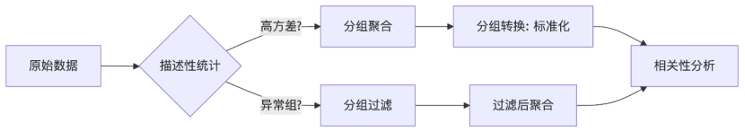 

通过以上关系图和表格，可清晰理解如何组合这些方法解决实际问题，例如： 

1. **数据清洗**：描述统计 → 发现异常 → 分组过滤 
2. **特征工程**：分组聚合 → 分组转换（如生成占比特征） 
3. **业务分析**：分组聚合 → 相关性分析（如用户分群行为关联）

### **常用聚合函数**


| **方法**       | **说明**                          |
| -------------- | --------------------------------- |
| **sum()**      | 求和                              |
| **mean()**     | 平均值                            |
| **min()**      | 最小值                            |
| **max()**      | 最大值                            |
| **var()**      | 方差                              |
| **std()**      | 标准差                            |
| **median()**   | 中位数                            |
| **quantile()** | 指定位置的分位数，如quantile(0.5) |
| **describe()** | 常见统计信息                      |
| **size()**     | 所有元素的个数                    |
| **count()**    | 非空元素的个数                    |
| **first**      | 第一行                            |
| **last**       | 最后一行                          |
| **nth**        | 第n行                             |

### 2. **分组聚合**

df.groupby("分组字段")["要聚合的字段"].聚合函数()

df.groupby(["分组字段", "分组字段2", ...])[["要聚合的字段", "要聚合的字段2", ...]].聚合函数()

#### **DataFrameGroupBy**对象

对DataFrame对象调用groupby()方法后，会返回DataFrameGroupBy对象。

```python
df = pd.read_csv("data/employees.csv")  # 读取员工数据
print(df.groupby("department_id"))  # 按department_id分组，返回DataFrameGroupBy对象
# <pandas.core.groupby.generic.DataFrameGroupBy object at 0x0000024FCBAFD700>
```

这个对象可以看成是一种特殊形式的 DataFrame，里面隐藏着若干组数据，但是在没有应用累计函数之前不会计算。GroupBy对象是一种非常灵活的抽象类型。在大多数场景中，可以将它看成是DataFrame的集合。

 

查看分组

通过groups属性查看分组结果，返回一个字典，字典的键是分组的标签，值是属于该组的所有索引的列表。

```python
print(df.groupby("department_id").groups)  # 查看分组结果
# {10.0: [100], 20.0: [101, 102], 30.0: [14, 15, 16, 17, 18, 19]...
```


通过get_group()方法获取分组。

```python
print(df.groupby("department_id").get_group(50))  # 获取分组为50的数据
#     employee_id first_name    last_name     email...
# 20          120    Matthew        Weiss    MWEISS...
# 21          121       Adam        Fripp    AFRIPP...
# 22          122      Payam     Kaufling  PKAUFLIN...
```


 

按列取值

```python
print(df.groupby("department_id")["salary"])  # 按department_id分组，取salary列
# <pandas.core.groupby.generic.SeriesGroupBy object at 0x0000022456D6F2F0>
```


 

这里从原来的DataFrame中取某个列名作为一个Series组。与GroupBy对象一样，直到我们运行累计函数，才会开始计算。

```python
print(df.groupby("department_id")["salary"].mean())  # 计算每个部门平均薪资
# department_id
# 10.0      4400.000000
# 20.0      9500.000000
# 30.0      4150.000000
```


 

按组迭代

GroupBy对象支持直接按组进行迭代，返回的每一组都是Series或DataFrame。

```python
for dept_id,group in df.groupby("department_id"):
    print(f"当前组为{dept_id}，组里的数据情况{group.shape}:")
    print(group.iloc[:,0:3])
    print("-------------------")
# 当前组为10.0，组里的数据情况(1, 10):
#      employee_id first_name last_name
# 100          200   Jennifer    Whalen
# -------------------
# 当前组为20.0，组里的数据情况(2, 10):
#      employee_id first_name  last_name
# 101          201    Michael  Hartstein
# 102          202        Pat        Fay
```


 

...

按多字段分组

```python
salary_mean = df.groupby(["department_id", "job_id"])[
   ["salary", "commission_pct"]
].mean()  # 按department_id和job_id分组
print(salary_mean.index)  # 查看分组后的索引
# MultiIndex([( 10.0,    'AD_ASST'),
#             ( 20.0,     'MK_MAN'),
#             ( 20.0,     'MK_REP'),
#             ( 30.0,   'PU_CLERK'),
#             ( 30.0,     'PU_MAN'),
#             ...
print(salary_mean.columns)  # 查看分组后的列
# Index(['salary', 'commission_pct'], dtype='object')
```


 

按多个字段分组后得到的索引为复合索引。

可通过reset_index()方法重置索引。

```python
print(salary_mean.reset_index())
#     department_id      job_id        salary  commission_pct
# 0            10.0     AD_ASST   4400.000000             NaN
# 1            20.0      MK_MAN  13000.000000             NaN
# 2            20.0      MK_REP   6000.000000             NaN
# 3            30.0    PU_CLERK   2780.000000             NaN
# 4            30.0      PU_MAN  11000.000000             NaN
```


 

也可以在分组的时候通过as_index = False参数（默认是True）重置索引。

```python
salary_mean = df.groupby(["department_id", "job_id"], as_index=False)[
    ["salary", "commission_pct"]
].mean()  # 按department_id和job_id分组
print(salary_mean)
#     department_id      job_id        salary  commission_pct
# 0            10.0     AD_ASST   4400.000000             NaN
# 1            20.0      MK_MAN  13000.000000             NaN
# 2            20.0      MK_REP   6000.000000             NaN
# 3            30.0    PU_CLERK   2780.000000             NaN
# 4            30.0      PU_MAN  11000.000000             NaN
```


 

 

将数据按月分组，并统计最大温度和最小温度的平均值

```python
df["month"] = pd.to_datetime(df["date"]).dt.to_period("M").astype(str)  # 将date转换为 年-月 的格式

df_groupby_date = df.groupby("month")  # 按month分组，返回一个分组对象(DataFrameGroupBy)
month_temp = df_groupby_date[["temp_max", "temp_min"]]  # 从分组对象中选择特定的列
month_temp_mean = month_temp.mean()  # 对每个列求平均值

# 以上代码可以写在一起
month_temp_mean = df.groupby("month")[["temp_max", "temp_min"]].mean()
#           temp_max   temp_min
# month
# 2012-01   7.054839   1.541935
# 2012-02   9.275862   3.203448
# 2012-03   9.554839   2.838710
# 2012-04  14.873333   5.993333
# 2012-05  17.661290   8.190323
```


 

分组后默认会将分组字段作为行索引。如果分组字段有多个，得到的是复合索引。

分组频数计算

统计每个月不同天气状况的数量。

```python
df.groupby("month")["weather"].nunique()
# date
# 2012-01    4
# 2012-02    4
# 2012-03    4
# 2012-04    4
# 2012-05    3
```


 

 

 

### 3 **一次计算多个统计值**

可以通过agg()或aggregate()进行更复杂的操作，如一次计算多个统计值。

```python
df = pd.read_csv("data/employees.csv")  # 读取员工数据
# 按department_id分组，计算salary的最小值，中位数，最大值
print(df.groupby("department_id")["salary"].agg(["min", "median", "max"]))
#                    min   median      max
# department_id
# 10.0            4400.0   4400.0   4400.0
# 20.0            6000.0   9500.0  13000.0
# 30.0            2500.0   2850.0  11000.0
# 40.0            6500.0   6500.0   6500.0
# 50.0            2100.0   3100.0   8200.0
```


 

多个列计算不同的统计值

也可以在agg()中传入字典，对多个列计算不同的统计值。

```python
df = pd.read_csv("data/employees.csv")  # 读取员工数据
# 按department_id分组，统计job_id的种类数，commission_pct的平均值
print(df.groupby("department_id").agg({"job_id": "nunique", "commission_pct": "mean"}))
#                job_id  commission_pct
# department_id
# 10.0                1             NaN
# 20.0                2             NaN
# 30.0                2             NaN
# 40.0                1             NaN
# 50.0                3             NaN
```


重命名统计值

可以在agg()后通过rename()对统计后的列重命名。

```python
df = pd.read_csv("data/employees.csv")  # 读取员工数据
# 按department_id分组，统计job_id的种类数，commission_pct的平均值
print(
    df.groupby("department_id")
    .agg(
        {"job_id": "nunique", "commission_pct": "mean"},
    )
    .rename(
        columns={"job_id": "工种数", "commission_pct": "佣金比例平均值"},
    )
)
#                工种数  佣金比例平均值
# department_id
# 10.0             1      NaN
# 20.0             2      NaN
# 30.0             2      NaN
# 40.0             1      NaN
# 50.0             3      NaN
```


 

自定义函数

可以向agg()中传入自定义函数进行计算。

```python
df = pd.read_csv("data/employees.csv")  # 读取员工数据

def f(x):
    """统计每个部门员工last_name的首字母"""
    result = set()
    for i in x:
        result.add(i[0])
    return result

print(df.groupby("department_id")["last_name"].agg(f))
# department_id
# 10.0                                                   {W}
# 20.0                                                {F, H}
# 30.0                                    {B, T, R, C, K, H}
# 40.0                                                   {M}
# 50.0     {O, E, K, S, W, L, P, D, C, V, B, T, M, J, F, ...
```


 

### 4.**分组转换**

​	聚合操作返回的是对组内全量数据缩减过的结果，而转换操作会返回一个新的全量数据。数据经过转换之后，其形状与原来的输入数据是一样的。

​	通过transform()将每一组的样本数据减去各组的均值，实现数据标准化

```python
df = pd.read_csv("data/employees.csv")  # 读取员工数据
print(df.groupby("department_id")["salary"].transform(lambda x: x - x.mean()))
```


通过transform()按分组使用平均值填充缺失值

```python
df = pd.read_csv("data/employees.csv")  # 读取员工数据
na_index = pd.Series(df.index.tolist()).sample(30)  # 随机挑选30条数据
df.loc[na_index, "salary"] = pd.NA  # 将这30条数据的salary设置为缺失值
print(df.groupby("department_id")["salary"].agg(["size", "count"]))  # 查看每组数据总数与非空数据数

def fill_missing(x):
    # 使用平均值填充，如果平均值也为NaN，用0填充
    if np.isnan(x.mean()):
        return 0
    return x.fillna(x.mean())

df["salary"] = df.groupby("department_id")["salary"].transform(fill_missing)
print(df.groupby("department_id")["salary"].agg(["size", "count"]))  # 查看每组数据总数与非空数据数
```


 

### 5. **分组过滤**

过滤操作可以让我们按照分组的属性丢弃若干数据。

例如，我们可能只需要保留commission_pct不包含空值的分组的数据。

```python
commission_pct_filter = df.groupby("department_id").filter(    
lambda x: x["commission_pct"].notnull().all()
)  # 按department_id分组，过滤掉commission_pct包含空值的分组
print(commission_pct_filter)
```


 

## **3.8案例讲解**

```python

# 导入必要的库
import pandas as pd
import numpy as np
# 1. 数据加载与初步探索
# 读取企鹅数据集，注意解析日期列（虽然这个数据集没有日期列，但展示parse_dates参数的用法）
penguins = pd.read_csv('data/penguins.csv')
print("数据集前5行：")
display(penguins.head())
print("\n数据集信息：")
display(penguins.info())
# 2. 数据清洗
# 检查缺失值
print("\n每列的缺失值数量：")
print(penguins.isnull().sum())
# 处理缺失值 - 删除含有缺失值的行
penguins_clean = penguins.dropna()
print("\n清洗后数据集形状：", penguins_clean.shape)
# 3. 数据转换与特征工程
# 将性别列转换为类别类型
penguins_clean['sex'] = penguins_clean['sex'].astype('category')
print("\n性别列数据类型：", penguins_clean['sex'].dtype)
# 创建新特征：喙长与喙深的比值
penguins_clean['bill_ratio'] = penguins_clean['bill_length_mm'] / penguins_clean['bill_depth_mm']
# 4. 数据分析
# 按物种分组计算平均特征值
species_stats = penguins_clean.groupby('species').agg({
    'bill_length_mm': 'mean',
    'bill_depth_mm': 'mean',
    'flipper_length_mm': 'mean',
    'body_mass_g': 'mean',
    'bill_ratio': 'mean'
}).round(2)

print("\n不同物种的平均特征值：")
display(species_stats)

# 5. 数据分箱 - 将体重分为低、中、高三个等级
labels = ['低', '中', '高']
penguins_clean['mass_category'] = pd.cut(penguins_clean['body_mass_g'], bins=3, labels=labels)

print("\n体重分箱结果：")
display(penguins_clean['mass_category'].value_counts())

# 6. 按岛屿和性别分组分析
island_sex_stats = penguins_clean.groupby(['sex']).agg({
    'body_mass_g': ['mean', 'count']
})
print("\n按性别分组的统计数据：")
print(island_sex_stats)

Python
# 导入必要的库
import pandas as pd
import numpy as np
import matplotlib.pyplot as plt
import seaborn as sns

# 设置可视化风格
plt.style.use('seaborn')
sns.set_palette("husl")

# 1. 数据加载与初步探索
# 读取睡眠数据集
sleep_data = pd.read_csv('sleep.csv')

# 显示前5行数据
print("数据集前5行：")
print(sleep_data.head())

# 显示数据集基本信息
print("\n数据集信息：")
print(sleep_data.info())

# 2. 数据清洗与预处理
# 检查缺失值
print("\n每列的缺失值数量：")
print(sleep_data.isnull().sum())

# 如果有缺失值，可以删除或填充
# 这里假设数据已经完整，直接复制
sleep_clean = sleep_data.copy()

# 3. 数据转换与特征工程
# 将性别列转换为类别类型
sleep_clean['gender'] = sleep_clean['gender'].astype('category')

# 分离血压为收缩压和舒张压
sleep_clean[['systolic_bp', 'diastolic_bp']] = sleep_clean['blood_pressure'].str.split('/', expand=True).astype(int)

# 创建睡眠质量分类列
bins = [0, 4, 7, 10]
labels = ['差', '中', '优']
sleep_clean['sleep_quality_category'] = pd.cut(sleep_clean['sleep_quality'], bins=bins, labels=labels)

# 创建年龄分段列
age_bins = [0, 30, 45, 60, 100]
age_labels = ['18-30', '31-45', '46-60', '60+']
sleep_clean['age_group'] = pd.cut(sleep_clean['age'], bins=age_bins, labels=age_labels)

# 4. 基本统计分析
# 描述性统计
print("\n数值变量的描述性统计：")
print(sleep_clean.describe())

# 分类变量统计
print("\n分类变量统计：")
print(sleep_clean['gender'].value_counts())
print("\nBMI类别分布：")
print(sleep_clean['bmi_category'].value_counts())
print("\n睡眠障碍分布：")
print(sleep_clean['sleep_disorder'].value_counts())

# 5. 睡眠质量分析
# 按性别分析平均睡眠时间和质量
gender_stats = sleep_clean.groupby('gender').agg({
    'sleep_duration': 'mean',
    'sleep_quality': 'mean',
    'stress_level': 'mean'
}).round(2)
print("\n按性别分组的睡眠统计：")
print(gender_stats)

# 按BMI类别分析
bmi_stats = sleep_clean.groupby('bmi_category').agg({
    'sleep_duration': 'mean',
    'sleep_quality': 'mean',
    'physical_activity_level': 'mean'
}).round(2)
print("\n按BMI类别分组的睡眠统计：")
print(bmi_stats)

# 6. 睡眠障碍分析
# 有睡眠障碍和无睡眠障碍的比较
disorder_stats = sleep_clean.groupby('sleep_disorder').agg({
    'sleep_duration': ['mean', 'count'],
    'sleep_quality': 'mean',
    'age': 'mean',
    'stress_level': 'mean'
}).round(2)
print("\n按睡眠障碍分组的统计：")
print(disorder_stats)

# 7. 相关性分析
# 计算数值变量之间的相关性
correlation = sleep_clean[['sleep_duration', 'sleep_quality', 'age', 'physical_activity_level', 
                          'stress_level', 'heart_rate', 'daily_steps', 'systolic_bp', 'diastolic_bp']].corr()

print("\n变量间相关性矩阵：")
print(correlation)

# 8. 高级分析 - 多因素分组
# 按性别和年龄组分析
gender_age_stats = sleep_clean.groupby(['gender', 'age_group']).agg({
    'sleep_duration': 'mean',
    'sleep_quality': 'mean',
    'stress_level': 'mean'
}).round(2)
print("\n按性别和年龄组分组的统计：")
print(gender_age_stats)

# 按职业和BMI类别分析
occupation_bmi_stats = sleep_clean.groupby(['occupation', 'bmi_category']).agg({
    'sleep_duration': 'mean',
    'sleep_quality': 'mean'
}).round(2)
print("\n按职业和BMI类别分组的统计：")
print(occupation_bmi_stats)

# 9. 数据可视化
# 设置图形大小
plt.figure(figsize=(15, 10))

# 睡眠质量分布
plt.subplot(2, 2, 1)
sns.histplot(sleep_clean['sleep_quality'], bins=10, kde=True)
plt.title('睡眠质量分布')
plt.xlabel('睡眠质量评分')
plt.ylabel('人数')

# 睡眠持续时间分布
plt.subplot(2, 2, 2)
sns.histplot(sleep_clean['sleep_duration'], bins=10, kde=True)
plt.title('睡眠持续时间分布')
plt.xlabel('睡眠时间(小时)')
plt.ylabel('人数')

# 睡眠质量与压力水平的关系
plt.subplot(2, 2, 3)
sns.scatterplot(x='stress_level', y='sleep_quality', hue='gender', data=sleep_clean)
plt.title('睡眠质量与压力水平的关系')
plt.xlabel('压力水平')
plt.ylabel('睡眠质量')

# 不同BMI类别的平均睡眠质量
plt.subplot(2, 2, 4)
sns.barplot(x='bmi_category', y='sleep_quality', data=sleep_clean, ci=None)
plt.title('不同BMI类别的平均睡眠质量')
plt.xlabel('BMI类别')
plt.ylabel('平均睡眠质量')

plt.tight_layout()
plt.show()

# 10. 更多可视化
plt.figure(figsize=(15, 5))

# 按年龄组的睡眠质量
plt.subplot(1, 2, 1)
sns.boxplot(x='age_group', y='sleep_quality', hue='gender', data=sleep_clean)
plt.title('不同年龄组的睡眠质量')
plt.xlabel('年龄组')
plt.ylabel('睡眠质量')

# 睡眠障碍与睡眠质量的关系
plt.subplot(1, 2, 2)
sns.boxplot(x='sleep_disorder', y='sleep_quality', data=sleep_clean)
plt.title('睡眠障碍与睡眠质量的关系')
plt.xlabel('睡眠障碍类型')
plt.ylabel('睡眠质量')

plt.tight_layout()
plt.show()

# 11. 保存处理后的数据
sleep_clean.to_csv('cleaned_sleep_data.csv', index=False)
print("\n处理后的数据已保存为 cleaned_sleep_data.csv")
```


 

# 4. **第4章 **数据可视化

## 4.1  **可视化介绍**

**为什么要进行数据可视化？**

• 数据可视化 = 把抽象的数据“看得见”

• 目的是让数据背后的**规律、异常、趋势**一目了然

场景举例：


***\*常见图表类型及使用场景\****

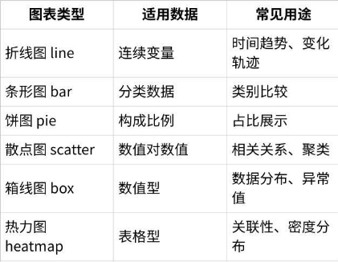

***\*好图的标准是什么？\****

 错误案例举例：

​	• 饼图太多分块 → 看不出比例

​	• 柱状图颜色混乱 → 无法聚焦

​	• 图表标题模糊不清 → 不知图中所指

 

**Python可视化工具对比**

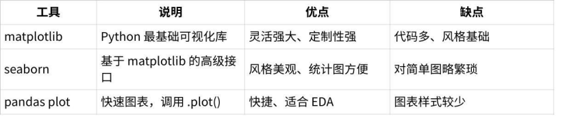

## 4.2  **Matplotlib可视化**

### 4.2.1  **Matplotlib简介**

什么是Matplotlib

Matplotlib是一个Python绘图库，广泛用于创建各种类型的静态、动态和交互式图表。它是数据科学、机器学习、工程和科学计算领域中常用的绘图工具之一。

​	• 支持多种图表类型：折线图（Line plots）、散点图（Scatter plots）、柱状图（Bar charts）、直方图（Histograms）、饼图（Pie charts）、热图（Heatmaps）、箱型图（Box plots）、极坐标图（Polar plots）、3D图（3D plots，配合 mpl_toolkits.mplot3d）。

​	• 高度自定义：允许用户自定义图表的每个部分，包括标题、轴标签、刻度、图例等。    支持多种颜色、字体和线条样式。提供精确的图形渲染控制，如坐标轴范围、图形大小、字体大小等。

​	• 兼容性：与NumPy、Pandas等库紧密集成，特别适用于绘制基于数据框和数组的数据可视化。可以输出到多种格式（如PNG、PDF、SVG、EPS等）。

​	• 交互式绘图：在Jupyter Notebook 中，Matplotlib支持交互式绘图，可以动态更新图表。支持图形缩放、平移等交互操作。

​	• 动态图表：可以生成动画（使用FuncAnimation类），为用户提供动态数据的可视化。

不同开发环境下显示图形

​	• 在一个脚本文件中使用Matplotlib，那么显示图形的时候必须使用plt.show()。

​	• 在Notebook中使用Matplotlib，运行命令之后在每一个Notebook的单元中就会直接将PNG格式图形文件嵌入在单元中。

### 4.2.2 **两种画图接口**

Matplotlib有两种画图接口：一个是便捷的MATLAB风格的有状态的接口，另一个是功能更强大的面向对象接口。

### **状态接口**

### **折线图**

```python
import matplotlib.pyplot as plt
from matplotlib import rcParams
rcParams["font.sans-serif"] = ["SimHei"] #指定中文字体
rcParams["font.sans-serif"] = ['STHeiti']  #mac


month = ['1月','2月','3月','4月']
sales = [100,150,80,130]
# 创建图表，并设置大小
plt.figure(figsize=(10,6))
# 绘制折线图
plt.plot(month, sales,
         label='产品A',
         color='orange',
         linewidth=2,
         linestyle='--',
         marker='o',)
# 添加标题
plt.title("2025年销售趋势",fontsize=16,color='red')
# 添加坐标轴的标签
plt.xlabel('月份',fontsize=12)
plt.ylabel('销售额（万元）',fontsize=12)
# 添加图例
plt.legend(loc='upper left')
# 添加网格线
plt.grid(True,alpha=0.1,color='blue',linestyle='--')
# grid（axis='x' axis='y'
# 自定义刻度字体大小
plt.xticks(rotation=0,fontsize=10)
plt.yticks(rotation=0,fontsize=10)
# 自定义y轴范围
plt.ylim(0,200)
# 在每个数据点上方添加数值标签
for xi, yi in zip(month, sales):
    plt.text(xi, yi + 1.5, str(yi), ha='center',fontsize=10)  # ha: 水平对齐方式
# 自动优化排版
plt.tight_layout()
# 显示图表
plt.show()
```


### **条形图（Bar Chart）**

适用场景：

​	• 对比不同类别的数据大小（如科目成绩、地区销量）

 完整代码：

```python
import matplotlib.pyplot as plt

# 类别与对应数值
subjects = ['语文', '数学', '英语', '科学']
scores = [85, 92, 78, 88]

# 创建条形图
plt.figure(figsize=(8, 5))
plt.bar(subjects, scores, color='skyblue', width=0.6)

# 添加图表元素
plt.title("学生各科成绩对比", fontsize=14)
plt.xlabel("科目")
plt.ylabel("分数")
plt.ylim(0, 100)  # 设置y轴范围
plt.grid(axis='y', linestyle='--', alpha=0.6)

# 为每个柱形添加数值标签
for i, score in enumerate(scores):
    plt.text(i, score + 1, str(score), ha='center', fontsize=10)

plt.tight_layout()
plt.show()
```

```python
plt.barh(month,sales,
        label='AI眼镜',
        color='orange',
        )
        
# 长标签场景（条形图更合适）
countries = ['United States', 'China', 'Japan', 'Germany', 'India']
gdp = [25, 18, 5, 4, 3]

plt.barh(countries, gdp, color='lightgreen')
plt.title('各国GDP对比（单位：万亿美元）')
# plt.tight_layout()  # 自动调整标签间距
plt.show()
```


 

### **饼图（**Pie Chart）

适用场景：

• 显示整体构成比例（时间分配、市场份额）

完整代码：

```python
import matplotlib.pyplot as plt

labels = ['学习', '娱乐', '运动', '睡觉']
time_spent = [4, 2, 1, 8]

# 创建饼图
plt.figure(figsize=(6, 6))
plt.pie(time_spent,
        labels=labels,
        autopct='%.1f%%',         # 显示百分比
        startangle=90,             # 起始角度
        colors=['#66b3ff','#99ff99','#ffcc99','#ff9999'])

plt.title("一天的时间分配", fontsize=14)
plt.show()
```


 

### 环形图

```python
import matplotlib.pyplot as plt

# 数据
labels = ['学习', '娱乐', '运动', '睡觉']
time_spent = [4, 2, 1, 8]
colors = ['#ff9999', '#66b3ff', '#99ff99', '#ffcc99']

# 绘制环形图
plt.figure(figsize=(8, 6))
plt.pie(time_spent, labels=labels, colors=colors,
        wedgeprops={'width': 0.5},  # 控制环的宽度（0.3~0.7）
        autopct='%.1f%%', pctdistance=0.85)  # pctdistance调整百分比位置
plt.title('环形图', fontsize=15)

# 在中心添加文字
plt.text(0, 0, "总计\n100%", ha='center', va='center', fontsize=12)
plt.show()
```


### 爆炸式饼图

```python
import matplotlib.pyplot as plt

# 数据
labels = ['学习', '娱乐', '运动', '睡觉']
time_spent = [4, 2, 1, 8]
colors = ['#ff9999', '#66b3ff', '#99ff99', '#ffcc99']
explode = (0.1, 0, 0, 0)  # 仅突出第一块

# 绘制爆炸式饼图
plt.figure(figsize=(6, 6))
plt.pie(time_spent, explode=explode, labels=labels, colors=colors,
        autopct='%.1f%%', shadow=True, startangle=90)
plt.title('爆炸式饼图', fontsize=15)
plt.show()
```


### **散点图（**Scatter Plot）

适用场景：

• 展示两个数值变量之间的关系（相关性）

完整代码：

```python
import matplotlib.pyplot as plt

# 模拟数据：学习时间与成绩
study_hours = [1, 2, 3, 4, 5, 6, 7]
scores = [50, 55, 65, 70, 78, 85, 90]

plt.figure(figsize=(7, 5))
plt.scatter(study_hours, scores, color='green', s=60)

plt.title("学习时间与成绩的关系")
plt.xlabel("每天学习小时数")
plt.ylabel("成绩")
plt.grid(True)

# 添加数据点注释（可选）
for i in range(len(study_hours)):
    plt.text(study_hours[i]+0.1, scores[i], f"{scores[i]}", fontsize=9)

plt.show()
```


 ```python
 import matplotlib.pyplot as plt
 import random  # 仅用Python内置库生成随机数
 
 # 1. 生成1000个随机点（模拟正相关数据）
 random.seed(42)
 x = [random.uniform(0, 10) for _ in range(1000)]  # X值：0~10均匀分布
 y = [xi * 2 + random.gauss(0, 2) for xi in x]     # Y值：2倍X值 + 高斯噪声
 
 # 2. 绘制散点图
 plt.figure(figsize=(10, 6))
 plt.scatter(
     x,                   # X轴坐标数据
     y,                   # Y轴坐标数据
     color='blue',        # 点的填充颜色为蓝色
     alpha=0.5,           # 透明度为50%（半透明）
     s=20,                # 点的大小为20平方磅
     edgecolors='none',   # 点边缘无颜色（无边框）
     label='数据点'       # 图例中显示的标签文本
 )
 
 #绘制回归线
 plt.plot([0, 10],
          [0,20],
          color='red', linestyle='--', linewidth=2,
          label=f'回归线: y = {slope:.2f}x + {intercept:.2f}')
 
 # 4. 美化图表
 plt.title('1000个随机点的散点图', fontsize=14)
 plt.xlabel('X轴：自变量', fontsize=12)
 plt.ylabel('Y轴：因变量', fontsize=12)
 plt.grid(True, linestyle='--', alpha=0.3)
 plt.legend()
 plt.tight_layout()
 plt.show()
 ```


### **箱线图（**Boxplot）

适用场景：

• 展示数据的**分布、极值、中位数、异常值**

完整代码：

```python
import matplotlib.pyplot as plt

# 模拟 3 门课的成绩
data = {
    '语文': [82, 85, 88, 70, 90, 76, 84, 83, 95],
    '数学': [75, 80, 79, 93, 88, 82, 87, 89, 92],
    '英语': [70, 72, 68, 65, 78, 80, 85, 90, 95]
}

plt.figure(figsize=(8, 6))
plt.boxplot(data.values(), labels=data.keys())

plt.title("各科成绩分布（箱线图）")
plt.ylabel("分数")
plt.grid(True, axis='y', linestyle='--', alpha=0.5)
plt.show()
```


​	• 中位数：盒子中间的线

​	• 上/下四分位数：盒子上下边缘

​	• 离群值：落在“胡须”外的点

1. 数学成绩

​	￮ 中位数最高（约88分），且箱体较短 → 学生成绩集中且整体较好。

​	￮ 无异常值 → 无极端高分或低分。

2. 语文成绩

​	￮ 箱体较长 → 成绩分布较分散（从70分到95分）。

​	￮ 上方有一个异常值（95分）→ 可能存在个别高分学生。

3. 英语成绩

​	￮ 中位数最低（约78分），但箱须向上延伸较长 → 部分学生成绩较高（90+分）。

​	￮ 下方无异常值 → 无极端低分。

### **总结**


 

 

### **面向对象接口**

多个图表的绘制

```python
import numpy as np
import matplotlib.pyplot as plt # 导入matplotlib

month = ['1月','2月','3月','4月']
sales = [100,150,80,130]

fig, ax = plt.subplots(2,2, figsize=(10, 10)) # 创建画布，并指定画布大小

# 绘制柱状图
ax[0][0].bar(month,sales,
        label='AI眼镜0',
        color='orange',
        width=0.6,)
ax[0][1].plot(month,sales,
        label='AI眼镜1',
        color='orange',
        )
ax[1][0].bar(month,sales,
        label='AI眼镜2',
        color='orange',
        width=0.6,)
ax[1][1].bar(month,sales,
        label='AI眼镜3',
        color='orange',
        width=0.6,)
# 添加标题
ax[0][0].set_title("2025年销售趋势",fontsize=16,color='red')
ax[1][0].set_title("2025年销售趋势",fontsize=16,color='red')
# 添加坐标轴的标签
ax[0][0].set_xlabel('月份',fontsize=12)
ax[0][0].set_ylabel('销售额（万元）',fontsize=12)
# 添加图例
ax[0][0].legend(loc='upper left')
# 添加网格线
ax[0][0].grid(True,alpha=0.1,color='blue',linestyle='--')
# grid（axis='x' axis='y'
# 自定义y轴范围
ax[0][0].set_ylim(0,200)
plt.show()
```

 

## 4.3  **Seaborn**可视化

### 4.3.1 **什么是**Seaborn

Seaborn是一个基于Matplotlib的Python可视化库，旨在简化数据可视化的过程。它提供了更高级的接口，用于生成漂亮和复杂的统计图表，同时也能保持与Pandas数据结构的良好兼容性。

### 4.3.2 **单变量可视化**

使用penguins（企鹅）数据集，其中包含7个字段：

​	• species：企鹅种类（Adelie、Gentoo、Chinstrap）。

​	• island：观测岛屿（Torgersen, Biscoe, Dream）。

​	• bill_length_mm：喙（嘴）长度（毫米）。

​	• bill_depth_mm：喙深度（毫米）。

​	• flipper_length_mm：脚蹼长度（毫米）。

​	• body_mass_g：体重（克）。

​	• sex：性别（Male、Female）。

加载数据：

```python
import pandas as pd
import seaborn as sns
import matplotlib.pyplot as plt

plt.rcParams["font.sans-serif"] = ["KaiTi"]
penguins = pd.read_csv("data/penguins.csv")
penguins.dropna(inplace=True)
penguins.info()
# <class 'pandas.core.frame.DataFrame'>
# Index: 333 entries, 0 to 343
# Data columns (total 7 columns):
#  #   Column             Non-Null Count  Dtype
# ---  ------             --------------  -----
#  0   species            333 non-null    object
#  1   island             333 non-null    object
#  2   bill_length_mm     333 non-null    float64
#  3   bill_depth_mm      333 non-null    float64
#  4   flipper_length_mm  333 non-null    float64
#  5   body_mass_g        333 non-null    float64
#  6   sex                333 non-null    object
# dtypes: float64(4), object(3)
# memory usage: 20.8+ KB
```


 

直方图

绘制不同种类企鹅数量的直方图。

```python
sns.histplot(data=penguins, x="species")
```


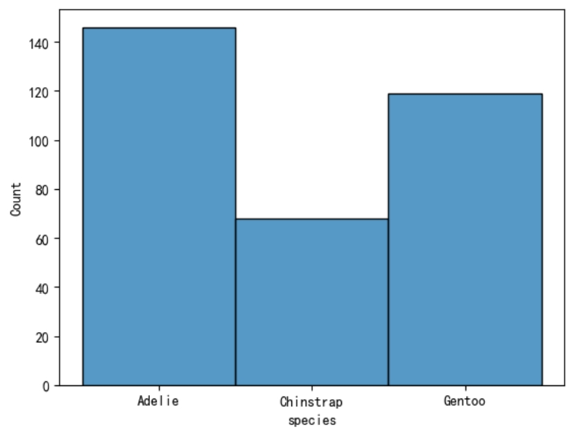 

核密度估计图

核密度估计图（KDE，Kernel Density Estimate Plot）是一种用于显示数据分布的统计图表，它通过平滑直方图的方法来估计数据的概率密度函数，使得分布图看起来更加连续和平滑。核密度估计是一种非参数方法，用于估计随机变量的概率密度函数。其基本思想是，将每个数据点视为一个“核”（通常是高斯分布），然后将这些核的贡献相加以形成平滑的密度曲线。

绘制喙长度的核密度估计图。

```python
sns.kdeplot(data=penguins, x="bill_length_mm")
```


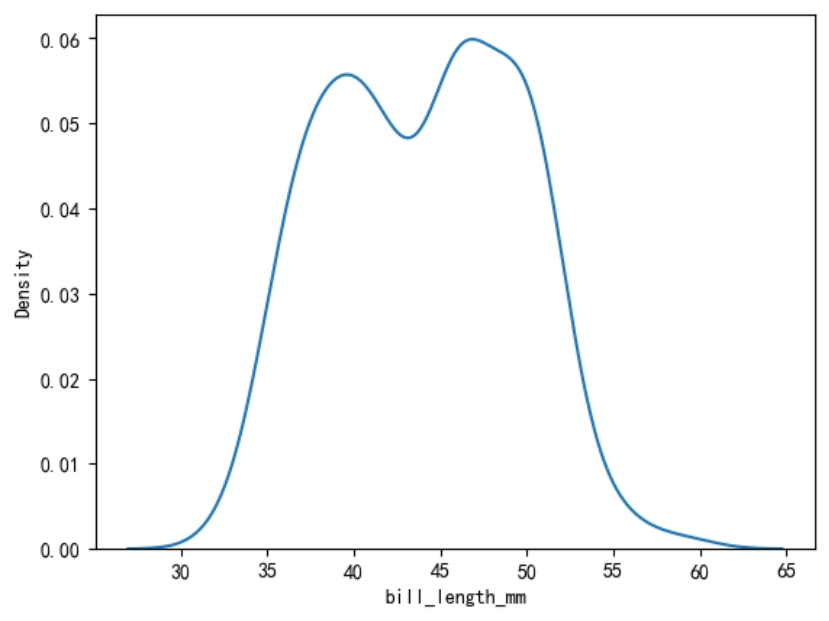 

在histplot()中设置kde=True也可以得到核密度估计图。

```python
sns.histplot(data=penguins, x="bill_length_mm", kde=True)
```


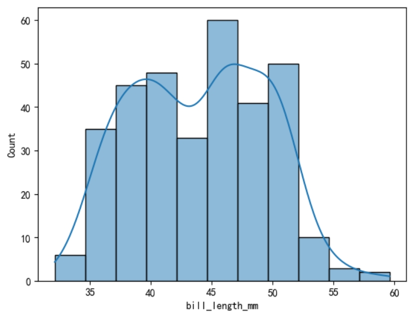 

计数图

计数图用于绘制分类变量的计数分布图，显示每个类别在数据集中出现的次数，是分析分类数据非常直观的工具，可以快速了解类别的分布情况。

绘制不同岛屿企鹅数量的计数图。

```python
sns.countplot(data=penguins, x="island")
```


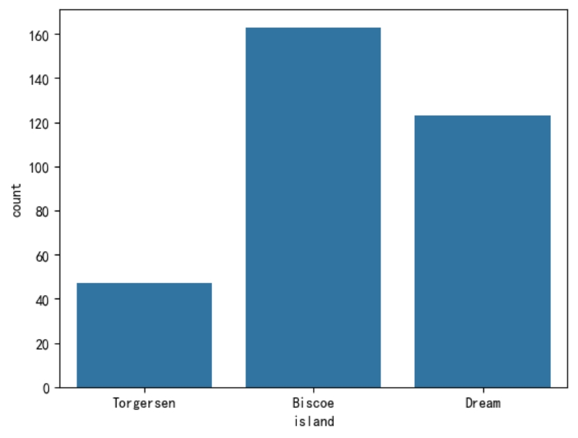 

### **4.3.3双变量可视化**

散点图

绘制横轴为体重，纵轴为脚蹼长度的散点图。可通过hue参数设置不同组别进行对比。

```python
sns.scatterplot(data=penguins, x="body_mass_g", y="flipper_length_mm", hue="sex")
```


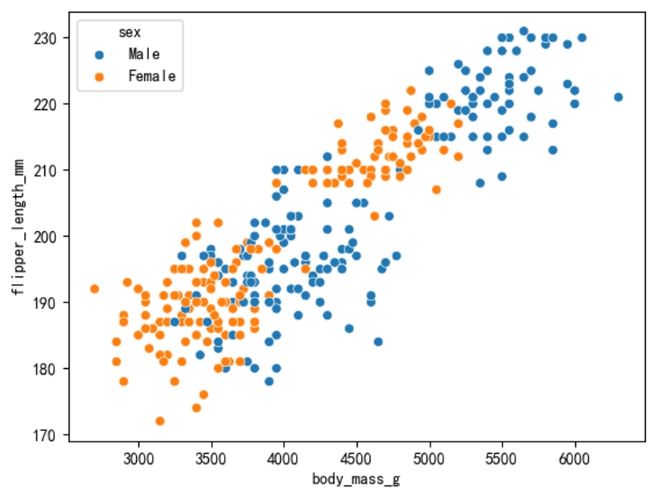 

也可以通过regplot()函数绘制散点图，同时会拟合回归曲线。可以通过fit_reg=False关闭拟合。

```python
sns.regplot(data=penguins, x="body_mass_g", y="flipper_length_mm")
```


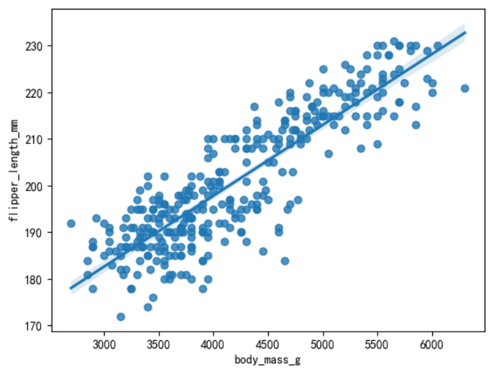 

也可以通过lmplot()函数绘制基于hue参数的分组回归图。

```python
sns.lmplot(data=penguins, x="body_mass_g", y="flipper_length_mm", hue="sex")
```


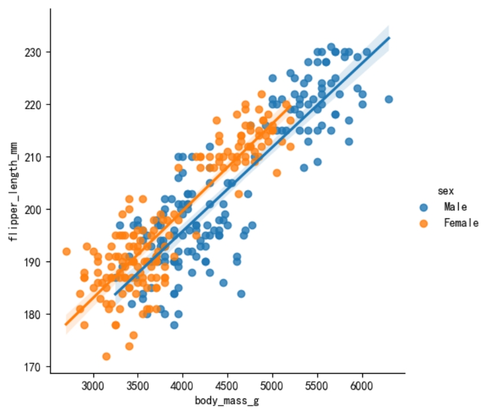 

也可以通过jointplot()函数绘制在每个轴上包含单个变量的散点图。

```python
sns.jointplot(data=penguins, x="body_mass_g", y="flipper_length_mm")
```


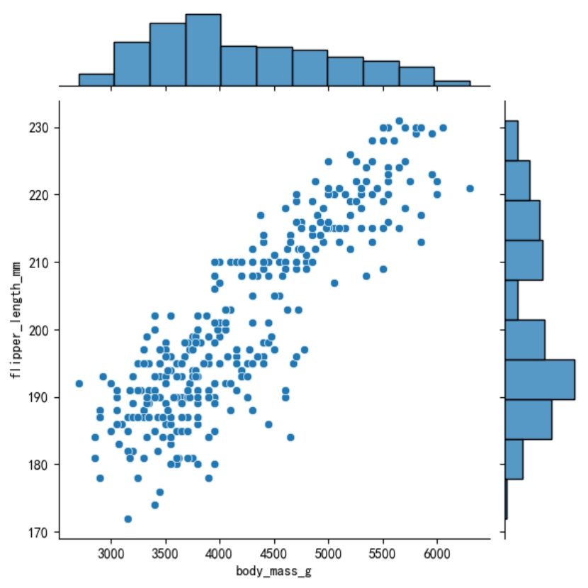 

蜂窝图

通过jointplot()函数，设置kind="hex"来绘制蜂窝图。

```python
sns.jointplot(data=penguins, x="body_mass_g", y="flipper_length_mm", kind="hex")
```


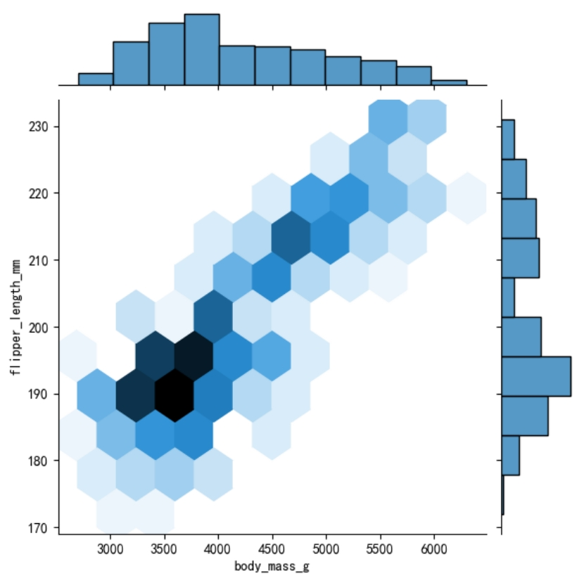 

二维核密度估计图

通过kdeplot()函数，同时设置x参数和y参数来绘制二维核密度估计图。

```python
sns.kdeplot(data=penguins, x="body_mass_g", y="flipper_length_mm")
```


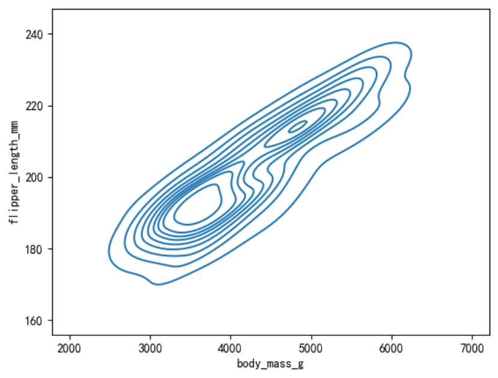 

通过fill=True设置为填充，通过cbar=True设置显示颜色示意条。

```python
sns.kdeplot(data=penguins, x="body_mass_g", y="flipper_length_mm", fill=True, cbar=True)
```


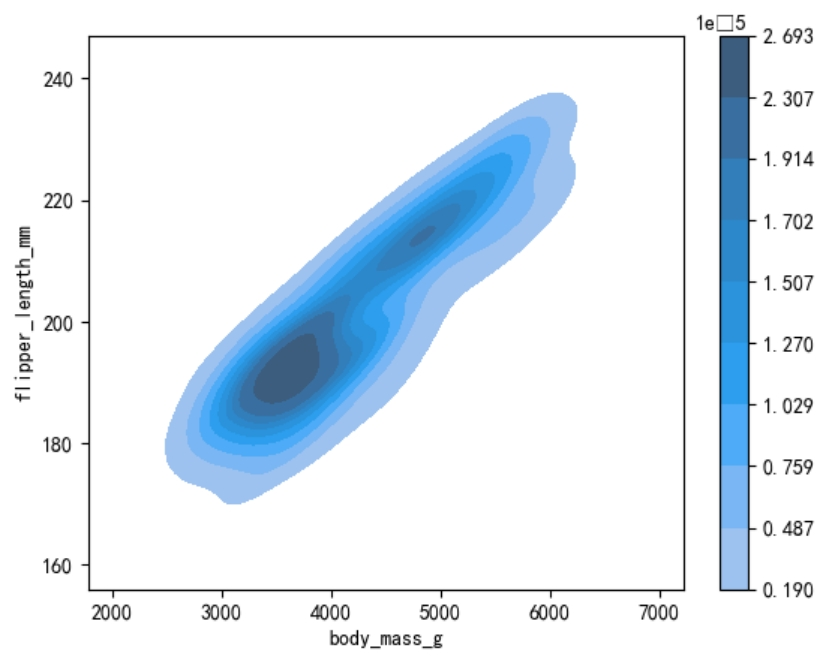 

条形图

条形图会按x分组对y进行聚合，通过estimator参数设置聚合函数，并通过errorbar设置误差条，误差条默认会显示。可以通过误差条显示抽样数据统计结果的可能统计范围，如果数据不是抽样数据, 可以设置为None来关闭误差条。

```python
sns.barplot(data=penguins, x="species", y="bill_length_mm", estimator="mean", errorbar=None)
```


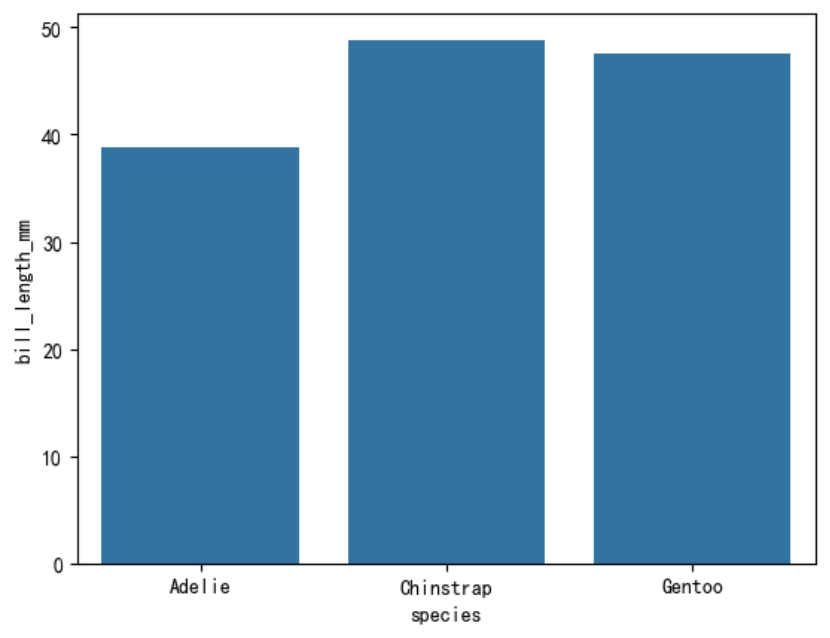 

箱线图

箱线图是一种用于展示数据分布、集中趋势、散布情况以及异常值的统计图表。它通过五个关键的统计量（最小值、第一四分位数、中位数、第三四分位数、最大值）来展示数据的分布情况。

箱线图通过箱体和须来表现数据的分布，能够有效地显示数据的偏斜、分散性以及异常值。箱线图的组成部分：

• 箱体（Box）：

​	￮ 下四分位数（Q1）：数据集下 25% 的位置，箱体的下边缘。

​	￮ 上四分位数（Q3）：数据集下 75% 的位置，箱体的上边缘。

​	￮ 四分位间距（IQR, Interquartile Range）：Q3 和 Q1 之间的距离，用来衡量数据的离散程度。

​	￮ 中位数（Median）：箱体内部的水平线，表示数据集的中位数。

• 须（Whiskers）：

​	￮ 下须：从 Q1 向下延伸，通常是数据集中最小值与 Q1 的距离，直到没有超过1.5倍 IQR 的数据点为止。

​	￮ 上须：从 Q3 向上延伸，通常是数据集中最大值与 Q3 的距离，直到没有超过1.5倍 IQR 的数据点为止。

• 异常值（Outliers）：

​	￮ 超过1.5倍 IQR 的数据被认为是异常值，通常用点标记出来。异常值是数据中相对于其他数据点而言“非常大”或“非常小”的值。

```python
sns.boxplot(data=penguins, x="species", y="bill_length_mm")
```


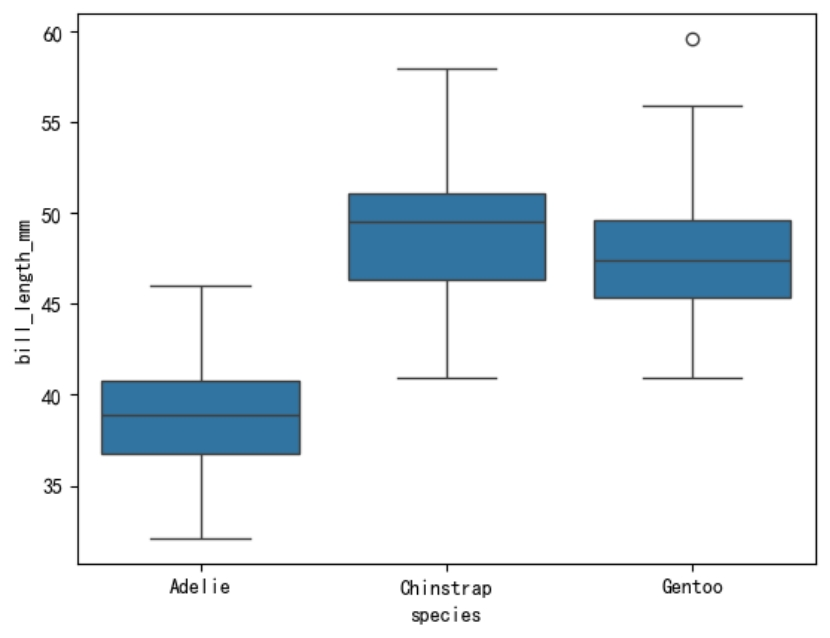 

小提琴图

小提琴图（Violin Plot） 是一种结合了箱线图和核密度估计图（KDE）的可视化图表，用于展示数据的分布情况、集中趋势、散布情况以及异常值。小提琴图不仅可以显示数据的基本统计量（如中位数和四分位数），还可以展示数据的概率密度，提供比箱线图更丰富的信息。

```python
sns.violinplot(data=penguins, x="species", y="bill_length_mm")
```


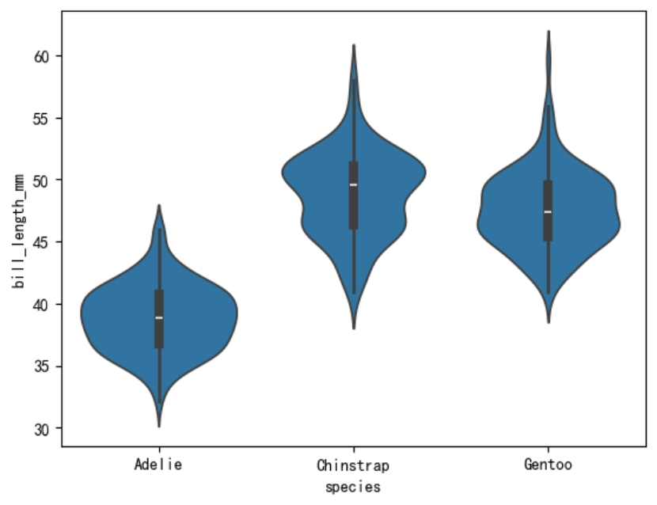 

成对关系图

成对关系图是一种用于显示多个变量之间关系的可视化工具。它可以展示各个变量之间的成对关系，并且通过不同的图表形式帮助我们理解数据中各个变量之间的相互作用。

对角线上的图通常显示每个变量的分布（如直方图或核密度估计图），帮助观察每个变量的单变量特性。其他位置展示所有变量的两两关系，用散点图表示。

```python
sns.pairplot(data=penguins, hue="species")
```


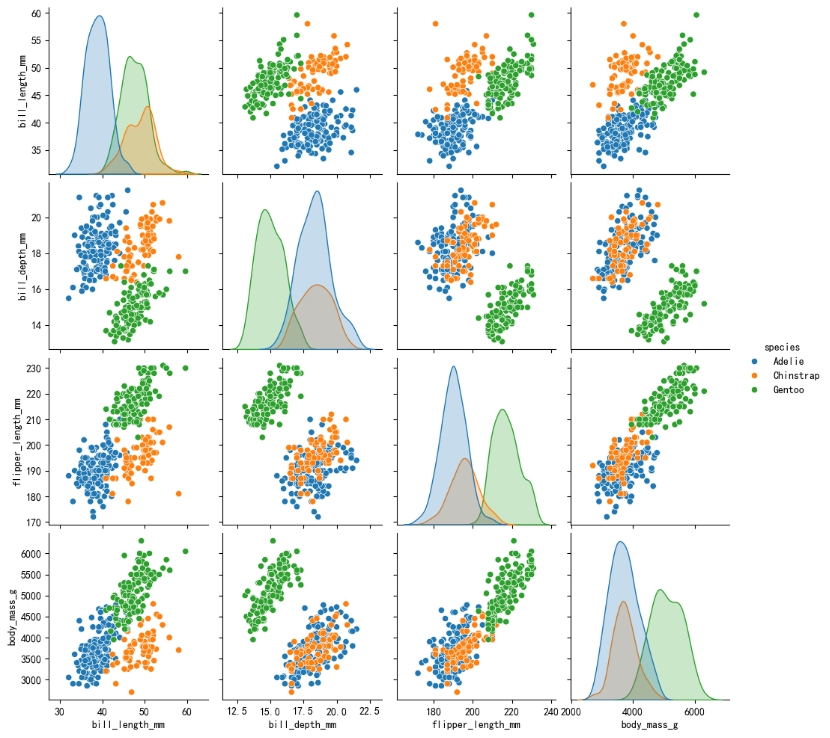 

通常情况下成对关系图左上和右下对应位置的图的信息是相同的，可以通过PairGrid()为每个区域设置不同的图类型。

```python
pair_grid = sns.PairGrid(data=penguins, hue="species")

# 通过 map 方法在网格上绘制不同的图形
pair_grid.map_upper(sns.scatterplot)  # 上三角部分使用散点图
pair_grid.map_lower(sns.kdeplot)  # 下三角部分使用核密度估计图
pair_grid.map_diag(sns.histplot)  # 对角线部分使用直方图
```


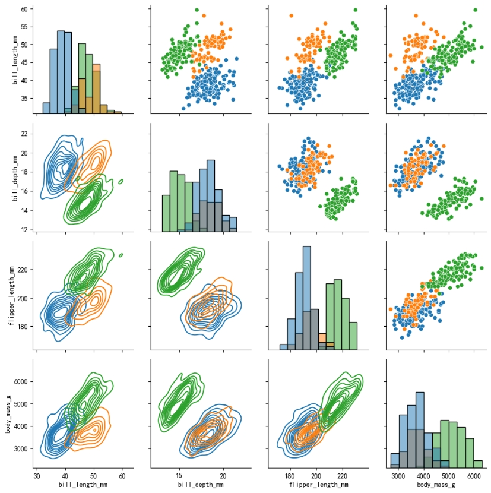 

### 4.3.4 **多变量可视化**

多数绘图函数都支持使用hue参数设置一个类别变量，统计时按此类别分组统计并在绘图时使用颜色区分。

例如对小提琴图设置hue参数添加性别类别：

```python
sns.violinplot(data=penguins, x="species", y="bill_length_mm", hue="sex", split=True)
```


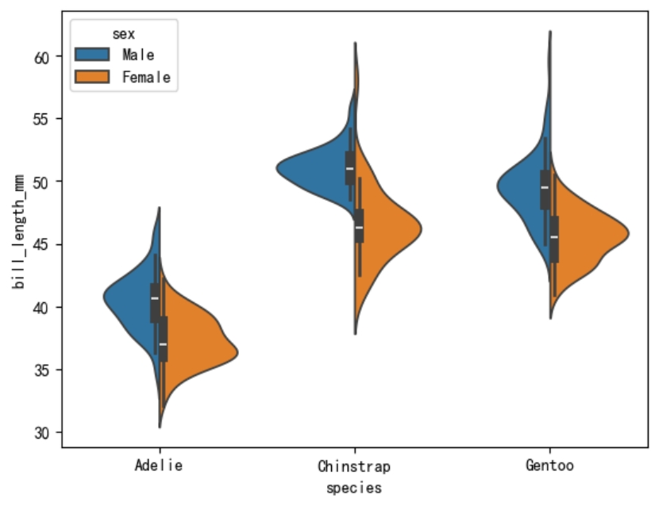 

### 4.3.5 **Seaborn**样式

在Seaborn中，样式（style）控制了图表的整体外观，包括背景色、网格线、刻度线等元素。Seaborn提供了一些内置的样式选项，可以通过seaborn.set_style()来设置当前图表的样式。常见的样式有以下几种：

​	• white：纯白背景，没有网格线。

​	• dark：深色背景，带有网格线。

​	• whitegrid：白色背景，带有网格线。

​	• darkgrid：深色背景，带有网格线（默认样式）。

```python
sns.set_style("darkgrid")
sns.histplot(data=penguins, x="island", kde=True)
```


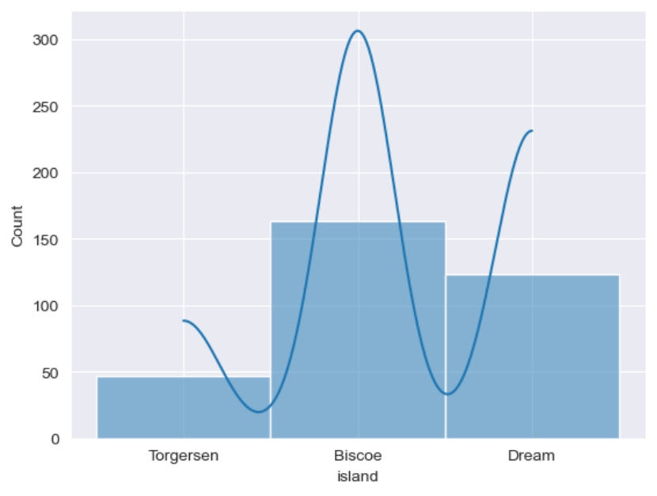 

## 4.4  **Pandas可视化**

pandas提供了非常方便的绘图功能，可以直接在DataFrame或Series上调用plot()方法来生成各种类型的图表。底层实现依赖于Matplotlib，pandas的绘图功能集成了许多常见的图形类型，易于使用。

### 4.4.1 **单变量可视化**

使用sleep（睡眠健康和生活方式）数据集，其中包含13个字段：

​	• person_id：每个人的唯一标识符。

​	• gender：个人的性别（男/女）。

​	• age：个人的年龄（以岁为单位）。

​	• occupation：个人的职业或就业状况（例如办公室职员、体力劳动者、学生）。

​	• sleep_duration：每天的睡眠总小时数。

​	• sleep_quality：睡眠质量的主观评分，范围从 1（差）到 10（极好）。

​	• physical_activity_level：每天花费在体力活动上的时间（以分钟为单位）。

​	• stress_level：压力水平的主观评级，范围从 1（低）到 10（高）。

​	• bmi_category：个人的 BMI 分类（体重过轻、正常、超重、肥胖）。

​	• blood_pressure：血压测量，显示为收缩压与舒张压的数值。

​	• heart_rate：静息心率，以每分钟心跳次数为单位。

​	• daily_steps：个人每天行走的步数。

​	• sleep_disorder：存在睡眠障碍（无、失眠、睡眠呼吸暂停）。

加载数据：

```python
import pandas as pd

df = pd.read_csv("data/sleep.csv")
df.info()  # 查看数据集信息
# RangeIndex: 400 entries, 0 to 399
# Data columns (total 13 columns):
#  #   Column                   Non-Null Count  Dtype
# ---  ------                   --------------  -----
#  0   person_id                400 non-null    int64
#  1   gender                   400 non-null    object
#  2   age                      400 non-null    int64
#  3   occupation               400 non-null    object
#  4   sleep_duration           400 non-null    float64
#  5   sleep_quality            400 non-null    float64
#  6   physical_activity_level  400 non-null    int64
#  7   stress_level             400 non-null    int64
#  8   bmi_category             400 non-null    object
#  9   blood_pressure           400 non-null    object
#  10  heart_rate               400 non-null    int64
#  11  daily_steps              400 non-null    int64
#  12  sleep_disorder           110 non-null    object
# dtypes: float64(2), int64(6), object(5)
# memory usage: 40.8+ KB
```


柱状图

柱状图用于展示类别数据的分布情况。它通过一系列矩形的高度（或长度）来展示数据值，适合对比不同类别之间的数量或频率。简单直观，容易理解和比较各类别数据。

使用柱状图展示不同睡眠时长的数量。

```python
pd.cut(df["sleep_duration"], [0, 5, 6, 7, 8, 9, 10, 11, 12]).value_counts().plot.bar(
    color=["red", "green", "blue", "yellow", "cyan", "magenta", "black", "purple"]
)
```


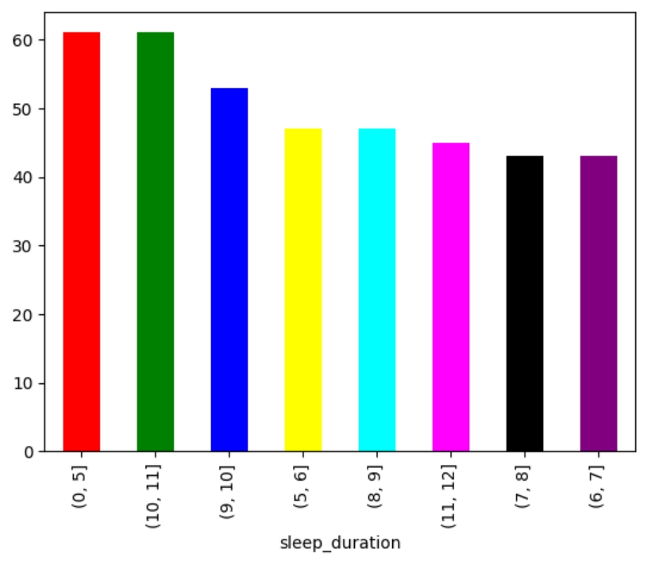 

折线图

折线图通常用于展示连续数据的变化趋势。它通过一系列数据点连接成的线段来表示数据的变化。能够清晰地展示数据的趋势和波动。

使用折线图展示不同睡眠时长的数量。

```python
pd.cut(df["sleep_duration"], [0, 5, 6, 7, 8, 9, 10, 11, 12]).value_counts().sort_index().plot()
```


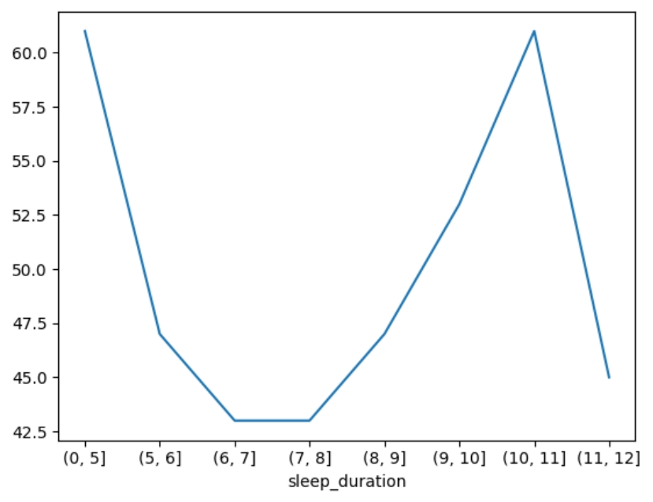 

面积图

面积图是折线图的一种变体，线下的区域被填充颜色，用于强调数据的总量或变化。可以更直观地展示数据量的变化，适合用来展示多个分类的累计趋势。

使用面积图展示不同睡眠时长的数量。

```python
pd.cut(df["sleep_duration"], [0, 5, 6, 7, 8, 9, 10, 11, 12]).value_counts().sort_index().plot.area()
```


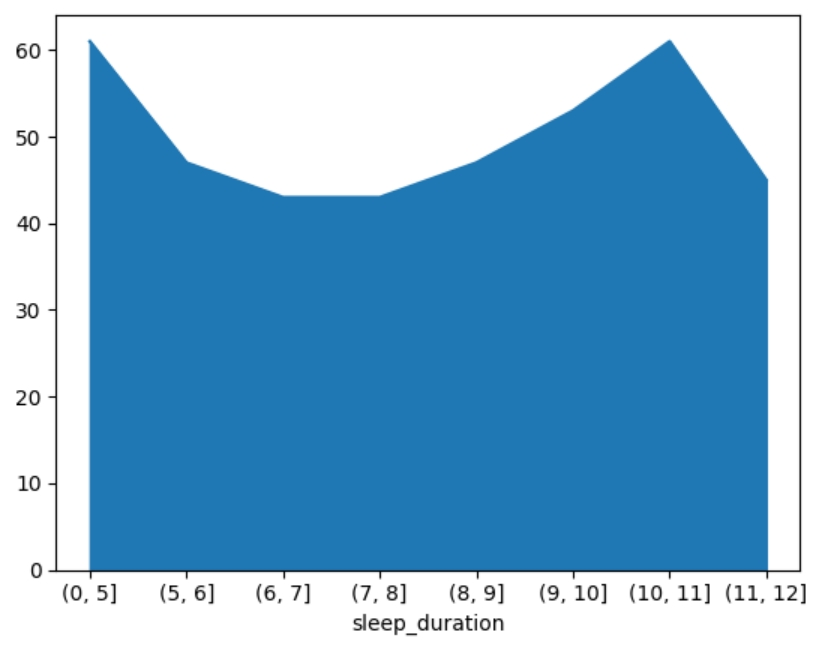 

直方图

直方图用于展示数据的分布情况。它将数据范围分成多个区间，并通过矩形的高度显示每个区间内数据的频率或数量。可以揭示数据分布的模式，如偏态、峰度等。

使用直方图展示不同睡眠时长的数量。

```python
df["sleep_duration"].value_counts().plot.hist()
```


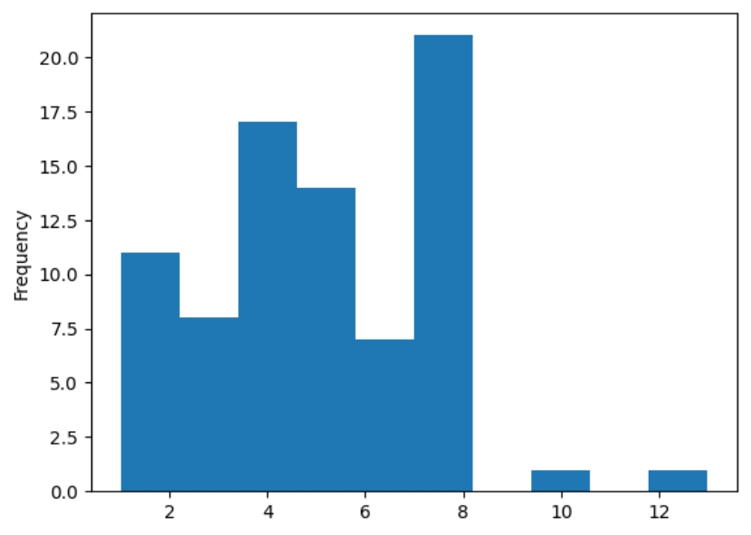 

饼状图

饼状图用于展示一个整体中各个部分所占的比例。它通过一个圆形图形分割成不同的扇形，每个扇形的角度与各部分的比例成正比。能够快速展示各部分之间的比例关系，但不适合用于展示过多的类别或比较数值差异较小的部分。

使用饼状图展示不同睡眠时长的占比。

```python
pd.cut(df["sleep_duration"], [0, 5, 6, 7, 8, 9, 10, 11, 12]).value_counts().sort_index().plot.pie()
```


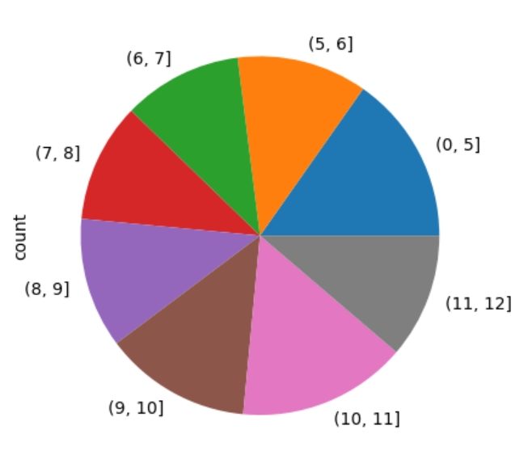 

### 4.4.2 **双变量可视化**

散点图

散点图通过在二维坐标系中绘制数据点来展示两组数值数据之间的关系。能够揭示两个变量之间的相关性和趋势。

绘制睡眠时间与睡眠质量的散点图。

```python
df.plot.scatter(x="sleep_duration", y="sleep_quality")
```


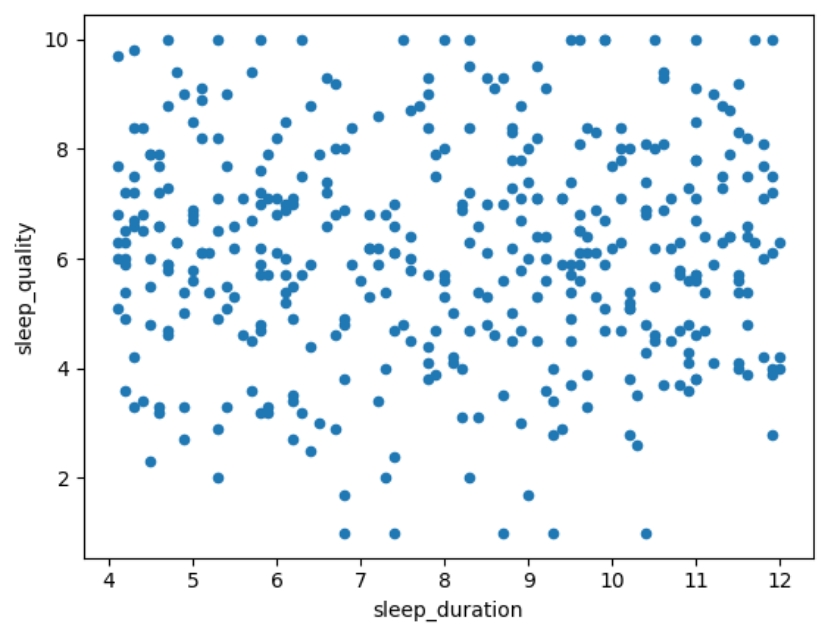 

蜂窝图

蜂窝图是散点图的扩展，通常用于表示大量数据点之间的关系。它通过将数据点分布在一个六边形网格中，每个六边形的颜色代表其中的数据密度。适合展示大量数据点，避免了散点图中的过度重叠问题。

绘制睡眠时间与睡眠质量的蜂窝图。

```python
df.plot.hexbin(x="sleep_duration", y="sleep_quality", gridsize=10)
```


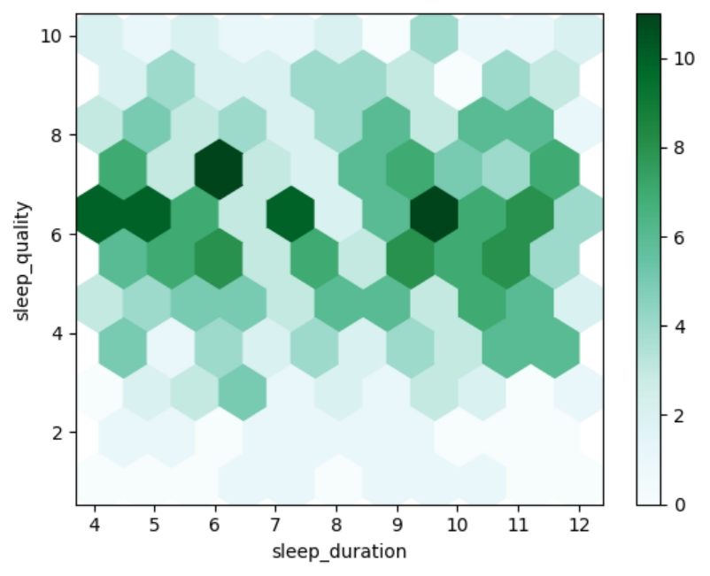 

堆叠图

堆叠图用于展示多个数据系列的累积变化。常见的堆叠图包括堆叠柱状图、堆叠面积图等。它通过将每个数据系列堆叠在前一个系列之上，展示数据的累积情况。能够清晰地展示不同部分的相对贡献，适合多个数据系列的比较。

绘制睡眠时间与睡眠质量的堆叠图。

```python
df["sleep_quality_stage"] = pd.cut(df["sleep_quality"], range(11))
df["sleep_duration_stage"] = pd.cut(df["sleep_duration"], [0, 5, 6, 7, 8, 9, 10, 11, 12])
df_pivot_table = df.pivot_table(
    values="person_id", index="sleep_quality_stage", columns="sleep_duration_stage", aggfunc="count"
)
df_pivot_table.plot.bar()
```


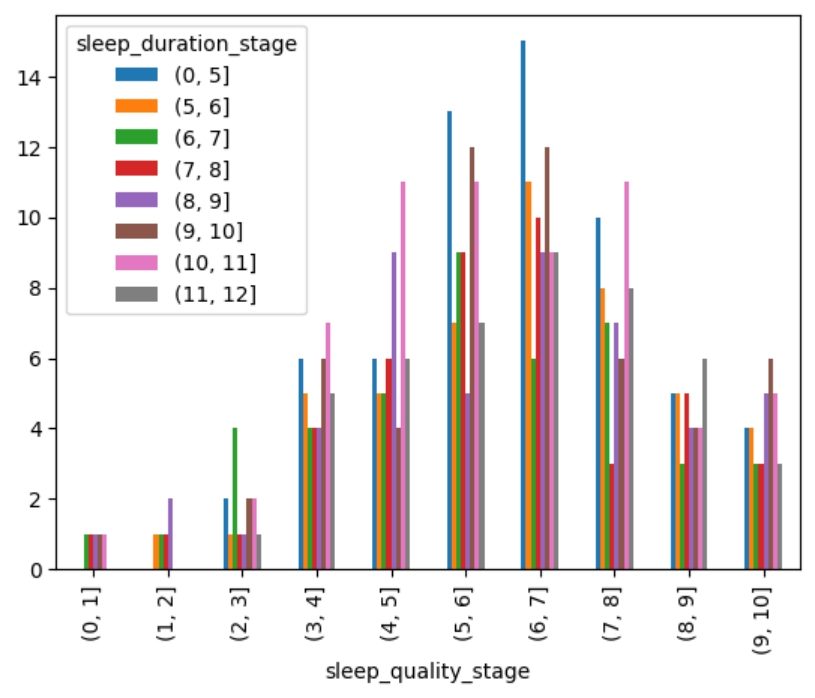 

设置stacked=True，会将柱体堆叠。

```python
df_pivot_table.plot.bar(stacked=True)
```


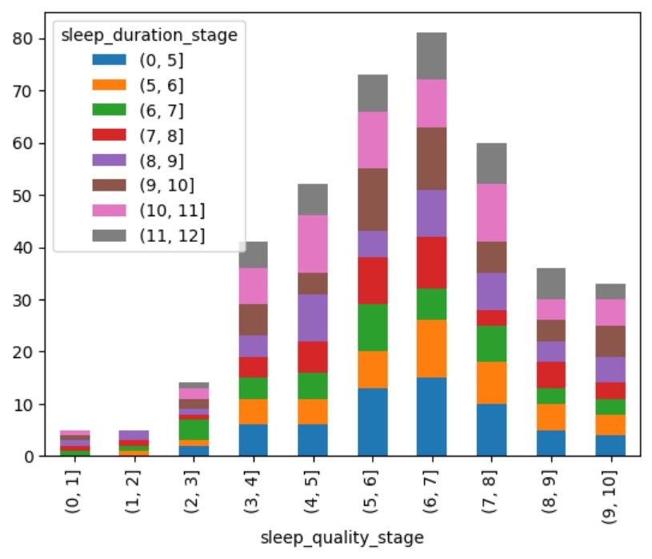 

折线图

```python
df_pivot_table.plot.line()
```


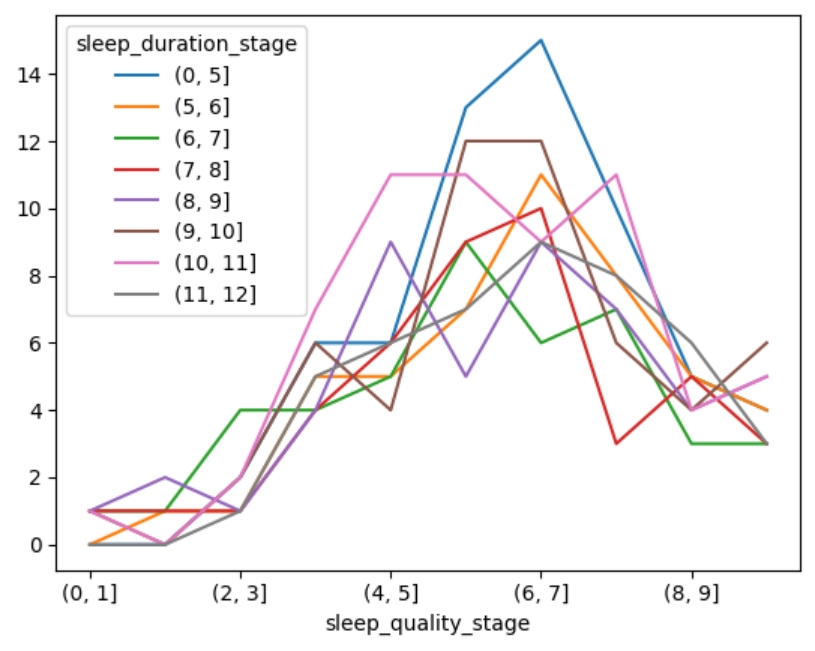 

 

# **第5章 项目实战：房地产市场洞察与价值评估**

 

**数据分析流程**

采集数据→确定分析方向→导入数据→数据清洗→数据分析→数据可视化

**数据源介绍**

| 字段名     | 含义     | 说明                                       |
| ---------- | -------- | ------------------------------------------ |
| city       | 城市     | 房屋所在的城市名称，例如“合肥”、“重庆”等。 |
| address    | 详细地址 | 房屋的具体位置，包含街道、交叉口等信息。   |
| area       | 面积     | 房屋的面积，单位为平方米（㎡）。           |
| floor      | 楼层     | 房屋所在的楼层信息，例如“中层（共18层）”。 |
| name       | 小区名称 | 房屋所在的小区或楼盘名称。                 |
| price      | 价格     | 房屋的总价，单位为“万”或“元”。             |
| province   | 省份     | 房屋所在的省份或直辖市名称。               |
| rooms      | 户型     | 房屋的户型结构，例如“3室2厅”。             |
| toward     | 朝向     | 房屋的朝向，例如“南北向”、“南向”等。       |
| unit       | 单价     | 房屋的单价，单位为“元/㎡”。                |
| year       | 建造年份 | 房屋的建造年份，例如“2013年建”。           |
| origin_url | 原始链接 | 房屋信息的来源网页链接。                   |

 

**分析及统计问题**

 

| 编号 | 问题                                                 | 分析主题         | 分析目标                       | 分组字段                | 指标/方法                     |
| ---- | ---------------------------------------------------- | ---------------- | ------------------------------ | ----------------------- | ----------------------------- |
| A1   | 哪些变量最影响房价？面积、楼层、房间数哪个影响更大？ | 特征相关性       | 了解房屋各特征对房价的线性影响 | 无                      | 皮尔逊相关系数                |
| A2   | 全国房价总体分布是怎样的？是否存在极端值？           | 描述性统计       | 概览数值型字段的分布特征       | 无                      | 平均数/中位数/四分位数/标准差 |
| A3   | 哪些城市房价最高？直辖市与非直辖市差异如何？         | 城市对比         | 比较不同城市房价水平           | city                    | 均价/单价中位数/箱线图        |
| A4   | 高价房在面积、楼层等方面有什么特征？                 | 价格分层         | 识别不同价位房屋特征差异       | 价格分段(低中高)        | 列联表/卡方检验               |
| A5   | 哪种户型最受欢迎？三室比两室贵多少？                 | 户型分析         | 分析不同户型的市场表现         | rooms                   | 占比/平均单价/溢价率          |
| A6   | 南北向是否真比单一朝向贵？贵多少？                   | 朝向溢价         | 评估不同朝向的价格差异         | toward                  | 方差分析/多重比较             |
| A7   | 新房比10年老房贵多少？折旧规律如何？                 | 楼龄效应         | 研究建筑年份对房价的影响       | year分段(5年间隔)       | 趋势线/回归分析               |
| A8   | 哪些区域交易最活跃？新区和老城区哪个更贵？           | 区域热度         | 识别各城市热门交易区域         | address(提取区域关键词) | 交易量/价格增长率             |
| A9   | 哪个面积段的性价比最高？超大户型有溢价吗？           | 面积区间         | 分析不同面积段的价格特征       | area分段(50㎡间隔)      | 密度图/价格梯度               |
| A10  | 中层真的比高层贵吗？差价是多少？                     | 楼层差异         | 比较不同楼层的价格表现         | floor(高中低层)         | Kruskal-Wallis检验            |
| A11  | 直辖市房价是否显著更高？单价和总价差异如何？         | 直辖市vs非直辖市 | 对比直辖市与非直辖市的房价差异 | province                | 独立样本t检验/曼-惠特尼U检验  |

**代码实现**

```python
# 1. 导入库
import numpy as np
import pandas as pd
import matplotlib.pyplot as plt
import seaborn as sns
plt.rcParams['font.sans-serif'] = ['STHeiti']  # 显示中文
# 2. 导入数据
df = pd.read_csv('data/house_sales.csv')
df.info()
len(df)

# 3. 数据概览
print('数据概览')
print('总记录数：',len(df))
print('字段数量：',len(df.columns))
print('前5行数据：')
df.head(5)

# 4. 数据清洗
# 删除无用的数据列
df.drop(columns='origin_url',inplace=True)

# 缺失值检查
print(df.isnull().sum())
# 删除缺失值数据
df.dropna(inplace=True)
# 缺失值检查
print(df.isnull().sum())

# 处理重复值
print(df.duplicated().sum())
df.drop_duplicates(inplace=True)
print(df.duplicated().sum())

print(len(df))

# 数据类型的转换
# 价格处理（示例："128万" "$128"-> 1280000）
df['price'] = df['price'].astype(str).str.replace('万', '')
df['price'] = df['price'].astype(str).str.replace('$', '').astype(float).round(1) * 10000

# 面积处理（示例："90㎡" -> 90）
df['area'] = df['area'].astype(str).str.replace('㎡','').astype(float).round(1)

# 单价处理
df['unit'] = df['unit'].astype(str).str.replace('元/㎡','').astype(float).round(1)

# year处理
df['year'] = df['year'].astype(str).str.replace('年建','').astype(int)
#朝向处理
df['toward'] = df['toward'].astype('category')
df.head(10)

# 异常数据处理
q1 = df['price'].quantile(0.25)
q3 = df['price'].quantile(0.75)
iqr=q3-q1
low=q1-1.5*iqr
high=q3+1.5*iqr
df = df[(df['price'] > low) & (df['price'] < high)]
print(len(df))
print(f"价格异常值处理后记录数: {len(df)}")

# 面积合理性检查
df = df[(df['area'] > 20) & (df['area'] < 500)]
print(f"面积异常值处理后记录数: {len(df)}")

# 5. 新数据特征构造
df['district'] = df['address'].str.split('-').str[0]
df['building_age'] = 2025 - df['year']  # 计算楼龄
df['bedroom'] = df['rooms'].str.split('室').str[0].astype(int)
df['livingroom'] = df['rooms'].str.split('室').str[1].str.split('厅').str[0].astype(int)
df['livingroom2'] = df['rooms'].str.extract(r'(\d+)厅').astype(int)
# 楼层分类
def classify_floor(floor_str):
        if pd.isna(floor_str):
            return '未知'
        if '低层' in floor_str:
            return '低层'
        elif '中层' in floor_str:
            return '中层'
        elif '高层' in floor_str:
            return '高层'
        else:
            return '未知'
df['floor_type'] = df['floor'].apply(classify_floor)

municipalities = ['北京', '上海', '天津', '重庆']
df['is_municipality'] = df['city'].apply(lambda x: 1 if x in municipalities else 0)
df.is_municipality.value_counts()

# 价格分段
bins = [0, 1000000, 2000000, 3000000, float('inf')]
labels = ['低价', '中价', '高价', '奢侈']
df['price_level'] = pd.cut(df['price'], bins=bins, labels=labels)
df.sample(5)
'''
问题编号: A1
问题: 哪些变量最影响房价？面积、楼层、房间数哪个影响更大？
分析主题: 特征相关性
分析目标: 了解房屋各特征对房价的线性影响
分组字段: 无
指标/方法: 皮尔逊相关系数
'''

# 选择数值型特征
num_features = ['price', 'area', 'unit', 'building_age']
corr_matrix = df[num_features].corr()
# 找出与价格最相关的特征
price_corr = corr_matrix['price'].sort_values(ascending=False)
print("\n与房价相关性最高的特征:")
price_corr[1:4] # 排除price自身
# 可视化：相关性热力图
plt.figure(figsize=(10, 8))
sns.heatmap(corr_matrix, annot=True, cmap='coolwarm', center=0, fmt=".2f")
plt.title("房屋特征相关性矩阵", fontsize=14)
plt.xticks(rotation=45)
plt.tight_layout()
# plt.show()


'''
问题编号: A2
问题: 全国房价总体分布是怎样的？是否存在极端值？
分析主题: 描述性统计
分析目标: 概览数值型字段的分布特征
分组字段: 无
指标/方法: 平均数/中位数/四分位数/标准差
'''
data[numeric_cols].describe()
# 房价分布直方图
plt.subplot()  # 1行2列的第2个图
plt.hist(df['price'], bins=30, color='skyblue')
plt.title('房价分布直方图')
plt.xlabel('价格(元)')
plt.ylabel('房屋数量')
plt.tight_layout()  # 避免标题重叠
plt.show()
'''
问题编号: A3
问题: 哪些城市房价最高？直辖市与非直辖市差异如何？
分析主题: 城市对比
分析目标: 比较不同城市房价水平
分组字段: city
指标/方法: 均价/单价中位数/箱线图
'''
# 按城市统计
city_stats = df.groupby('city').agg({
    'price': ['mean', 'median', 'count'],
    'unit': ['mean', 'median']
})
print("\n各城市房价统计:")
display(city_stats.sort_values(('unit', 'mean'), ascending=False).head(10))

# 可视化前10城市
top_cities = city_stats.sort_values(('unit', 'mean'), ascending=False).head(10).index
df_top = df[df['city'].isin(top_cities)]

plt.figure(figsize=(12, 6))
sns.boxplot(x='city', y='price', data=df_top, order=top_cities)
plt.title('TOP10城市房价分布对比', fontsize=14)
plt.xlabel('城市')
plt.ylabel('价格(元)')
plt.xticks(rotation=45)
plt.tight_layout()
plt.show()
'''
问题编号: A4
问题: 高价房在面积、楼层等方面有什么特征？
分析主题: 价格分层
分析目标: 识别不同价位房屋特征差异
分组字段: 价格分段(低中高)
指标/方法: 列联表/卡方检验
'''

'''
问题编号: A5
问题: 哪种户型最受欢迎？三室比两室贵多少？
分析主题: 户型分析
分析目标: 分析不同户型的市场表现
分组字段: rooms
指标/方法: 占比/平均单价/溢价率
'''

'''
问题编号: A6
问题: 南北向是否真比单一朝向贵？贵多少？
分析主题: 朝向溢价
分析目标: 评估不同朝向的价格差异
分组字段: toward
指标/方法: 方差分析/多重比较
'''

'''
问题编号: A6
问题: 南北向是否真比单一朝向贵？贵多少？
分析主题: 朝向溢价
分析目标: 评估不同朝向的价格差异
分组字段: toward
指标/方法: 方差分析/多重比较
'''
# 筛选主要朝向（出现次数>50次）
toward_counts = df['toward'].value_counts()
main_towards = toward_counts[toward_counts > 50].index
df_toward = df[df['toward'].isin(main_towards)]

# 朝向统计
toward_stats = df_toward.groupby('toward').agg({
    'price': ['mean', 'median'],
    'unit': 'median',
    'building_age': 'mean'
}).sort_values(('unit', 'median'), ascending=False)

print("\n各朝向价格表现:")
display(toward_stats)

# 方差分析
groups = [group['unit'].values for name, group in df_toward.groupby('toward')]

# 可视化
plt.figure(figsize=(12, 6))
sns.boxplot(x='toward', y='unit', data=df_toward,
            order=toward_stats.index)
plt.title('不同朝向单价分布', fontsize=14)
plt.xticks(rotation=45)
plt.tight_layout()
plt.show()

'''
问题编号: A7
问题: 新房比10年老房贵多少？折旧规律如何？
分析主题: 楼龄效应
分析目标: 研究建筑年份对房价的影响
分组字段: year分段(5年间隔)
指标/方法: 趋势线/回归分析
'''

'''
问题编号: A8
问题: 哪些区域交易最活跃？新区和老城区哪个更贵？
分析主题: 区域热度
分析目标: 识别各城市热门交易区域
分组字段: address(提取区域关键词)
指标/方法: 交易量/价格增长率
'''

'''
问题编号: A9
问题: 哪个面积段的性价比最高？超大户型有溢价吗？
分析主题: 面积区间
分析目标: 分析不同面积段的价格特征
分组字段: area分段(50㎡间隔)
指标/方法: 密度图/价格梯度
'''

'''
问题编号: A10
问题: 中层真的比高层贵吗？差价是多少？
分析主题: 楼层差异
分析目标: 比较不同楼层的价格表现
分组字段: floor(高中低层)
指标/方法: Kruskal-Wallis检验
'''

'''
问题编号: A11
问题: 直辖市房价是否显著更高？单价和总价差异如何？
分析主题: 直辖市vs非直辖市
分析目标: 对比直辖市与非直辖市的房价差异
分组字段: province（直辖市/安徽）
指标/方法: 独立样本t检验/曼-惠特尼U检验
'''
```

 

#  第6章 课件

# ndarray

## 1.ndarray的特性
### 1.1 多维性


```python
import numpy as np
```


```python
arr = np.array(5)  # 创建0维的ndarray数组
print(arr)
print('arr的维度：', arr.ndim)   # 数组的维度number of dimensions
```


```python
arr = np.array([1, 2, 3])  # 创建1维的ndarray数组
print(arr)
print('arr的维度：', arr.ndim)   # 数组的维度number of dimensions
```


```python
arr = np.array([ [1, 2, 3], [4, 5, 6]])  # 创建2维的ndarray数组
print(arr)
print('arr的维度：', arr.ndim)   # 数组的维度number of dimensions
```

### 1.2同质性


```python
arr = np.array([1, 'hello'])  # 不同的数据类型会被强制转换成相同的数据类型
print(arr)
```


```python
arr = np.array([1, 2.5])  # 不同的数据类型会被强制转换成相同的数据类型
print(arr)
```

## 2.ndarray的属性


```python
arr = np.array(1)
print(arr)
print('数组的形状：', arr.shape)
print('数组的维度：', arr.ndim)
print('元素的个数：', arr.size)
print('元素的数据类型：', arr.dtype)
print('元素的转置', arr.T)
```


```python
arr = np.array([1, 2.5, 3])
print(arr)
print('数组的形状：', arr.shape)
print('数组的维度：', arr.ndim)
print('元素的个数：', arr.size)
print('元素的数据类型：', arr.dtype)
print('元素的转置', arr.T)
```


```python
arr = np.array([[1,2,3],[4,5,6]])
print(arr)
print('数组的形状：', arr.shape)
print('数组的维度：', arr.ndim)
print('元素的个数：', arr.size)
print('元素的转置', arr.T)
```

## 3.ndarray的创建


```python
# 基础的创建方法
list1 = [4, 5, 6]
arr = np.array(list1,dtype=np.float64)
print(arr.ndim)  # 属性
print(arr)
```


```python
# copy
arr1 = np.copy(arr)  # 元素跟原始的数组相同，但是不是一个数组了
print(arr1)
arr1[0] = 8
print(arr1)
print(arr)
```


```python
# 预定义形状
# 全0  全1  未初始化  固定值
# 全0
arr = np.zeros((2,3),dtype=int)
print(arr)
print(arr.dtype)
```


```python
arr = np.zeros((200,),dtype=int)
print(arr)
```


```python
# 全1
arr = np.ones((5,8),dtype=int)
print(arr)
```


```python
# 未初始化
arr = np.empty((2,3))
print(arr)
```


```python
arr = np.empty((4, 2))
print(arr)
```


```python
arr = np.full((3,4),2025)
print(arr)
```


```python
arr1 = np.zeros_like(arr)
print(arr1)
arr1 = np.empty_like(arr)
print(arr1)
arr1 = np.ones_like(arr)
print(arr1)
arr1 = np.full_like(arr,2026)
print(arr1)
```


```python
# 等差数列 2 4 6 8 10
arr = np.arange(1, 51, 1) # start,end,step(步长）
print(arr)
```


```python
# 等间隔数列
arr = np.linspace(0,100,5)
print(arr)
```


```python
arr = np.linspace(0,100,5,dtype=int)
print(arr)
arr = np.arange(0,101, 25)
print(arr)
```


```python
# 对数间隔数列
arr = np.logspace(0,4,3,base=2)
print(arr)
```


```python
arr = np.linspace(0,4,3)
print(arr)
```


```python
arr = np.logspace(0,4,3)
print(arr)
```


```python
# 特殊矩阵
# 单位矩阵：主对角线上的数字为1，其他的数字为0
arr = np.eye(3,4,dtype=int)
print(arr)

```


```python
# 对角矩阵：主对角线上非零的0，其他的数字为0
arr = np.diag([5,1,2,3])
print(arr)
```


```python
# 随机数组的生成
# 生成0到1之间的随机浮点数（均匀分布）
arr = np.random.rand(2,3)
print(arr)
```


```python
# 生成指定范围区间的随机浮点数
arr = np.random.uniform(3, 6,(2,3))
print(arr)
```


```python
# 生成指定范围区间的随机整数
arr = np.random.randint(3, 30,(2,3))
print(arr)
```


```python
# 生成随机数列（正态分布）（-3到3之间）
# 两边小，中间大
arr = np.random.randn(2,3)
print(arr)
```


```python
# 设置随机种子
np.random.seed(20)
arr = np.random.randint(1,10,(2,5))
print(arr)
```


```python
arr = np.array([1,2,3],dtype='i8')
print(arr)
```

## 4. ndarray的数据类型

布尔类型 bool

整数类型  int  uint

浮点数   float

复数  complex


```python
arr = np.array([1,0,127,0],dtype= np.int8)
print(arr)
```

## 5 索引与切片


```python
# 一维数组的索引与切片
arr = np.random.randint(1,100,20)
print(arr)
```


```python
print(arr[10])
print(arr[:]) # 获取全部的数据
print(arr[2:5])  # start:end+1 左包右不包
print(arr[slice(2,15,3)])  #start,end,step
print(arr[ (arr>10)  & (arr<70) ]) # 布尔索引
```


```python
# 二维数组的索引与切片
arr = np.random.randint(1,100,(4,8))
print(arr)
```


```python
print(arr[1,3])  # 索引
print(arr[ 1,2:5])
print(arr[2][  arr[2] > 50 ])
print( arr[:,3] )
```

## 6.ndarray的运算


```python
# 算术运算
a = np.array([1,2,3])
b = np.array([4,5,6])
print(a + b)
print(a - b)
print(a * b)
print(a / b)
print(a ** 2)
```


```python
c = [1, 2, 3]
d = [4, 5, 6]
for i in range(len(c)):
    d[i] = d[i]+c[i]
print(d)
```


```python
a = np.array([[1,2,3],[4,5,6],[7,8,9]])
b = np.array([[4,5,6],[7,8,9],[1,2,3]])
print(a + b)
print(a - b)
print(a * b)
print(a / b)
print(a ** 2)
```


```python
# 数组与标量之间的算术运算
a = np.array([[1,2,3],[4,5,6],[7,8,9]])
print(a + 3)
print(a * 3)
```


```python
# 广播机制: 1.获取形状 2.是否可广播
# 同一维度：相同、1
a = np.array([1,2,3]) #1*3
b = np.array([[4],[5],[6]])  #3*1
print(b - a )
'''a
 1 2 3
 1 2 3
 1 2 3
 b
 4 4 4
 5 5 5
 6 6 6
'''
```


```python
a = np.array([1,2,3]) #1*3
b = np.array([4,5])  #1*2
print(b - a )
```


```python
# 矩阵运算
a = np.array([[1,2,3],[4,5,6],[7,8,9]])
b = np.array([[4,5,6],[7,8,9],[1,2,3]])
print(a @ b)
```


```python
'''a
1 2 3
4 5 6
7 8 9
b
4 5 6
7 8 9

1 2 3'''

```

# 2 numpy中的常用函数
## 2.1. 基本数学函数


```python
# 计算平方根
print(np.sqrt(9))
print(np.sqrt([1,4,9]))
arr = np.array([1,25,81])
print(np.sqrt(arr))
```


```python
# 计算指数  e^x  = y
print(np.exp(1))
```


```python
# 计算自然对数  ln y = x
print(np.log(2.71))
```


```python
# 计算正弦值、余弦值
print(np.sin(np.pi/2))
print(np.cos(np.pi))
```


```python
# 计算绝对值
arr = np.array([-1, 1, 2, -3])
print(np.abs(arr))
```


```python
# 计算a的b次幂
print(np.power(arr,3))
```


```python
# 四舍五入
print(np.round([3.2, 4.5, 8.1, 9.6]))
```


```python
# 向上取整，向下取整
arr = np.array([1.6, 25.1, 81.7])
print(np.ceil(arr))
print(np.floor(arr))
```


```python
# 检测缺失值NaN
np.isnan([1, 2, np.nan, 3])
```

## 2.2.统计函数

求和、计算平均值、计算中位数、标准差、方差

查找最大值、最小值

计算分位数、累积和、累积差


```python
arr = np.random.randint(1,200,8)
print(arr)
```


```python
# 求和
print(np.sum([1,2,3]))
```


```python
# 计算平均值
print(np.mean(arr))
```


```python
# 计算中位数
# 奇数：排序后中间的数值
# 偶数：中间的两个数的平均值
print(np.median([4,1,2]))
print(np.median([1,1,1,1,1,1,1,1,1,100]))
```


```python
# 计算标准差、方差
# 1,2,3 的平均值 2
# ((1-2)^2 + (2-2)^2 + (3-2)^2 )/ 3 = 0.666
arr1 = np.array([1,2,1,2,1,1,1,2])
arr2 = np.array([1,0,3,0,0,0,4,3])
print(np.mean(arr1))
print(np.mean(arr2))
print(np.var(arr1))
print(np.var(arr2))
```


```python
# 计算最大值、最小值
print(arr)
print(np.max(arr), np.argmax(arr))
print(np.min(arr), np.argmin(arr))
```


```python
# 分位数
# 中位数
# __________________
# 1     2    3     4
# 1       2        3
print(np.median([1,2,3]))
print(np.median([1,2,3,4]))
np.random.seed(0)
arr = np.random.randint(0,100,4)
print(arr)
# __________________
# 44   47   64   67
# (47+64)/2
print(np.median(arr))
print(np.percentile(arr,80))
# 0.25*3=0.75
# (47-44)*0.75=2.25 + 44 = 46.25
# 3*0.8 = 2.4
# (67-64)*0.4 = 1.2 + 64 = 65.2
```


```python
# 累积和、累积积
arr = np.array([1,2,3])
print(np.sum(arr))
print(np.cumsum(arr))
print(np.cumprod(arr))
```


```python
# 创建嵌套JSON结构的数据
import numpy as np
products = {
    "products": [
        {
            "id": f"P{i}",
            "name": f"Product {i}",
            "category": np.random.choice(["Electronics", "Clothing", "Home", "Food"]),
            "price": round(np.random.uniform(5, 200), 2),
            "in_stock": np.random.choice([True, False]),
            "specs": {
                "weight": round(np.random.uniform(0.1, 5), 2),
                "dimensions": {
                    "length": np.random.randint(5, 50),
                    "width": np.random.randint(5, 30),
                    "height": np.random.randint(5, 20)
                }
            }
        } for i in range(1, 21)
    ]
}

# 保存为JSON
import json
with open('data/products.json', 'w') as f:
    json.dump(products, f, indent=2)
```
```python
# series的创建
import pandas as pd
s = pd.Series([10,2,3,4,5])
# 自定义索引
s = pd.Series([10,2,3,4,5], index=['A', 'B', 'C', 'D', 'E'])
# s = pd.Series([10,2,3,4,5], index=[1,2,3,4,5])
# 定义name
s = pd.Series([10,2,3,4,5], index=['A', 'B', 'C', 'D', 'E'], name = '月份')
print(s)
```


```python
# 通过字典来创建
s = pd.Series({"a":1,"b":2,"c":3,"d":4,"e":5})
# print(s)
s2 = pd.Series([10,2,3,4,5], index=['A', 'B', 'C', 'D', 'E'], name = '月份')
s1 = pd.Series(s2,index=["A","C"])
print(s1)
```


```python
# series的属性
'''
index:Series的索引对象
values:Series的值
dtype或dtypes"Series的元素类型
shape:Series的形状
ndim:Series的维度
size:Series的元素个数
name:Series的名称
loc[]  显式索引，按标签索引或切片
iloc[]  隐式索引，按位置索引或切片
at[]  使用标签访问单个元素
iat[]  使用位置访问单个元素
'''
# print(s.index)
# print(s.values)
# print(s.shape,s.ndim,s.size)
# s.name = 'test'
# print(s.dtype,s.name)
print(s.loc['a']) #显式索引
print(s.iloc[0])  #隐式索引
print(s.at['a'])
print(s.iat[0])
```


```python
# 访问数据
# print(s[1])
# print(s['c'])
# print(s)
# print(s[s<3])
s['f']=6
print(s.head(2))
print(s.tail(1))
```


```python
# 常见函数
s = pd.Series([10,2,np.nan,None,3,4,5], index=['A', 'B', 'C', 'D', 'E','F','G'], name= 'data')
print(s)
```


```python
s.head(3)  # 默认取前5行的数据
s.tail(2)   #默认取后5行的数据
```


```python
# 查看所有的描述性信息
s.describe()
```


```python
# 获取元素个数(忽略缺失值）
print(s.count())
```


```python
# 获取索引
print(s.keys())   # 方法
print(s.index)   # 属性
```


```python
print(s.isna())  #检查Series里的每一个元素是否为缺失值
s.isna()
```


```python
s.isin([4,5,6])  # 检查每个元素是否在参数集合中
```


```python
s.describe()
```


```python
print(s.mean())  #平均值
print(s.sum())   #总和
print(s.std())   #标准差
print(s.var())   #方差
print(s.min()) #最小值
print(s.max())  #最大值
print(s.median())  #中位数
```


```python
print(s)
```


```python
# print(s.sort_values())
print(s.quantile(0.8)) #分位数
#————————————————
#2  3   4  5   10
#位置 4*0.8=3.2
#值的计算  5 + （10-5）*0.2 = 6
```


```python
#众数
s['H']=4
print(s.mode())
```


```python
print(s.value_counts())  # 每个元素的计数
```


```python
s.drop_duplicates()  #去重
s.unique()
print(s.nunique()) #去重后的元素个数
```


```python
# 排序  值、索引
s.sort_index()  # 按索引排序
s.sort_values()  #按值排序
```


```python
'''创建一个包含10名学生数学成绩的Series，成绩范围在50-100之间。
计算平均分、最高分、最低分，并找出高于平均分的学生人数。'''

import pandas as pd
import numpy as np
np.random.seed(42)
values = np.random.randint(50,101,10)
indexes = []
for i in range(1,11):
    indexes.append('学生'+str(i))
scores = pd.Series(values,indexes)
# print(scores)
print('平均分：',scores.mean())
print('最高分：',scores.max())
print('最低分：',scores.min())
# 高于平均分的学生人数
mean = scores.mean()
print('高于平均分的学生人数:',len(scores[scores>mean]))
print('高于平均分的学生人数:',scores[scores>mean].count())
```


```python
'''温度数据统计
给定某城市一周每天的最高温度Series，完成以下任务：
找出温度超过30度的天数
计算平均温度
将温度从高到低排序
找出温度变化最大的两天
'''
import pandas as pd
import numpy as np
temperatures = pd.Series([28, 31, 29, 32, 30, 27, 33],
                         index=['周一', '周二', '周三', '周四', '周五', '周六', '周日'])
```


```python
# 找出温度超过30度的天数
n = temperatures[temperatures>30].count()
print('超过30度的天数：',n)
```


```python
# 计算平均温度
print('平均温度：',temperatures.mean())
```


```python
# 将温度从高到低排序
t2 = temperatures.sort_values(ascending=False)
print('从高到低排序：',t2)
```


```python
# 找出温度变化最大的两天
# 28 31 29 32 30 27 33
# none 3 -2 3 -2 -3 6
t3 = temperatures.diff().abs()   #计算series的变化值

print('温度变化最大的两天',*(t3.sort_values(ascending=False).keys()[:2].tolist()))
```


```python
'''
股票价格分析
给定某股票连续10个交易日的收盘价Series：
计算每日收益率（当日收盘价/前日收盘价 - 1）
找出收益率最高和最低的日期
计算波动率（收益率的标准差）


prices = pd.Series([102.3, 103.5, 105.1, 104.8, 106.2, 107.0, 106.5, 108.1, 109.3, 110.2], index=pd.date_range('2023-01-01', periods=10))
'''
```


```python
import pandas as pd
import numpy as np
# 日期序列
date = pd.date_range('2000-06-1',periods=60)
print(list(date))
```


```python
prices = pd.Series([102.3, 103.5, 105.1, 104.8, 106.2, 107.0, 106.5, 108.1, 109.3, 110.2], index=pd.date_range('2023-01-01', periods=10))
```


```python
prices
```


```python
'''计算每日收益率（当日收盘价/前日收盘价 - 1）
找出收益率最高和最低的日期
计算波动率（收益率的标准差）'''
# 计算每日收益率
a = prices.pct_change()  #percent  103.5/102.3 - 1
```


```python
# 收益率最高的日期
print(a.idxmax())
# 收益率最低的日期
print(a.idxmin())
```


```python
# 波动率
print(a.std())
```


```python
'''销售数据分析
某产品过去12个月的销售量Series：
计算季度平均销量（每3个月为一个季度）
找出销量最高的月份
计算月环比增长率
找出连续增长超过2个月的月份

sales = pd.Series([120, 135, 145, 160, 155, 170, 180, 175, 190, 200, 210, 220],index=pd.date_range('2022-01-01', periods=12, freq='MS'))'''
```


```python
a = pd.date_range('2022-01-01', periods=12, freq='MS')
```


```python
sales = pd.Series([120, 135, 145, 160, 155, 170, 180, 175, 190, 200, 210, 220],index=pd.date_range('2022-01-01', periods=12, freq='MS'))
```


```python
sales
```


```python
# 季度的平均销量
# (120+135+145)/3 = 400/3
sales.resample('QS').mean()  #重新采样
```


```python
print('销量最高的月份',sales.idxmax())
```


```python
print('月环比的增长率')
sales.pct_change()
```


```python
# 找出连续增长超过2个月的月份
sales
```


```python
a = sales.pct_change()
b=a>0
b[b.rolling(3).sum()==3].keys().tolist()
```


```python
'''每小时销售数据分析
某商店每小时销售额Series：
按天重采样计算每日总销售额
计算每天营业时间（8:00-22:00）和非营业时间的销售额比例
找出销售额最高的3个小时'''
```


```python
import pandas as pd
import numpy as np
np.random.seed(42)
h = pd.Series(np.random.randint(0,100,24),
          index=pd.date_range('2025-01-01',periods=24,freq='h'))
# 按天重采样计算每日总销售额
day_sales = h.resample('D').sum()
# hours_sales.sum()
# 计算每天营业时间（8:00-22:00）和非营业时间的销售额比例
mask =(h.index.hour>=8) & ((h.index.hour<=22))
b = h[mask]
n_b = h[~mask]
print(b.sum()/n_b.sum())
# 找出销售额最高的3个小时
print(h.nlargest(3).keys())
```
```python
# dataframe的创建方式
import pandas as pd
import numpy as np
# 通过series来创建
s1 = pd.Series([1,2,3,4,5])
s2 = pd.Series([6,7,8,9,10])
df = pd.DataFrame({"第1列":s1,"第2列":s2})
# 通过字典来创建
df = pd.DataFrame(
    {
        "name":["tom",'jack','alice','bob','allen'],
        "age":[15,17,20,26,30],
        "score":[60.5,80,30.6,70,83.5]
    },index=[1,2,3,4,5],columns=["name","score","age"]
)
df
```


```python
# dataframe的属性
print('行索引：')
print(df.index)
print('列标签：')
print(df.columns)
print('值')
print(df.values)
```


```python
print('维度：',df.ndim)
print('形状:', df.shape)
print('元素个数：', df.size)
print('数据类型：')
print(df.dtypes)
```


```python
# 行列转置
print(df.T)
```


```python
# 获取元素 loc  iloc  at  iat
# 某行
print(df.loc[4])
print(df.iloc[3])
```


```python
# 某列
print(df.loc[:,'name'])
print(df.iloc[:,0])
```


```python
# 单个元素
print(df.at[3,'score'])
print(df.iat[2,1])
print(df.loc[3,'score'])
print(df.iloc[2,1])
```


```python
# 获取单列数据
print(df['name'])
print(type(df['name']))
print(df.name)
print(type(df.name))
print(df[['name']])
print(type(df[['name']]))
df[['name']]
```


```python
print(df[['name','score']]) # 多列数据的获取
```


```python
# 查看部分数据
print(df.head(2))
```


```python
print(df.tail(3))
```


```python
# 使用布尔索引筛选数据
df[df.score>70]
df[ (df['score']>70) & (df.age<20)]
```


```python
# 随机抽样
df.sample(3)
```


```python
df = pd.DataFrame(
    {
        "name":["tom",'jack','alice','bob','allen'],
        "age":[15,17,20,26,30],
        "score":[60.5,80,30.6,70,83.5]
    },index=[1,2,3,4,5],columns=["name","score","age"]
)
```


```python
print(df.head()) #查看前n行数据，默认是5行
print(df.tail(1))  #查看后n行数据，默认是5行
```


```python
print(df.isin(['jack',20]))  #查看元素是否包含在参数集合中
```


```python
print(df.isna()) # 查看元素是否是缺失值
```


```python
print(df['score'].sum())  #某一列的总和
print(df.score.max())  #最大值
print(df.age.min())  #最小值
print(df.score.mean())  #平均数
print(df.score.median())  #中位数
print(df.age.mode())  #众数
```


```python
df = pd.DataFrame(
    {
        "name":["tom","tom",'jack','alice','bob','allen'],
        "age":[15,15,15,20,26,30],
        "score":[60.5,60.5,80,30.6,70,83.5]
    },index=[1,2,3,4,5,6],columns=["name","score","age"]
)
```


```python
print(df.score.std())  #标准差
print(df.score.var()) #方差
print(df.score.quantile(0.25))  #分位数
```


```python
print(df.describe())
```


```python
print(df.count())  #每一列非缺失值的个数
```


```python
print(df.value_counts()) #出现的次数
```


```python
print(df.drop_duplicates())
```


```python
print(df.duplicated(subset=['age']))  #查看是否重复
```


```python
df.sample(2) #随机抽样
```


```python
print(df.replace(15,30))
```


```python
df.cumsum()
df.cummin(axis=0)
```


```python
print(df.sort_index(ascending=False))
```


```python
print(df.sort_values(by='score'))
```


```python
df = pd.DataFrame(
    {
        "name":["tom","tom",'jack','alice','bob','allen'],
        "age":[15,15,15,20,26,30],
        "score":[60.5,60.5,80,30.6,70,80]
    },index=[1,2,3,4,5,6],columns=["name","score","age"]
)
```


```python
print(df.sort_values(by=['score','age'],ascending=[True,False]))
```


```python
df.nlargest(2,columns=['score','age'])
df.nsmallest(2,columns=['score','age'])
```


```python
'''
案例1：学生成绩分析
场景：某班级的学生成绩数据如下，请完成以下任务：
1. 计算每位学生的总分和平均分。
2. 找出数学成绩高于90分或英语成绩高于85分的学生。
3. 按总分从高到低排序，并输出前3名学生。
'''
import pandas as pd
data = {
    '姓名': ['张三', '李四', '王五', '赵六', '钱七'],
    '数学': [85, 92, 78, 88, 95],
    '英语': [90, 88, 85, 92, 80],
    '物理': [75, 80, 88, 85, 90]
}
scores = pd.DataFrame(data)

#1. 计算每位学生的总分和平均分。
scores['总分'] = scores[['数学','英语','物理']].sum(axis=1)
scores['平均分'] = scores['总分'] / 3
scores['平均分2'] = scores[['数学','英语','物理']].mean(axis=1)
#2. 找出数学成绩高于90分或英语成绩高于85分的学生。
scores[ (scores['数学']>90 ) | (scores['英语']>85 )  ]
#3. 按总分从高到低排序，并输出前3名学生。
r1 = scores.sort_values('总分',ascending=False).head(3)
r2 =scores.nlargest(3,columns=['总分'])
print(r1)
print(r2)
```


```python
'''
案例2：销售数据分析
场景：某公司销售数据如下，请完成以下任务：
1. 计算每种产品的总销售额（销售额 = 单价 × 销量）。
2. 找出销售额最高的产品。
3. 按销售额从高到低排序，并输出所有产品信息。
'''
import pandas as pd

data = {
    '产品名称': ['A', 'B', 'C', 'D'],
    '单价': [100, 150, 200, 120],
    '销量': [50, 30, 20, 40]
}
df = pd.DataFrame(data)
df['总销售额'] = df['单价']*df['销量']
df.nlargest(1,columns=['总销售额'])
df.sort_values('总销售额',ascending=False)
```


```python
'''案例3：电商用户行为分析
场景：某电商平台的用户行为数据如下，请完成以下任务：
1. 计算每位用户的总消费金额（消费金额 = 商品单价 × 购买数量）
2. 找出消费金额最高的用户，并输出其所有信息
3. 计算所有用户的平均消费金额（保留2位小数）
4. 统计电子产品的总购买数量
'''
import pandas as pd

data = {
    '用户ID': [101, 102, 103, 104, 105],
    '用户名': ['Alice', 'Bob', 'Charlie', 'David', 'Eve'],
    '商品类别': ['电子产品', '服饰', '电子产品', '家居', '服饰'],
    '商品单价': [1200, 300, 800, 150, 200],
    '购买数量': [1, 3, 2, 5, 4]
}
df = pd.DataFrame(data)
df['总消费金额'] = df['商品单价']*df['购买数量']
df.nlargest(1,columns=['总消费金额'])
df['总消费金额'].mean()
df[df['商品类别']=='电子产品']['购买数量'].sum()
```


    np.int64(3)


```python
#数据变形
import pandas as pd
data = {
    'ID': [1, 2],
    'name':['张三','李四'],
    'Math': [90, 85],
    'English': [88, 92],
    'Science': [95, 89]
}
df = pd.DataFrame(data)
df
df.T
#宽表转长表
df2= pd.melt(df, id_vars=['ID','name'], var_name='科目', value_name='分数')
df2.sort_values(by=['name','科目'])
#长表转宽表
df3=pd.pivot(df2,index=['ID','name'],columns=['科目'],values='分数')
#分列
data = {
    'ID': [1, 2],
    'name':['alice smith','bob jack'],
    'Math': [90, 85],
    'English': [88, 92],
    'Science': [95, 89]
}
df = pd.DataFrame(data)
df[['first name','last name']] = df['name'].str.split(' ')
# 加载数据
df = pd.read_csv("data/sleep.csv")

df=df[['person_id','blood_pressure']]
df[['high','low']]=df['blood_pressure'].str.split('/',expand=True)
df
```


```python
# 加载数据
df_employees = pd.read_csv("data/employees.csv")
df_employees

```


<div>
<style scoped>
    .dataframe tbody tr th:only-of-type {
        vertical-align: middle;
    }

    .dataframe tbody tr th {
        vertical-align: top;
    }
    
    .dataframe thead th {
        text-align: right;
    }
</style>
<table border="1" class="dataframe">
  <thead>
    <tr style="text-align: right;">
      <th></th>
      <th>employee_id</th>
      <th>first_name</th>
      <th>last_name</th>
      <th>email</th>
      <th>phone_number</th>
      <th>job_id</th>
      <th>salary</th>
      <th>commission_pct</th>
      <th>manager_id</th>
      <th>department_id</th>
    </tr>
  </thead>
  <tbody>
    <tr>
      <th>0</th>
      <td>100</td>
      <td>Steven</td>
      <td>King</td>
      <td>SKING</td>
      <td>515.123.4567</td>
      <td>AD_PRES</td>
      <td>24000.0</td>
      <td>NaN</td>
      <td>NaN</td>
      <td>90.0</td>
    </tr>
    <tr>
      <th>1</th>
      <td>101</td>
      <td>N_ann</td>
      <td>Kochhar</td>
      <td>NKOCHHAR</td>
      <td>515.123.4568</td>
      <td>AD_VP</td>
      <td>17000.0</td>
      <td>NaN</td>
      <td>100.0</td>
      <td>90.0</td>
    </tr>
    <tr>
      <th>2</th>
      <td>102</td>
      <td>Lex</td>
      <td>De Haan</td>
      <td>LDEHAAN</td>
      <td>515.123.4569</td>
      <td>AD_VP</td>
      <td>17000.0</td>
      <td>NaN</td>
      <td>100.0</td>
      <td>90.0</td>
    </tr>
    <tr>
      <th>3</th>
      <td>103</td>
      <td>Alexander</td>
      <td>Hunold</td>
      <td>AHUNOLD</td>
      <td>590.423.4567</td>
      <td>IT_PROG</td>
      <td>9000.0</td>
      <td>NaN</td>
      <td>102.0</td>
      <td>60.0</td>
    </tr>
    <tr>
      <th>4</th>
      <td>104</td>
      <td>Bruce</td>
      <td>Ernst</td>
      <td>BERNST</td>
      <td>590.423.4568</td>
      <td>IT_PROG</td>
      <td>6000.0</td>
      <td>NaN</td>
      <td>103.0</td>
      <td>60.0</td>
    </tr>
    <tr>
      <th>...</th>
      <td>...</td>
      <td>...</td>
      <td>...</td>
      <td>...</td>
      <td>...</td>
      <td>...</td>
      <td>...</td>
      <td>...</td>
      <td>...</td>
      <td>...</td>
    </tr>
    <tr>
      <th>102</th>
      <td>202</td>
      <td>Pat</td>
      <td>Fay</td>
      <td>PFAY</td>
      <td>603.123.6666</td>
      <td>MK_REP</td>
      <td>6000.0</td>
      <td>NaN</td>
      <td>201.0</td>
      <td>20.0</td>
    </tr>
    <tr>
      <th>103</th>
      <td>203</td>
      <td>Susan</td>
      <td>Mavris</td>
      <td>SMAVRIS</td>
      <td>515.123.7777</td>
      <td>HR_REP</td>
      <td>6500.0</td>
      <td>NaN</td>
      <td>101.0</td>
      <td>40.0</td>
    </tr>
    <tr>
      <th>104</th>
      <td>204</td>
      <td>Hermann</td>
      <td>Baer</td>
      <td>HBAER</td>
      <td>515.123.8888</td>
      <td>PR_REP</td>
      <td>10000.0</td>
      <td>NaN</td>
      <td>101.0</td>
      <td>70.0</td>
    </tr>
    <tr>
      <th>105</th>
      <td>205</td>
      <td>Shelley</td>
      <td>Higgins</td>
      <td>SHIGGINS</td>
      <td>515.123.8080</td>
      <td>AC_MGR</td>
      <td>12000.0</td>
      <td>NaN</td>
      <td>101.0</td>
      <td>110.0</td>
    </tr>
    <tr>
      <th>106</th>
      <td>206</td>
      <td>William</td>
      <td>Gietz</td>
      <td>WGIETZ</td>
      <td>515.123.8181</td>
      <td>AC_ACCOUNT</td>
      <td>8300.0</td>
      <td>NaN</td>
      <td>205.0</td>
      <td>110.0</td>
    </tr>
  </tbody>
</table>
<p>107 rows × 10 columns</p>
</div>


```python
# 加载数据
df_employees = pd.read_csv("data/employees.csv")
df_employees
# 1. 将first_name首字母大写，其余小写
df_employees['first_name'] = df_employees['first_name'].str.capitalize()

# 2. 提取邮箱域名（@后部分）
df_employees['email_domain'] = df_employees['email'].str.extract(r'@(.+)')

print(df_employees[['first_name', 'email', 'email_domain']].head())
```
```python
# 数据的导入
import pandas as pd
df = pd.read_csv('data/employees.csv')
print(type(df))
print(df.tail())
print(df.salary.mean())
# 数据的导出
df = df.tail()
df.to_csv('data/new.csv')
```


```python
# json
df = pd.read_json('data/data1.json')
print(type(df))

import json
with open('data/test.json') as f:
    data = json.load(f)
# print(data['users'])
print(type(data))
df = pd.DataFrame(data['users'])
print(type(df))
df
```


```python
# 缺失值的处理
# nan:not a number
import pandas as pd
import numpy as np
s = pd.Series([12,25,np.nan, None, pd.NA])
df = pd.DataFrame([[1,pd.NA,2],[2,3,5],[None,4,6]],columns=['第1列','第2列','第3列'])
print(s)
# 查看是否是缺失值
print(s.isna())
print(s.isnull())
print(df.isna())
print(df.isnull())
print(df.isna().sum(axis=1))
print(s.isna().sum()) #查看缺失值的个数

# 剔除缺失值
print(s.dropna())
print('-'*30)
print(df)
print(df.dropna()) #剔除一整条的记录
print(df.dropna(how='all')) #如果所有的值都是缺失值，删除这一行
print(df.dropna(thresh=1)) #如果至少有n个值不是缺失值，就保留
print(df.dropna(axis=1)) #剔除一整列的记录
print(df.dropna(subset=['第1列'])) #如果某列有缺失值，则删除这一行

# 填充缺失值
df = pd.read_csv('data/weather_withna.csv')
df.tail()
df.isna().sum(axis=0)
df.head()
print(df.fillna({'temp_max':20,'wind':2.5}).tail()) #使用字典来填充
print(df.fillna(df[['temp_max','wind']].mean()).tail()) #使用统计值来填充
print(df.ffill().tail())#用前面的相邻值填充
print(df.bfill().tail())#用后面的相邻值填充
```


```python
# 时间数据的处理
import pandas as pd
d = pd.Timestamp('2015-02-28 10:22')
d1 = pd.Timestamp('2015-02-28 13:22')
print(d)
print(type(d))
print("年：",d.year)
print("月：",d.month)
print("日：",d.day)
print(d.hour, d.minute, d.second)
print("季度：",d.quarter)
print("是否是月底：",d.is_month_end)
# 方法
print("星期几：",d.day_name())
print("转换为天：",d.to_period("D"))
print("转换为季度：",d1.to_period("Q"))
print("转换为年度：",d1.to_period("Y"))
print("转换为月度：",d1.to_period("M"))
print("转换为周维度：",d1.to_period("W"))
```


```python
# 字符串转换为日期类型
a = pd.to_datetime('20150228')
print(a)
print(type(a))
print(a.day_name())

# dataFrame 日期转换
df = pd.DataFrame({
    'sales':[100,200,300],
    'date':['20250601','20250602','20250603']
})
df['datetime'] = pd.to_datetime(df['date'])
df
print(df.info())
print(type(df['datetime']))
df['week']=df['datetime'].dt.day_name()
df['datetime'].dt.year


```


```python
# csv 日期转换
df = pd.read_csv('data/weather.csv',parse_dates=['date'])
df.info()
df['date'].dt.day_name()
```


```python
# 日期数据作为索引
# df.set_index('date' , inplace=True)#设置原来的df的索引
print(df.loc["2013-01":"2013-02"])
```


```python
# 时间间隔
d1 = pd.Timestamp('2013-01-15')
d2 = pd.Timestamp('2023-02-23')
d3 = d2-d1
print(type(d3))
print(d3)
```


```python
df = pd.read_csv('data/weather.csv',parse_dates=['date'])
df.info()
df['delta'] = df['date'] - df['date'][0]
df.set_index('delta',inplace=True)
```


```python
df
print(df.loc['10 days':'20 days'])
```


```python
days = pd.date_range("2025-07-03","2026-02-09",freq="W")
days = pd.date_range("2025-07-03",periods=10,freq="QE")
print(days)
```


```python
df = pd.read_csv('data/weather.csv',parse_dates=['date'])
# 重新采样
df.set_index('date',inplace=True)
```


```python
df[ ["temp_max","temp_min"]].resample("MS").mean()
```


```python
df[ ["temp_max","temp_min"]].resample("YE").mean()
```


```python
import pandas as pd
data = {
    "name":['alice','alice','bob','alice','jack','bob'],
    "age":[26,25,30,25,35,30],
    'city':['NY','NY','LA','NY','SF','LA']
}
df = pd.DataFrame(data)
```


```python
df.duplicated() #一整条记录都是一样的，标记为重复，返回True
df.drop_duplicates(subset=['name']) #根据指定列去重
df.drop_duplicates(subset=['name'],keep='last') #保留最后一次出现的行
```


```python
# 数据类型的转换
df = pd.read_csv('data/sleep.csv')
df.dtypes
```


```python
df['age'] = df['age'].astype('int16')
```


```python
df['gender'] = df['gender'].astype('category')
```


```python
df.gender
```


```python
df['is_male'] = df['gender'].map({'Female':True,'Male':False})
```


```python
df.is_male
```


```python
#数据变形
import pandas as pd
data = {
    'ID': [1, 2],
    'name':['alice','bob'],
    'Math': [90, 85],
    'English': [88, 92],
    'Science': [95, 89]
}
df = pd.DataFrame(data)
print(df)
df.T   #行列转置
# 宽表转换成长表
df2 = pd.melt(df,id_vars=['ID','name'],var_name='科目',value_name='分数')
df2.sort_values('name')
print(df2)
# 长表转宽表
pd.pivot(df2,index=['ID','name'],columns='科目',values='分数')
```


```python
data = {
    'ID': [1, 2],
    'name':['alice smith','bob smith'],
    'Math': [90, 85],
    'English': [88, 92],
    'Science': [95, 89]
}
df = pd.DataFrame(data)
# 分列
df[['first','last']]  = df['name'].str.split(" ",expand=True)
df = pd.read_csv('data/sleep.csv')
df = df[['person_id','blood_pressure']]
df[['high','low']] = df['blood_pressure'].str.split('/',expand=True)
df['high']=df['high'].astype('int64')
df['low']=df['low'].astype('int64')
df.info()
df.high.mean()
df.low.mean()
```


```python
# 数据分箱 pd.cut(x,bins,labels)
import pandas as pd
df = pd.read_csv('data/employees.csv')
df.head(10)
```


```python
df1 = df.head(10)[['employee_id','salary']]
df1
```


```python
pd.cut(df1['salary'],bins=3) #bins=n，分成n段区间，起始值、结束值是所有数据的最小值、最大值
#4180~14100~24000
pd.cut(df1['salary'],bins=3).value_counts()
pd.cut(df1['salary'],bins=[0,10000,20000,30000])#bins=list，分成n段区间
pd.cut(df1['salary'],bins=[0,10000,20000,30000]).value_counts()
df1['收入范围'] =pd.cut(df1['salary'],bins=[0,10000,20000,30000],labels=['低','中','高'])#bins=list，分成n段区间
pd.qcut(df1['salary'],3).value_counts()
```


```python
# 睡眠数据
df = pd.read_csv('data/sleep.csv')
df1 = df.head(10)[['person_id','sleep_quality']]
df1
df['睡眠质量'] = pd.cut(df['sleep_quality'],bins=3,labels=
                         ['差','中','优'])
df['睡眠质量'].value_counts()
df.head(10)
df['gender']=df['gender'].astype('category')
df['gender'].value_counts()
# 字符串-->类别-->统计
# 数值-->分箱-->统计
print(df['gender'].dtype)
print(df['睡眠质量'].dtype)
```


```python
# df.rename()   df.set_index()  df.reset_index()
df = pd.DataFrame({
    'name':['jack','alice','tom','bob'],
    'age':[20,30,40,50],
    'gender':['female','male','female','male']
})
df.set_index("name",inplace=True)
df.reset_index(inplace=True)
df.rename(columns={"age":"年龄"},index={0:4})
```


```python
df.index=[1,2,3,4]
df.columns=["姓名",'年龄',"性别"]
df
```


```python
# 分组聚合
# df.groupby('分组的字段')['聚合的字段'].聚合函数()
import pandas as pd
df = pd.read_csv('data/employees.csv')
df = df.dropna(subset=['department_id'])
df['department_id'] = df['department_id'].astype('int64')
# 计算不同部门的平均薪资
df.groupby('department_id').groups #查看分组
df.groupby('department_id').get_group(20) #查看具体的某个分组数据
df2 = df.groupby('department_id')[['salary']].mean()
df2['salary'] = df2['salary'].round(2)
df2=df2.reset_index()
df2.sort_values('salary',ascending=False)
```


```python
# 计算不同部门不同岗位的人的平均薪资
df2=df.groupby(['department_id','job_id'])[['salary']].mean()
df2=df2.reset_index()
df2['salary'] = df2['salary'].round(1)
df2.sort_values('salary',ascending=False)
```


```python
# 企鹅数据分析
# 1. 导入必要的库
import pandas as pd
import numpy as np
# 2. 导入数据 喙
df = pd.read_csv('data/penguins.csv')
df.head(5)
df.info()

```


```python
# 3. 数据清洗
# 缺失值的检查
print(df.isna().sum())
df.dropna(inplace=True)
```


```python
# 4. 数据特征的构造
df['sex'] = df['sex'].astype('category')
df['bill_ratio'] = df['bill_length_mm']/df['bill_depth_mm']
df.head()
```


```python
# 5. 数据分析
# 数据分箱-把体重分为三个等级
labels = ['低','中','高']
df['mass_level'] = pd.cut(df['body_mass_g'],bins=3,labels=labels)
print(df['mass_level'].value_counts())
# 按岛屿、性别分组分析
df.groupby(['sex','island']).agg({
    'body_mass_g':['mean','count'],
})
```


```python
# 睡眠质量分析
# 1.导入库
import pandas as pd
import numpy as np
# 2.导入数据
df = pd.read_csv('data/sleep.csv')
df.head()
df.info()
df.describe()
```


```python
# 3.数据清洗
df.isna().sum()
df.drop(columns='sleep_disorder',inplace=True)
```


```python
# 4. 数据特征的构造
df['gender'] = df['gender'].astype('category')
df['occupation'] = df['occupation'].astype('category')
df['bmi_category'] = df['bmi_category'].astype('category')
df[['high','low']]=df['blood_pressure'].str.split('/',expand=True)

# 睡眠质量的分箱
labels = ['差','中','优']
df['quality_level'] = pd.cut(df['sleep_quality'],bins=3,labels=labels)
age_labels=['青少年','中年','老年']
df['age_level'] = pd.cut(df['age'],bins=3,labels=age_labels)
df.head()
```


```python
# 5.数据的统计、分析
print(df['bmi_category'].value_counts())
```


```python
# 根据不同的bmi分组，睡眠质量
df.groupby(['age_level','bmi_category']).agg({
    'sleep_duration':'mean',
    'sleep_quality':'mean',
    'stress_level':'mean'
})
```
```python
'''
折线图  plot
条形图  bar
饼图 pie
散点图  scatter
箱线图  boxplot
多个图表
组合图
'''
```


```python
# 绘制折线图
import matplotlib.pyplot as plt
from matplotlib import rcParams # 字体
# rcParams['font.family'] = 'STHeiti' #mac  win:SimHei
rcParams['font.sans-serif'] = 'STHeiti'
# 创建图表，设置大小
plt.figure(figsize=(10,5))

# 要绘图的数据
month = ['1月','2月','3月','4月']
sales = [100,150,80,130]
# 绘制折线图
plt.plot(month,sales,
         label='产品A',
         color='orange',
         linewidth=2,
         linestyle='--',
         marker='o',)

# 添加标题
plt.title('2025年销售趋势', color='red',fontsize=20)
# 添加坐标轴的标签
plt.xlabel('月份',fontsize=10)
plt.ylabel('销售额（万元）',fontsize=10)
# 添加图例
plt.legend(loc='upper left')
# 添加网格线
plt.grid(True,alpha=0.1,color='blue',linestyle='--')
# plt.grid(axis='x')
# 设置刻度字体大小
plt.xticks(rotation=0,fontsize=12)
plt.yticks(rotation=0,fontsize=12)
# 设置y轴的范围
plt.ylim(0,160)
# 在每个数据点上显示数值
for x,y in zip(month,sales):
    plt.text(x,y+1,str(y),ha='center',va='bottom',fontsize=10)
# 显示图表
plt.show()
```


```python
# 绘制柱状图
import matplotlib.pyplot as plt
from matplotlib import rcParams # 字体
# rcParams['font.family'] = 'STHeiti' #mac  win:SimHei
rcParams['font.sans-serif'] = 'STHeiti'
# 创建图表，设置大小
plt.figure(figsize=(10,5))

# 要绘图的数据
subjects = ['语文','数学','英语','科学']
scores = [85, 92, 78, 88]

# 绘制柱状图
plt.bar(subjects,scores,
        label='小红',
        color='orange',
        width=0.6,)
#
# 添加标题
plt.title('2025年成绩分布', color='red',fontsize=20)
# 添加坐标轴的标签
plt.xlabel('科目',fontsize=10)
plt.ylabel('分数',fontsize=10)
# 添加图例
plt.legend(loc='upper right')
# 添加网格线
plt.grid(axis='y',alpha=0.1,color='blue',linestyle='--')
# plt.grid(axis='x')
# 设置刻度字体大小
plt.xticks(rotation=0,fontsize=12)
plt.yticks(rotation=0,fontsize=12)
# 设置y轴的范围
plt.ylim(0,100)
# 在每个数据点上显示数值
for x,y in zip(subjects,scores):
    plt.text(x,y+1,str(y),ha='center',va='bottom',fontsize=10)
# 自动优化排版
plt.tight_layout()
# 显示图表
plt.show()
```


```python
# 绘制条形图
import matplotlib.pyplot as plt
from matplotlib import rcParams # 字体
# rcParams['font.family'] = 'STHeiti' #mac  win:SimHei
rcParams['font.sans-serif'] = 'STHeiti'
# 创建图表，设置大小
plt.figure(figsize=(10,5))

# 要绘图的数据
countries = ['United States','China','Japan','Germany','India']
gdp = [ 92,78, 43, 22,8]
#
# 绘制条形图
plt.barh(countries,gdp,color='orange',)

# 添加标题
plt.title('2025年GDP排名', color='red',fontsize=20)
# 添加坐标轴的标签
plt.xlabel('GDP',fontsize=10)
plt.ylabel('国家',fontsize=10)
# 自动优化排版
plt.tight_layout()
# 显示图表
plt.show()
```


```python
# 绘制饼图
import matplotlib.pyplot as plt
from matplotlib import rcParams # 字体
# rcParams['font.family'] = 'STHeiti' #mac  win:SimHei
rcParams['font.sans-serif'] = 'STHeiti'
# 创建图表，设置大小
plt.figure(figsize=(10,5))
# 要绘图的数据
things = ['学习','娱乐','运动','睡觉','其他']
times = [6,4,1,8,5]
colors = ['#66b3ff','#99ff99','#ffcc99','#ff9999','#ff4499']  #配色
# 绘制饼图
plt.pie(times,labels=things,
        autopct='%.1f%%',  # 显示百分比
        startangle=90, #调整初始画图的角度
        colors = colors,
        )
# 添加标题
plt.title('一天的时间分布', color='red',fontsize=20)
# 自动优化排版
plt.tight_layout()
# 显示图表
plt.show()
```


```python
# 绘制环形图
import matplotlib.pyplot as plt
from matplotlib import rcParams # 字体
# rcParams['font.family'] = 'STHeiti' #mac  win:SimHei
rcParams['font.sans-serif'] = 'STHeiti'
# 创建图表，设置大小
plt.figure(figsize=(10,5))
# 要绘图的数据
things = ['学习','娱乐','运动','睡觉','其他']
times = [6,4,1,8,5]
colors = ['#66b3ff','#99ff99','#ffcc99','#ff9999','#ff4499']  #配色
# 绘制饼图
plt.pie(times,labels=things,
        autopct='%.1f%%',  # 显示百分比
        startangle=90, #调整初始画图的角度
        colors = colors,# 设置饼图的配色
        wedgeprops={'width':0.6},#设置圆环的宽度
        pctdistance=0.6, #设置百分比的位置
        )
# 添加标题
plt.title('一天的时间分布', color='red',fontsize=20)
plt.text(0,0,'总计：\n100%',ha='center',va='bottom',fontsize=10)
# 自动优化排版
plt.tight_layout()
# 显示图表
plt.show()
```


```python
# 绘制爆炸式饼图
import matplotlib.pyplot as plt
from matplotlib import rcParams # 字体
# rcParams['font.family'] = 'STHeiti' #mac  win:SimHei
rcParams['font.sans-serif'] = 'STHeiti'
# 创建图表，设置大小
plt.figure(figsize=(10,5))
# 要绘图的数据
things = ['学习','娱乐','运动','睡觉','其他']
times = [6,4,1,8,5]
colors = ['#66b3ff','#99ff99','#ffcc99','#ff9999','#ff4499']  #配色
explode = [0.1,0,0,0,0]#设置突出块的位置
# 绘制饼图
plt.pie(times,labels=things,
        autopct='%.1f%%',  # 显示百分比
        startangle=0, #调整初始画图的角度
        colors = colors,
        explode = explode,#设置突出块
        shadow=True,
        )
# 添加标题
plt.title('一天的时间分布', color='red',fontsize=20)
# 自动优化排版
plt.tight_layout()
# 显示图表
plt.show()
```


```python
# 绘制散点图
import matplotlib.pyplot as plt
from matplotlib import rcParams # 字体
# rcParams['font.family'] = 'STHeiti' #mac  win:SimHei
rcParams['font.sans-serif'] = 'STHeiti'
# 创建图表，设置大小
plt.figure(figsize=(10,5))

# 要绘图的数据
scores=[50,55,60,65,70,75,80]
hours=[1,2,3,4,5,6,7]

# 绘制散点图
plt.scatter(hours,scores)

# 显示图表
plt.show()
```


```python
# 箱线图
import matplotlib.pyplot as plt

# 模拟 3 门课的成绩
data = {
    '语文': [82, 85, 88, 70, 90, 76, 84, 83, 95],
    '数学': [75, 80, 79, 93, 88, 82, 87, 89, 92],
    '英语': [70, 72, 68, 65, 78, 80, 85, 90, 95]
}
plt.figure(figsize=(8, 6))
plt.boxplot(data.values(), tick_labels=data.keys())

plt.title("各科成绩分布（箱线图）")
plt.ylabel("分数")
plt.grid(True, axis='y', linestyle='--', alpha=0.5)
plt.show()
```


```python
'''
折线图：趋势随时间变化
条形图/柱状图：类别之间对比
饼图：整体组成比例
散点图：两变量相关性
箱线图：数据分布、异常
'''
```


```python
# 多个图的绘制方法
import matplotlib.pyplot as plt
# 要绘图的数据
month = ['1','2','3','4']
sales = [100,150,80,130]

# 动态图表的生成
# f1 = plt.subplot(2,2,1) #生成一个子图 行 列 索引
f1 = plt.subplot(221) #生成一个子图 行 列 索引
f1.plot(month,sales)
f2 = plt.subplot(2,2,2)
f2.bar(month,sales)
f3 = plt.subplot(2,2,3)
f3.scatter(month,sales)
f4 = plt.subplot(224)
f4.barh(month,sales)
```


```python
# 分析案例：温度分析
# 1. 导入库
import pandas as pd
import matplotlib.pyplot as plt
from matplotlib import rcParams
rcParams['font.sans-serif'] = 'STHeiti'

# 2. 导入数据
df = pd.read_csv('data/weather.csv')
df.head()
# 绘制气温的趋势变化图
df['date'] = pd.to_datetime(df['date'])
df=df[df['date'].dt.year==2015]
plt.figure(figsize=(15,10))
plt.plot(df['date'],df['temp_max'],label='最高气温')
plt.plot(df['date'],df['temp_min'],label='最低气温')
plt.title('2015年气温趋势变化图')
plt.xlabel('日期')
plt.ylabel('气温')
plt.legend()

# 绘制降水量的直方图
df['temp_mean'] = (df['temp_max'] + df['temp_min'])/2
plt.figure(figsize=(15,10))
plt.plot(df['date'],df['temp_mean'],label='平均气温')
plt.title('2015年气温趋势变化图')
plt.xlabel('日期')
plt.ylabel('气温')
plt.legend()
# 绘制降水量的直方图
plt.hist(df['precipitation'],bins=5)
```
```python
import pandas as pd
import seaborn as sns
import matplotlib.pyplot as plt

plt.rcParams["font.sans-serif"] = ["STHeiti"]
penguins = pd.read_csv("data/penguins.csv")
penguins.dropna(inplace=True)
penguins.info()
penguins.head()
```


```python
# 直方图
sns.histplot(data=penguins, x="species")
```


```python
#核密度估计图
'''核密度估计图（KDE，Kernel Density Estimate Plot）是一种用于显示数据分布的统计图表，它通过平滑直方图的方法来估计数据的概率密度函数，使得分布图看起来更加连续和平滑。核密度估计是一种非参数方法，用于估计随机变量的概率密度函数。其基本思想是，将每个数据点视为一个“核”（通常是高斯分布），然后将这些核的贡献相加以形成平滑的密度曲线。'''
#绘制喙长度的核密度估计图
sns.kdeplot(data=penguins, x="bill_length_mm")
```


```python
sns.histplot(data=penguins, x="bill_length_mm", kde=True)
```


```python
'''计数图
计数图用于绘制分类变量的计数分布图，显示每个类别在数据集中出现的次数，是分析分类数据非常直观的工具，可以快速了解类别的分布情况。'''
#绘制不同岛屿企鹅数量的计数图
sns.countplot(data=penguins, x="island")
```


```python
#散点图
#绘制横轴为体重，纵轴为脚蹼长度的散点图。可通过hue参数设置不同组别进行对比
sns.scatterplot(data=penguins, x="body_mass_g", y="flipper_length_mm", hue="sex")
```


```python
#蜂窝图
#通过jointplot()函数，设置kind="hex"来绘制蜂窝图。
sns.jointplot(data=penguins, x="body_mass_g", y="flipper_length_mm", kind="hex")
```


```python
#二维核密度估计图
#通过kdeplot()函数，同时设置x参数和y参数来绘制二维核密度估计图。
sns.kdeplot(data=penguins, x="body_mass_g", y="flipper_length_mm")
```


```python
#通过fill=True设置为填充，通过cbar=True设置显示颜色示意条。
sns.kdeplot(data=penguins, x="body_mass_g", y="flipper_length_mm", fill=True, cbar=True)
```


```python
#条形图
sns.barplot(data=penguins, x="species", y="bill_length_mm", estimator="mean", errorbar=None)
```


```python
#箱线图
sns.boxplot(data=penguins, x="species", y="bill_length_mm")
```


```python
#小提琴图
'''小提琴图（Violin Plot） 是一种结合了箱线图和核密度估计图（KDE）的可视化图表，用于展示数据的分布情况、集中趋势、散布情况以及异常值。小提琴图不仅可以显示数据的基本统计量（如中位数和四分位数），还可以展示数据的概率密度，提供比箱线图更丰富的信息。'''
sns.violinplot(data=penguins, x="species", y="bill_length_mm")
```


```python
#成对关系图
'''成对关系图是一种用于显示多个变量之间关系的可视化工具。它可以展示各个变量之间的成对关系，并且通过不同的图表形式帮助我们理解数据中各个变量之间的相互作用。
对角线上的图通常显示每个变量的分布（如直方图或核密度估计图），帮助观察每个变量的单变量特性。其他位置展示所有变量的两两关系，用散点图表示。'''
sns.pairplot(data=penguins, hue="species")
```
```python
# 1. 导入库
import numpy as np
import matplotlib.pyplot as plt
import pandas as pd
import seaborn as sns
from matplotlib import rcParams
rcParams['font.sans-serif'] = ['SimHei'] #win
rcParams['font.sans-serif'] = ['STHeiti'] #mac
```


```python
# 2. 导入数据
df = pd.read_csv('data/house_sales.csv')
```


```python
# 3. 数据概览
print('总记录数：', len(df))
print('字段数量：', len(df.columns))
df.head(5)
df.info()
```


```python
# 4. 数据清洗
# 删除无用的数据列
df.drop(columns='origin_url',inplace=True)
```


```python
# 检查是否有缺失值
df.isna().sum()
# 删除缺失值
df.dropna(inplace=True)
```


```python
# 检查是否有重复值
df.duplicated().sum()
# 删除重复数据
df.drop_duplicates(inplace=True)
# print(len(df))
# 面积的数据类型转换
df['area'] = df['area'].str.replace('㎡','').astype(float)
# 售价的数据类型转换
df['price'] = df['price'].str.replace('万','').astype(float)
# 朝向的数据类型转换
df['toward'] = df['toward'].astype('category')
# 单价的数据类型转换
df['unit'] = df['unit'].str.replace('元/㎡','').astype(float)
# 建造年份的数据类型转换
df['year'] = df['year'].str.replace('年建','').astype(int)
```


```python
# 异常值的处理
# 房屋面积的异常处理
df = df[ (df['area']<600) & (df['area']>20)]
```


```python
# 房屋售价的异常处理  IQR
Q1 = df['price'].quantile(0.25)
Q3 = df['price'].quantile(0.75)
IQR = Q3 - Q1
low_price = Q1 - 1.5*IQR
high_price = Q3 + 1.5*IQR
df = df[ (df['price']<high_price) & (df['price']>low_price) ]
```


```python
# 5. 新数据特征构造
# 地区district
df['district'] = df['address'].str.split('-').str[0]
# 楼层的类型floor_type
df['floor_type'] = df['floor'].str.split('（').str[0].astype('category')
def fun1(str1):
    if pd.isna(str1):
        return '未知'
    elif '低' in str1:
        return '低楼层'
    elif '中' in str1:
        return '中楼层'
    elif '高' in str1:
        return '高楼层'
    else:
        return '未知'
df['floor_type2'] = df['floor'].apply(fun1).astype('category')
# 是否是直辖市zxs
df['zxs'] = df['city'].apply(lambda x: 1 if x in ['北京','上海','天津','重庆'] else 0)
# 卧室的数量bedrooms
df['bedrooms'] = df['rooms'].str.split('室').str[0].astype(int)
# 客厅的数量livingrooms
# df['rooms'].str.split('室').str[1].str.split('厅').str[0].astype(int)
df['livingrooms'] = df['rooms'].str.extract(r'(\d+)厅').astype('int')
# 楼龄building_age
df['building_age'] = 2025 - df['year']
# 价格的分段price_labels
df['price_labels'] = pd.cut(df['price'],bins=4,labels=['低价','中价','高价','豪华'])
```


```python
# 6. 问题分析及可视化
```


```python
'''
问题编号: A1
问题: 哪些变量最影响房价？面积、楼层、房间数哪个影响更大？
分析主题: 特征相关性
分析目标: 了解房屋各特征对房价的线性影响
分组字段: 无
指标/方法: 皮尔逊相关系数
'''
# 选择数值型特征
a = df[['price','area','unit','building_age']].corr()#相关系数
# 对房价的影响最大的几个因素的排序
a['price'].sort_values(ascending=False)[1:]
# 相关性的热力图
plt.figure(figsize = (5,5))
sns.heatmap(a,cmap='coolwarm')
plt.title('房屋特征相关性热力图')
plt.tight_layout()
# df.head()
```


```python
'''
问题编号: A2
问题: 全国房价总体分布是怎样的？是否存在极端值？
分析主题: 描述性统计
分析目标: 概览数值型字段的分布特征
分组字段: 无
指标/方法: 平均数/中位数/四分位数/标准差
'''
df.describe()
# 房价分布直方图
plt.subplot(111)
plt.hist(df['price'],bins=10)
df.head()
sns.histplot(data=df,x='price',bins=10,kde=True)
```


```python
'''
问题编号: A3
问题: 哪些城市房价最高？直辖市与非直辖市差异如何？
分析主题: 城市对比
分析目标: 比较不同城市房价水平
分组字段: city
指标/方法: 均价/单价中位数/箱线图
'''
# 按城市统计
city_stats = df.groupby('city').agg({
    'price': ['mean', 'median', 'count'],
    'unit': ['mean', 'median']
})
print("\n各城市房价统计:")
display(city_stats.sort_values(('unit', 'mean'), ascending=False).head(10))

# 可视化前10城市
top_cities = city_stats.sort_values(('unit', 'mean'), ascending=False).head(10).index
df_top = df[df['city'].isin(top_cities)]

plt.figure(figsize=(12, 6))
sns.boxplot(x='city', y='price', data=df_top, order=top_cities)
plt.title('TOP10城市房价分布对比', fontsize=14)
plt.xlabel('城市')
plt.ylabel('价格(元)')
plt.xticks(rotation=45)
plt.tight_layout()
plt.show()
```


```python
'''
问题编号: A4
问题: 高价房在面积、楼层等方面有什么特征？
分析主题: 价格分层
分析目标: 识别不同价位房屋特征差异
分组字段: 价格分段(低中高)
指标/方法: 列联表/卡方检验
'''
"""A4 价格分层特征差异分析"""
print("\n=== A4 价格分层特征差异 ===")

# 按价格分段分析特征
price_group = df.groupby('price_labels').agg({
    'area': ['mean', 'median'],
    'building_age': 'mean',
    'unit': 'median',
    'zxs': 'mean'  # 直辖市占比
})

print("\n各价格层级特征对比:")
display(price_group)

# 可视化
plt.figure(figsize=(14, 5))

plt.subplot(131)
sns.barplot(x='price_labels', y='area', data=df, estimator=np.median)
plt.title('不同价格层级面积对比')
plt.ylabel('面积(㎡)')

plt.subplot(132)
sns.boxplot(x='price_labels', y='building_age', data=df)
plt.title('不同价格层级楼龄分布')
plt.ylabel('楼龄(年)')


plt.tight_layout()
plt.show()
```


```python
'''
问题编号: A5
问题: 哪种户型最受欢迎？三室比两室贵多少？
分析主题: 户型分析
分析目标: 分析不同户型的市场表现
分组字段: rooms
指标/方法: 占比/平均单价/溢价率
'''
"""A5 户型市场表现分析"""
print("\n=== A5 户型分析 ===")

# 提取房间数（示例："3室2厅" -> 3）
df['room_count'] = df['rooms'].str.extract('(\d+)室').astype(float)

# 按户型统计
room_stats = df.groupby('room_count').agg({
    'price': ['mean', 'median'],
    'unit': 'median',
    'area': 'median',
    'city': 'nunique'
}).sort_values(('price', 'mean'))

print("\n各户型市场表现:")
display(room_stats)

# 可视化
plt.figure(figsize=(14, 5))

plt.subplot(131)
sns.boxplot(x='room_count', y='price', data=df)
plt.title('不同户型总价分布')
plt.xlabel('房间数')

plt.subplot(132)
sns.scatterplot(x='area', y='price', hue='room_count', data=df, palette='viridis')
plt.title('面积-价格-户型关系')

plt.subplot(133)
sns.barplot(x='room_count', y='unit', data=df, estimator=np.median)
plt.title('不同户型单价对比')
plt.xlabel('房间数')

plt.tight_layout()
plt.show()
```


```python
'''
问题编号: A6
问题: 南北向是否真比单一朝向贵？贵多少？
分析主题: 朝向溢价
分析目标: 评估不同朝向的价格差异
分组字段: toward
指标/方法: 方差分析/多重比较
'''
df['toward'].value_counts()
df.groupby('toward').agg({
    'price':['mean','median'],
    'unit':'median',
    'building_age':'mean',
})
# 数据可视化
plt.figure(figsize=(14, 5))
sns.boxplot(x='toward', y='price', data=df)
plt.tight_layout()
```
